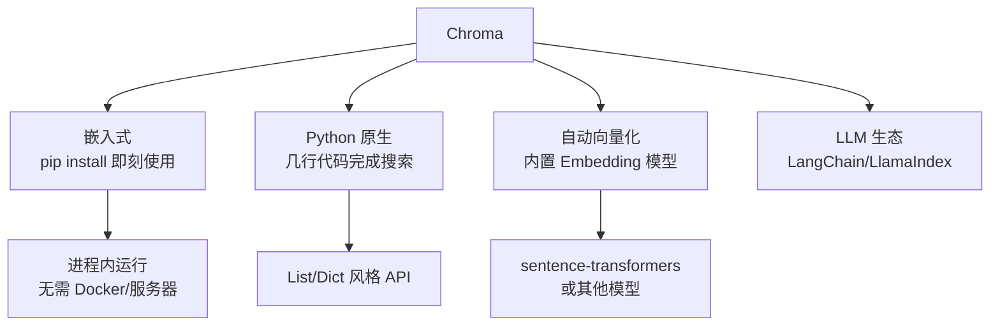
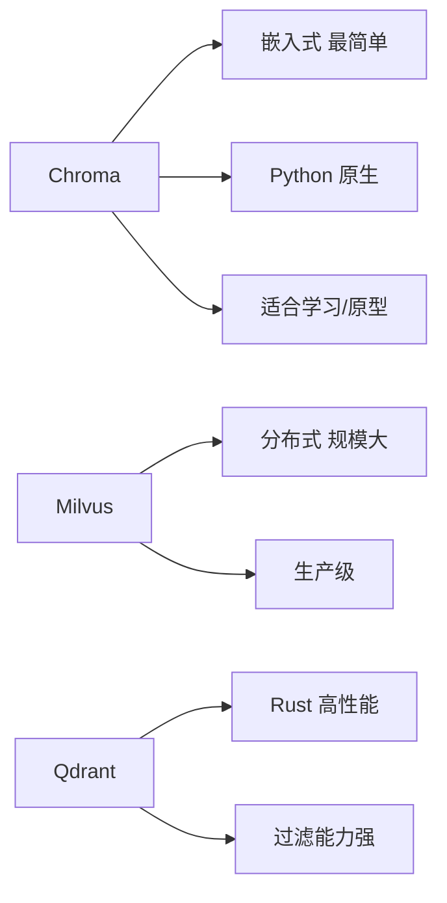
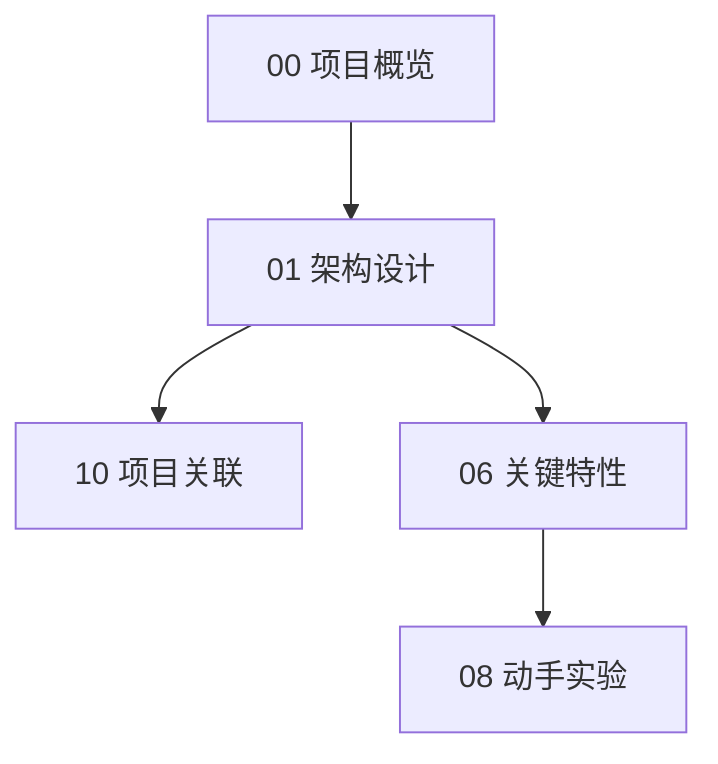

# Chroma 项目概览

## 学习目标

- 了解 Chroma 的嵌入式向量数据库定位
- 掌握 Chroma "AI 原生"设计的核心思想

## 项目定位

> Chroma 是一个 AI 原生的嵌入式向量数据库，专为 LLM 应用和嵌入工作流设计，强调极简部署和开发体验。

**基本信息**：

- 开发方：Chroma 开源社区
- 首次发布：2022 年
- 开源协议：Apache 2.0
- GitHub Stars：约 18k（[chroma-core/chroma](https://github.com/chroma-core/chroma)）

## 核心设计理念

嵌入式零服务器、Python 原生 API、自动向量化、与 LLM 框架深度集成。

## 对比

## 学习路线图

## 要点总结

- 嵌入式设计，零安装成本，最适合学习和原型
- Python 原生 API，几行代码即可运行
- 自动处理向量化，无需外部模型
- 与 LangChain/LlamaIndex 深度集成

## 思考题

1. Chroma 的"嵌入式"设计和传统数据库的"客户端-服务器"模式有什么区别？
2. 自动向量化功能在什么时候会成为瓶颈？
3. Chroma 适合生产环境吗？为什么？