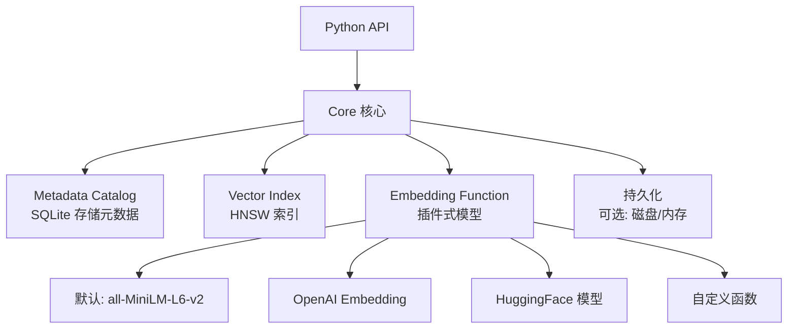
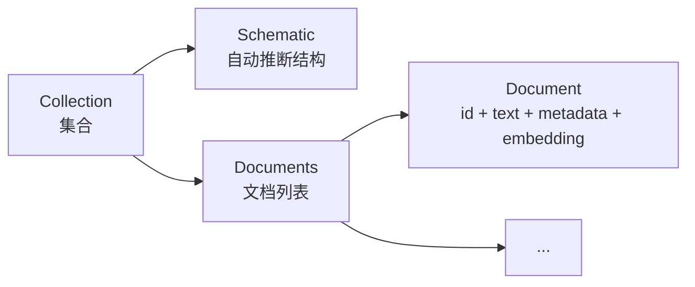

# Chroma 架构设计

## 学习目标

- 理解 Chroma 的嵌入式架构设计
- 掌握 Chroma 的核心组件

## 架构总览

## 数据模型

- **Collection**：类似关系数据库的表
- **Document**：文本 + 元数据 + 向量
- **Embedding**：向量表示，自动或手动生成

## 要点总结

- 核心组件：SQLite 元数据 + HNSW 索引 + Embedding 函数
- 数据模型：Collection → Document（含自动向量化）
- 可选持久化：内存（默认）或磁盘
- 嵌入式架构：进程内运行，无独立服务