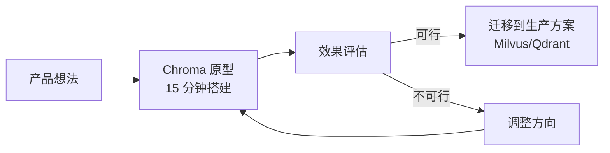
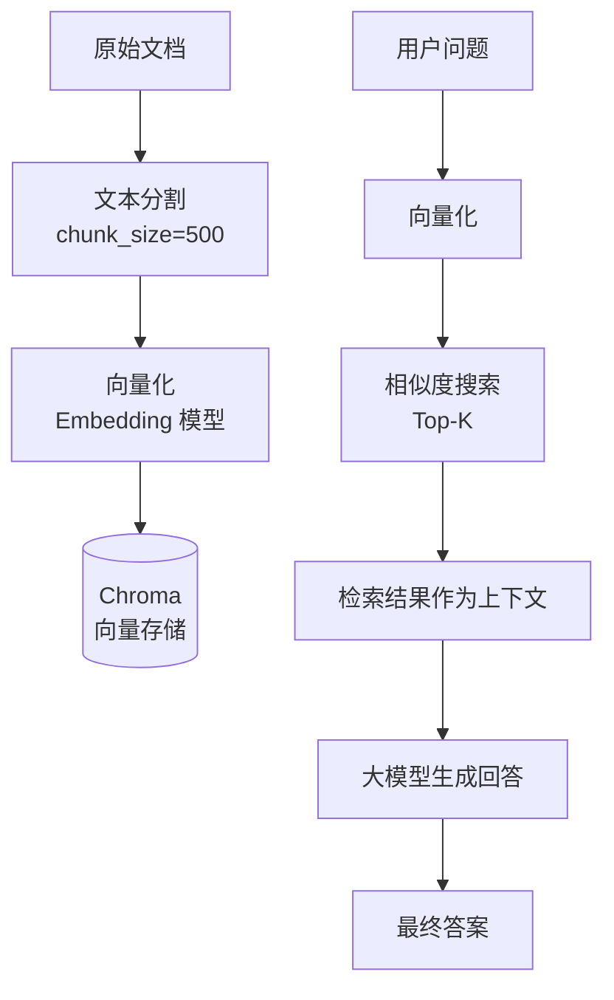

# Chroma 使用场景

## 学习目标

- 掌握 Chroma 的典型应用场景
- 理解场景与 Chroma 特性的对应关系
- 学会根据需求选择合适的场景

## 快速原型验证

Chroma 最擅长的场景：快速搭建向量搜索原型，验证想法可行性。

```python
# 15 分钟完成语义搜索原型
import chromadb

client = chromadb.Client()  # 内存模式，零配置
collection = client.create_collection("quick_demo")

# 添加示例数据
collection.add(
    documents=[
        "Redis 是内存数据库",
        "PostgreSQL 是关系数据库",
        "MongoDB 是文档数据库",
        "Chroma 是向量数据库"
    ],
    ids=["1", "2", "3", "4"]
)

# 搜索
results = collection.query(
    query_texts=["哪些数据库支持 SQL？"],
    n_results=2
)
```



### 优势

- **零部署成本**：`pip install chromadb` 即可开始
- **代码量极少**：10 行代码完成语义搜索
- **快速迭代**：内存模式无需清理数据
- **适合验证**：先验证效果，再决定是否投入生产

## LLM 应用开发

### LangChain 集成

Chroma 是 LangChain 中最常用的向量存储之一：

```python
from langchain_chroma import Chroma
from langchain_openai import OpenAIEmbeddings
from langchain_text_splitters import RecursiveCharacterTextSplitter
from langchain_community.document_loaders import TextLoader

# 1. 加载文档
loader = TextLoader("knowledge.txt")
documents = loader.load()

# 2. 文本分割
splitter = RecursiveCharacterTextSplitter(
    chunk_size=500,
    chunk_overlap=50
)
chunks = splitter.split_documents(documents)

# 3. 创建向量存储
vector_store = Chroma.from_documents(
    documents=chunks,
    embedding=OpenAIEmbeddings(),
    persist_directory="./chroma_langchain"
)

# 4. RAG 检索
retriever = vector_store.as_retriever(
    search_type="similarity",
    search_kwargs={"k": 3}
)
docs = retriever.invoke("什么是向量数据库？")
```

### LlamaIndex 集成

```python
from llama_index.core import VectorStoreIndex, SimpleDirectoryReader
from llama_index.vector_stores.chroma import ChromaVectorStore
import chromadb

# 初始化 Chroma
db = chromadb.PersistentClient(path="./chroma_llama")
chroma_collection = db.get_or_create_collection("documents")
vector_store = ChromaVectorStore(chroma_collection=chroma_collection)

# 创建索引
documents = SimpleDirectoryReader("./docs").load_data()
index = VectorStoreIndex.from_documents(
    documents,
    vector_store=vector_store
)

# 查询
query_engine = index.as_query_engine()
response = query_engine.query("Chroma 的架构是什么？")
```

### RAG 工作流



## 教育/学习场景

Chroma 的极简设计使其成为学习和教学向量数据库的理想选择：

### 教学内容

```python
# 教学示例：理解向量相似度
import chromadb
import numpy as np

client = chromadb.Client()
collection = client.create_collection("colors")

# 用 RGB 值作为向量，展示相似度概念
colors = {
    "red": [255, 0, 0],
    "green": [0, 255, 0],
    "blue": [0, 0, 255],
    "yellow": [255, 255, 0],
    "orange": [255, 165, 0],
}

collection.add(
    embeddings=list(colors.values()),
    documents=list(colors.keys()),
    ids=list(colors.keys())
)

# 查询"接近红色的颜色"
results = collection.query(
    query_embeddings=[[255, 10, 10]],
    n_results=3
)
print(results['documents'][0])  # ['red', 'orange', 'yellow']
```

### 适用教育场景

| 场景 | 用途 | 教学价值 |
|------|------|---------|
| 向量搜索入门 | 第一个向量数据库实验 | 理解核心概念 |
| 语义搜索演示 | 展示"语义"而非"关键词" | 理解嵌入原理 |
| 过滤实验 | Metadata 过滤效果对比 | 理解混合搜索 |
| 性能基准 | FLAT vs HNSW 对比 | 理解算法权衡 |

## 本地知识库

个人或团队内部的轻量级知识库系统：

```python
class LocalKnowledgeBase:
    def __init__(self, path="./kb"):
        self.client = chromadb.PersistentClient(path=path)
        self.collection = self.client.get_or_create_collection(
            name="knowledge_base",
            metadata={"hnsw:space": "cosine"}
        )
    
    def add_document(self, doc_id, text, metadata=None):
        self.collection.add(
            documents=[text],
            metadatas=[metadata or {}],
            ids=[doc_id]
        )
    
    def search(self, query, k=5, filter=None):
        results = self.collection.query(
            query_texts=[query],
            n_results=k,
            where=filter
        )
        return results
    
    def delete_document(self, doc_id):
        self.collection.delete(ids=[doc_id])

# 使用
kb = LocalKnowledgeBase()
kb.add_document("doc1", "Chroma 是一个嵌入式的向量数据库", 
                {"category": "vectordb", "date": "2024-01-01"})
results = kb.search("什么是向量数据库？")
```

### 本地知识库适用场景

- **个人笔记搜索**：将 Obsidian/Notion 笔记向量化后语义搜索
- **技术文档库**：团队内部 API 文档、设计文档的智能检索
- **代码搜索**：代码注释和文档的语义搜索
- **客户 FAQ**：常见问题自动匹配

## 场景选择矩阵

| 场景 | Chroma 适合度 | 推荐理由 | 替代方案 |
|------|-------------|---------|---------|
| 快速原型验证 | 最适合 | 零配置、代码极少 | Milvus Lite |
| LLM RAG 开发 | 很适合 | LangChain/LlamaIndex 深度集成 | Pinecone |
| 个人知识库 | 很适合 | 嵌入式、无服务依赖 | SQLite + vec0 |
| 教学入门 | 最适合 | 学习曲线最平缓 | FAISS |
| 生产高并发 | 不适合 | 无分布式、性能有限 | Qdrant/Milvus |
| 百万级数据 | 不太适合 | 内存/磁盘管理较弱 | Milvus |
| 多模态搜索 | 一般 | 主要面向文本 | Weaviate |

## 要点总结

- 快速原型是 Chroma 的杀手场景，15 分钟即可搭建语义搜索
- LLM 应用开发（RAG）是 Chroma 最广泛的使用场景
- 教育场景中，Chroma 是学习向量数据库的最佳入门工具
- 本地知识库适合个人和小团队使用
- 不适合高并发、大容量、多模态的生产场景

## 思考题

1. 为什么 Chroma 在 RAG 应用中如此流行？它的哪些设计直接服务于这个场景？
2. 从 Chroma 原型迁移到 Milvus/Qdrant 生产环境，需要考虑哪些问题？
3. 在本地知识库场景中，如何解决文档更新后向量不同步的问题？
4. Chroma 的"嵌入式"设计在哪些场景下反而是劣势？