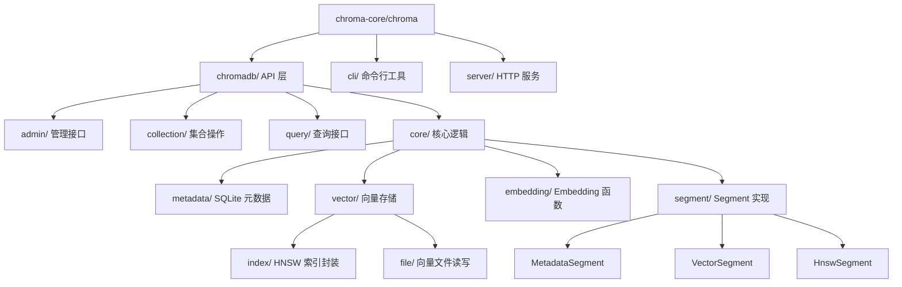
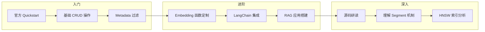

# Chroma 学习资源

## 学习目标

- 获取 Chroma 的优质学习资源
- 了解 Chroma 源码结构和研读路径

## 官方资源

### 官方文档与代码

- **官方文档**：[https://docs.trychroma.com/](https://docs.trychroma.com/)
- **GitHub 仓库**：[https://github.com/chroma-core/chroma](https://github.com/chroma-core/chroma)
- **Python API 参考**：[https://docs.trychroma.com/reference](https://docs.trychroma.com/reference)
- **官方博客**：[https://www.trychroma.com/blog](https://www.trychroma.com/blog)

### 快速开始

- **Quickstart**：[https://docs.trychroma.com/getting-started](https://docs.trychroma.com/getting-started)
- **示例代码**：[https://github.com/chroma-core/chroma/tree/main/examples](https://github.com/chroma-core/chroma/tree/main/examples)

## 源码研读路径

Chroma 的 Python 源码结构清晰，适合作为向量数据库的入门研读对象：

### 核心模块说明

| 模块 | 路径 | 说明 |
|------|------|------|
| **API 层** | `chromadb/api/` | 对外暴露的接口，`Collection`、`Client` 等 |
| **Segment** | `chromadb/segment/` | 存储引擎核心，向量/元数据分段管理 |
| **Metadata** | `chromadb/db/` | SQLite 元数据存储和查询 |
| **Embedding** | `chromadb/utils/embedding_functions.py` | Embedding 函数插件 |
| **索引封装** | `chromadb/segment/impl/vector/` | HNSW 的 Python 封装 |
| **配置文件** | `chromadb/config.py` | 配置选项定义 |

### 推荐研读顺序

1. **先看 API**：`chromadb/api/` → 理解对外接口设计
2. **再看 Segment**：`chromadb/segment/` → 理解存储核心
3. **再看 Metadata**：`chromadb/db/` → 理解元数据管理
4. **最后看 Embedding**：`chromadb/utils/embedding_functions.py` → 理解插件机制

## LangChain/LlamaIndex 集成文档

### LangChain

- **Chroma 集成文档**：[https://python.langchain.com/docs/integrations/vectorstores/chroma/](https://python.langchain.com/docs/integrations/vectorstores/chroma/)
- **API 参考**：[https://api.python.langchain.com/en/latest/vectorstores/langchain_chroma.vectorstores.Chroma.html](https://api.python.langchain.com/en/latest/vectorstores/langchain_chroma.vectorstores.Chroma.html)

### LlamaIndex

- **Chroma 集成文档**：[https://docs.llamaindex.ai/en/stable/examples/vector_stores/ChromaIndexDemo.html](https://docs.llamaindex.ai/en/stable/examples/vector_stores/ChromaIndexDemo.html)
- **API 参考**：[https://docs.llamaindex.ai/en/stable/api_reference/llama_index.vector_stores.chroma.html](https://docs.llamaindex.ai/en/stable/api_reference/llama_index.vector_stores.chroma.html)

## 学习路径

### 按阶段推荐

| 阶段 | 目标 | 推荐资源 | 预计时间 |
|------|------|---------|---------|
| 入门 | 能独立使用 Chroma 完成搜索 | 官方 Quickstart + API 文档 | 2-3 小时 |
| 进阶 | 能集成到 LangChain/LlamaIndex 做 RAG | LangChain 集成文档 + 博客 | 1-2 天 |
| 深入 | 理解实现原理，能贡献代码 | 源码研读 + 设计文档 | 1-2 周 |

### 对比学习建议

将 Chroma 与其他向量数据库对比学习，效果更佳：

1. **Chroma vs FAISS**：都是嵌入式，但 Chroma 更"数据库"（元数据、持久化）
2. **Chroma vs Milvus**：极简 vs 分布式，理解不同设计哲学
3. **Chroma vs Qdrant**：Python 原生 vs Rust 高性能，理解语言选择的影响
4. **Chroma vs pgvector**：嵌入式 vs SQL 集成，理解不同集成方式

## 要点总结

- 官方文档和 GitHub 是最权威的学习资源
- Chroma 源码结构清晰，适合作为向量数据库的入门研读对象
- LangChain/LlamaIndex 集成文档提供了 RAG 应用的完整示例
- 学习路径建议：入门（Quickstart）→ 进阶（LangChain 集成）→ 深入（源码研读）
- 对比学习（Chroma vs FAISS/Milvus/Qdrant/pgvector）能加深理解