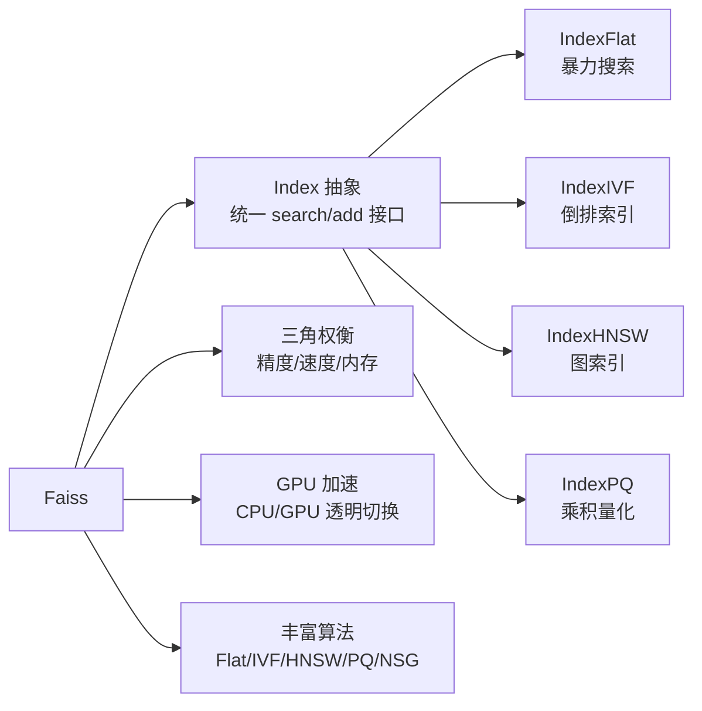
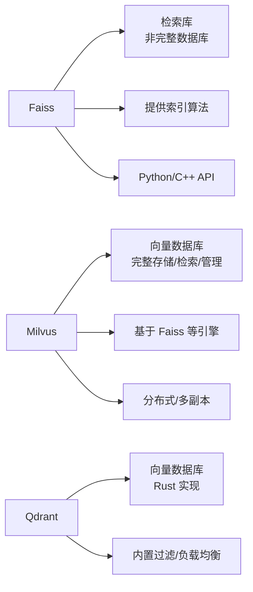
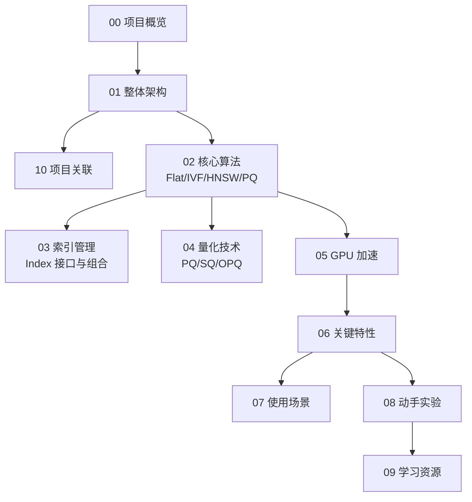

# Faiss 项目概览

## 学习目标

- 了解 Faiss 的项目定位、历史脉络与社区生态
- 掌握 Faiss 的核心设计理念与适用场景
- 建立对向量检索全栈模块的整体认知框架

## 项目定位

> Faiss 是 Meta（Facebook AI Research）开发的向量相似性搜索与聚类库，用于高效检索和聚类稠密向量。

**基本信息**：

- 开发方：Meta FAIR（Fundamental AI Research）
- 首次发布：2017 年
- 开源协议：MIT
- 最新版本：1.9.x（截至 2026 年）
- GitHub Stars：约 33k（[facebookresearch/faiss](https://github.com/facebookresearch/faiss)）
- 官方网站：[https://faiss.ai](https://faiss.ai)

## 核心设计理念

Faiss 的设计哲学可以概括为三点：**索引抽象**、**精度-速度-内存三角权衡**、**GPU 加速**。

第一，**索引抽象**。Faiss 将"向量集合 + 检索方法"封装为 Index 对象，每种算法都实现相同的 `search()` 和 `add()` 接口。用户只需更换 Index 类型即可切换算法，从暴力搜索（IndexFlat）到 IVF、HNSW、PQ 等近似搜索，接口一致。

第二，**精度-速度-内存三角权衡**。Faiss 提供一系列算法，在搜索精度、搜索速度和内存占用之间形成连续光谱。用户根据场景选择：需要高精度用 IndexFlat（暴力搜索），需要低内存用 PQ（乘积量化），需要平衡用 IVF+PQ 或 HNSW。

第三，**GPU 加速**。Faiss 的 GPU 实现支持 CUDA 和 ROCm，且提供 CPU/GPU 透明切换——`GpuIndexFlatL2` 可替换 `IndexFlatL2`，数据自动在 CPU/GPU 间传输。

## 与向量数据库的对比

| 维度 | Faiss | Milvus | Qdrant |
|------|-------|--------|--------|
| 定位 | 检索库 | 向量数据库 | 向量数据库 |
| 持久化 | 不支持 | 支持 | 支持 |
| 分布式 | 不支持 | 支持 | 支持 |
| 过滤 | 不支持 | 支持 Scalar Filtering | 支持 |
| 语言 | C++/Python | Go/Java SDK | Rust/Python SDK |
| 适用场景 | 嵌入式/研究 | 生产环境 | 生产环境 |

## 适用场景

Faiss 在以下场景中表现出色：

- **向量相似性搜索**：推荐系统、图像检索、文本匹配
- **大规模聚类**：K-Means 聚类，支持 GPU 加速
- **近似最近邻搜索（ANN）**：亿级向量的近似搜索
- **研究与原型**：快速验证 ANN 算法效果
- **嵌入式系统**：C++ 库可嵌入其他应用

不擅长的场景：

- **需要持久化**：Faiss 不提供数据持久化，需自行管理
- **需要分布式**：单机库，不支持多节点
- **需要实时增删改**：Faiss 的索引构建通常需要全量重建
- **标量过滤**：Faiss 不关联元数据，无法过滤

## 学习路线图

## 要点总结

- Faiss 是 Meta 的开源向量检索库，核心是索引抽象层
- 提供精度-速度-内存的连续权衡光谱
- 支持 CPU 和 GPU，接口统一
- 适合嵌入式和研究场景，但不提供持久化和分布式能力

## 思考题

1. Faiss 的 Index 抽象设计对项目中的多模态引擎设计有什么启发？
2. 精度-速度-内存三角权衡在实际应用中如何选择最优配置？
3. Faiss 在 GPU 上的搜索相比 CPU 能快多少？瓶颈在哪里？