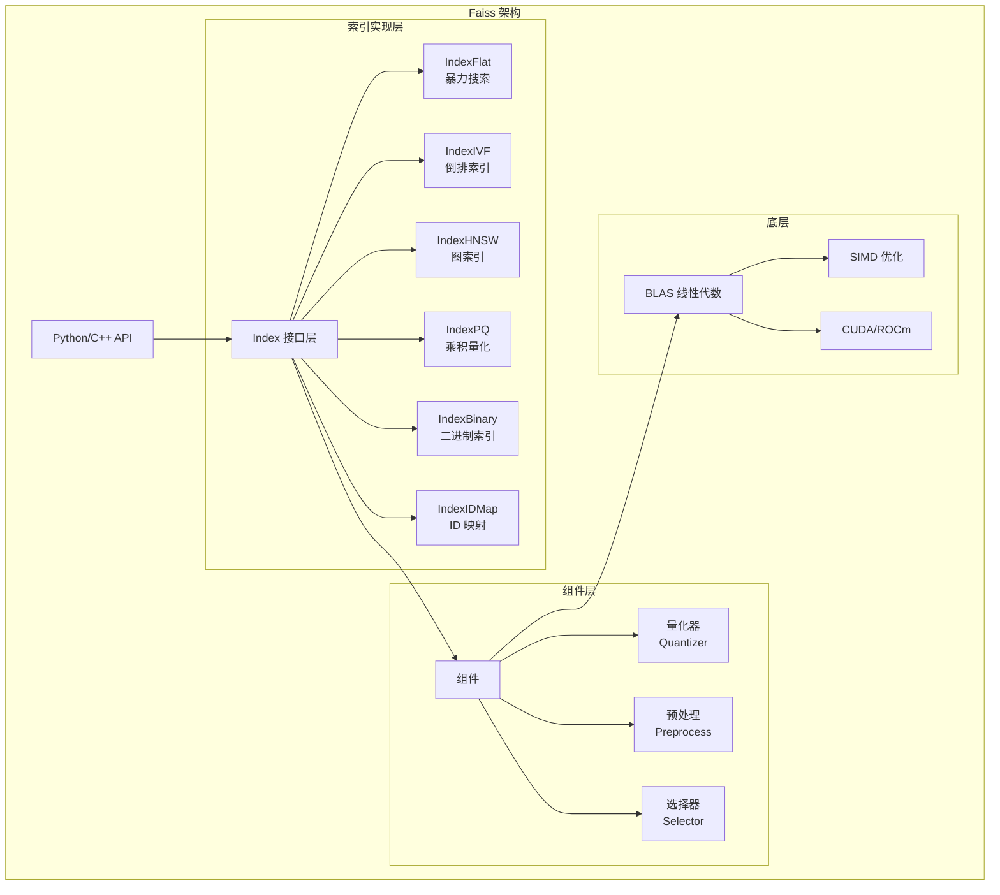
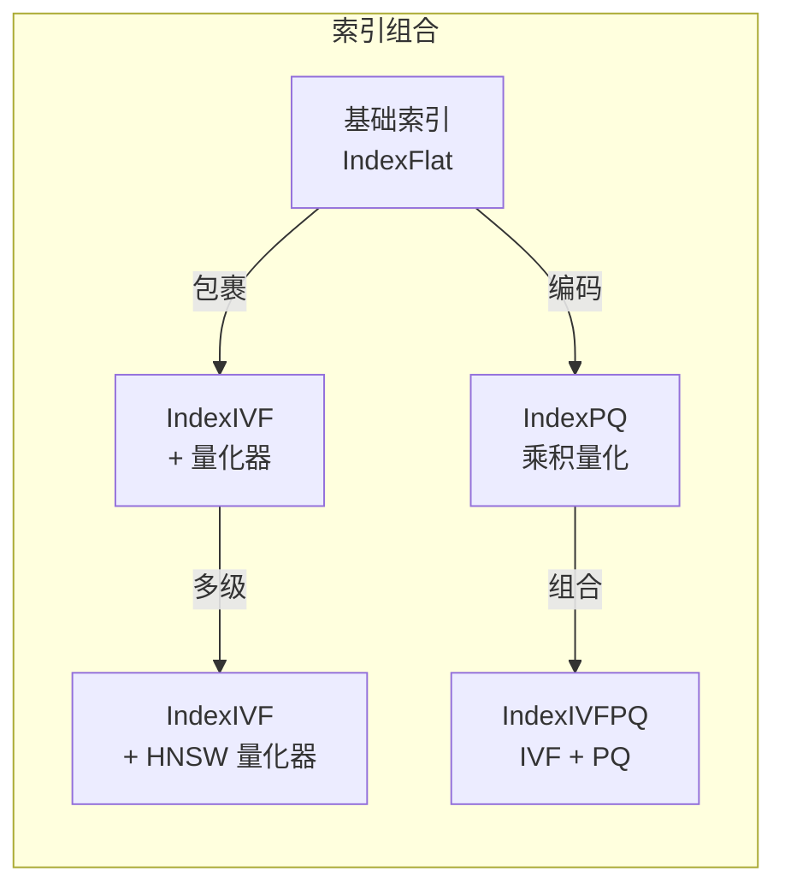
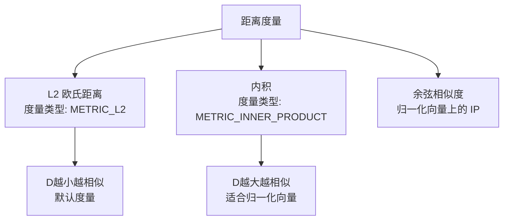

# Faiss 整体架构

## 学习目标

- 理解 Faiss 的模块化架构设计
- 掌握 Index 对象体系与组件的组合方式

## 核心概念

- **Index**：Faiss 的核心抽象，统一封转向量集合和搜索方法
- **量化器（Quantizer）**：用于压缩向量的组件，可独立使用或作为 Index 的一部分
- **预处理器（Preprocess）**：向量标准化、PCA 降维等预处理
- **选择器（Selector）**：控制搜索结果排序和过滤

## 架构总览



## Index 接口

所有 Index 类型都继承自基类 `Index`，提供统一接口：

```mermaid
graph TD
    IDX[Index 基类] --> M1[add(n, x)<br/>添加向量]
    IDX --> M2[search(n, q, k)<br/>搜索 k 近邻]
    IDX --> M3[remove(n, ids)<br/>移除向量]
    IDX --> M4[reconstruct(n, key)<br/>重建原始向量]
    IDX --> M5[train(n, x)<br/>训练索引]

    IDX --> D[d: 向量维度]
    IDX --> NT[ntotal: 向量总数]
    IDX --> MT[metric_type: 距离度量<br/>L2/IP]
```

### Index 关键属性

```python
import faiss

# 创建索引
index = faiss.IndexFlatL2(128)  # L2 距离，128 维

# 基本属性
print(index.d)       # 向量维度: 128
print(index.ntotal)  # 向量数量
print(index.is_trained)  # 是否需要训练

# 统一接口
index.add(vectors)          # 添加向量
D, I = index.search(query, k)  # 搜索，返回距离和索引

# 重建
vec = index.reconstruct(0)  # 重建第 0 个向量的原始数据
```

## Index 组合模式

Faiss 通过组合模式实现复杂索引：



典型组合：

| 索引类型 | 组成 | 特点 |
|---------|------|------|
| IndexFlatL2 | 暴力搜索 | 精确结果，速度慢 |
| IndexIVFFlat | IVF + Flat | 加速搜索，精度高 |
| IndexIVFPQ | IVF + PQ | 加速 + 压缩内存 |
| IndexHNSWFlat | HNSW + Flat | 快速高精度图索引 |
| IndexHNSWPQ | HNSW + PQ | 快速 + 低内存 |
| IndexBinaryIVF | 二进制 IVF | 极低内存 |

## 距离度量



## 索引工厂

Faiss 提供字符串工厂方法快速创建索引：

```python
# 索引工厂语法: "算法名(参数)"
index = faiss.index_factory(128, "Flat")           # 暴力搜索
index = faiss.index_factory(128, "IVF100,Flat")    # IVF + 100 中心
index = faiss.index_factory(128, "IVF100,PQ8")     # IVF + PQ 8 字节
index = faiss.index_factory(128, "HNSW32,Flat")    # HNSW + 32 邻居
index = faiss.index_factory(128, "OPQ16,IVF100,PQ8")  # OPQ + IVF + PQ
```

## 要点总结

- Faiss 以 Index 接口为核心，统一封装向量存储与搜索
- 多种 Index 实现覆盖从精确到近似的全光谱
- 通过组合模式将基础算法组合为复合索引
- 索引工厂提供字符串 DSL，快速创建复杂索引

## 思考题

1. Faiss 的 Index 抽象设计能否用于项目中多模态引擎的统一接口？
2. IndexIVFPQ 这种组合索引中各组件（IVF + PQ）分别解决什么问题？
3. 距离度量选择 L2 和 IP 对搜索结果有什么差异？