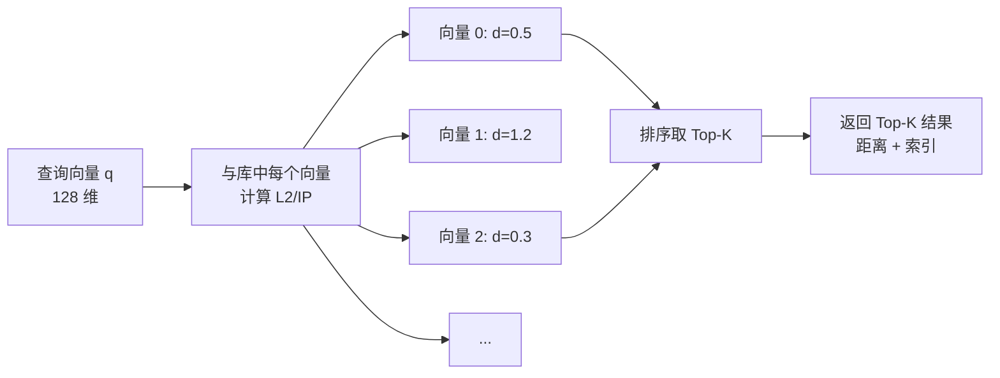
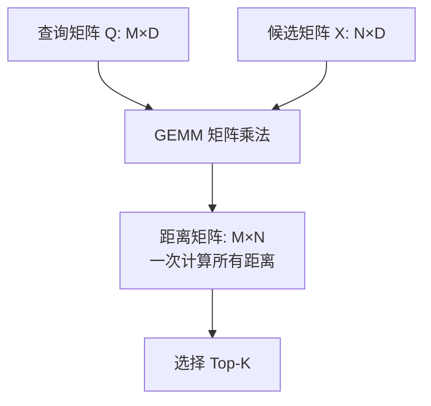

# 核心算法 — Flat 暴力搜索

## 学习目标

- 理解暴力搜索算法的实现原理
- 掌握 Faiss 中 Flat 索引的使用场景

## 原理

暴力搜索（IndexFlat）是 Faiss 中最基础的索引，对所有向量逐一计算距离：



### 算法流程

```mermaid
flowchart TD
    Q[输入: 查询向量 q, 候选集 X, K] --> LOOP[遍历 X 中每个向量 x_i]
    LOOP --> COMP[计算 d_i = ||q - x_i||²]
    COMP --> HEAP[维护大小为 K 的最小堆]
    HEAP --> MORE{遍历完成?}
    MORE -->|否| LOOP
    MORE -->|是| RES[输出: Top-K 距离和索引]
```

### 时间复杂度

- 搜索复杂度：O(N × D)，N 为向量数，D 为维度
- 内存占用：O(N × D)，存储所有原始向量

## Faiss 实现

```python
import faiss
import numpy as np

# 创建 Flat 索引
d = 128  # 向量维度
index = faiss.IndexFlatL2(d)  # L2 距离
# 或
index = faiss.IndexFlatIP(d)  # 内积

# 添加向量 (N x d)
xb = np.random.random((10000, d)).astype('float32')
index.add(xb)

# 搜索
xq = np.random.random((10, d)).astype('float32')
D, I = index.search(xq, k=5)  # 返回 Top-5
# D: 距离矩阵 (10 x 5)
# I: 索引矩阵 (10 x 5)
```

## 优化技巧

Faiss 的 Flat 实现使用 BLAS 库进行矩阵乘法加速：



- **批量查询**：一次搜索多个查询向量，利用矩阵乘法并行
- **SIMD 加速**：x86 上使用 MKL/OpenBLAS 的 SIMD 指令
- **分块计算**：超大候选集时自动分块，避免内存溢出

## 适用场景

| 场景 | 是否适合 | 原因 |
|------|---------|------|
| 小数据集 (< 10 万) | ✅ | 计算快，实现简单 |
| 高精度要求 | ✅ | 精确结果，无近似损失 |
| 大数据集 (> 100 万) | ❌ | 速度慢，内存大 |
| 高维度 (> 500) | ⚠️ | 维度诅咒，速度下降 |

## 要点总结

- IndexFlat 是精确的暴力搜索，结果就是真实最近邻
- Faiss 使用 BLAS 矩阵乘法实现批量查询优化
- 适合小数据集和高精度场景，不适合大规模数据
- 常作为其他近似算法的基线对比

## 思考题

1. 当 N=100 万、D=128 维时，一次暴力搜索的计算量有多大？
2. 为什么说 Flat 索引是 Faiss 所有复合索引的"最后回退"？
3. 维度诅咒对暴力搜索的影响体现在哪些方面？