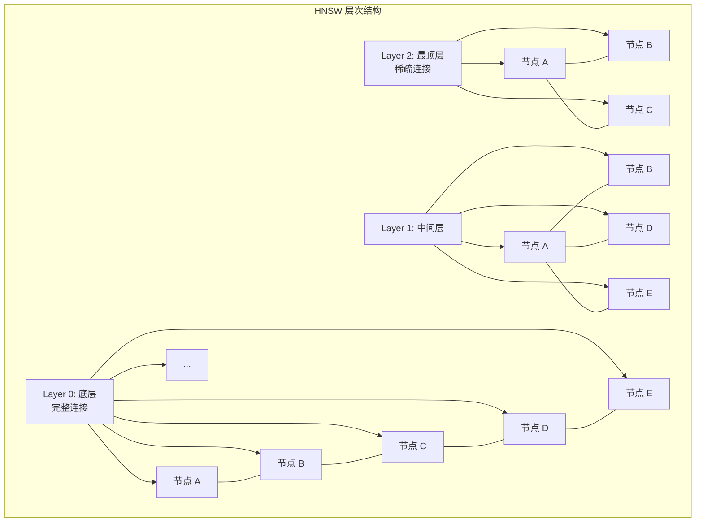
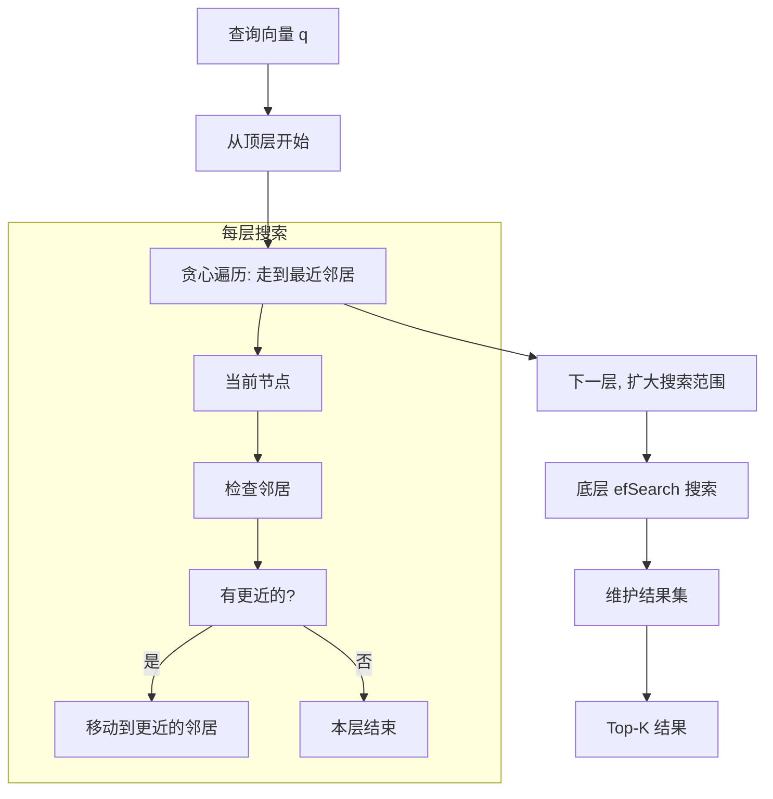
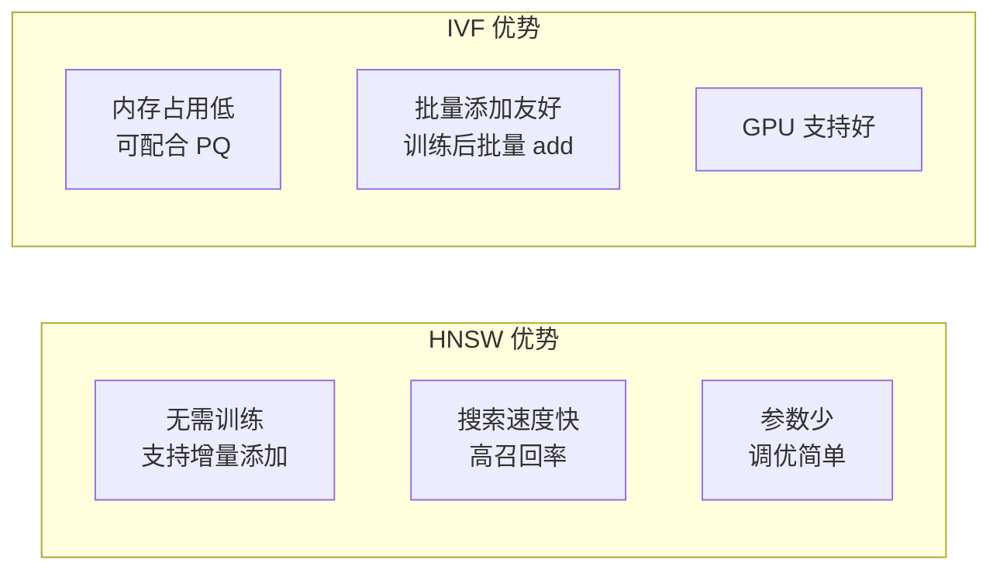

# 核心算法 — HNSW 图索引

## 学习目标

- 理解 HNSW（Hierarchical Navigable Small World）算法的原理
- 掌握 HNSW 在 Faiss 中的实现和参数调优

## 原理

HNSW 构建层次化的可导航小世界图，从顶层到底层逐层搜索：



### 搜索过程



### 参数

- **M**：每个节点的最大连接数（默认 32）
- **efConstruction**：构建时的搜索范围（默认 40）
- **efSearch**：搜索时的动态列表大小

## 参数影响

| 参数 | 增大效果 | 减小效果 |
|------|---------|---------|
| M | 精度↑ 内存↑ 构建慢↑ | 精度↓ 内存↓ |
| efConstruction | 精度↑ 构建慢↑ | 精度↓ |
| efSearch | 精度↑ 搜索慢↑ | 精度↓ 搜索快↑ |

## Faiss 实现

```python
import faiss
import numpy as np

d = 128
M = 32
efSearch = 64
efConstruction = 80

# 创建 HNSW 索引
index = faiss.IndexHNSWFlat(d, M)
index.hnsw.efConstruction = efConstruction

# 添加向量 (无需训练)
xb = np.random.random((100000, d)).astype('float32')
index.add(xb)

# 设置搜索参数
index.hnsw.efSearch = efSearch

# 搜索
xq = np.random.random((10, d)).astype('float32')
D, I = index.search(xq, k=5)
```

## HNSW vs IVF



| 维度 | HNSW | IVF |
|------|------|-----|
| 训练 | 不需要 | 需要 K-Means 训练 |
| 增量添加 | 原生支持 | 需重建 |
| 搜索速度 | 快（对数级） | 中（线性扫描倒排列表） |
| 内存 | 高（存图结构） | 中（存倒排列表） |
| 精度 | 高（可调 M） | 中（依赖 nprobe） |
| 适用场景 | 中等规模、高精度 | 大规模、内存敏感 |

## 要点总结

- HNSW 构建多层图结构，从粗到细逐层搜索
- 无需训练阶段，支持增量添加向量
- 搜索速度快（对数级），精度高
- 主要缺点是内存占用较高（存储图连接关系）

## 思考题

1. HNSW 的"层次"如何确定？每个节点出现在哪些层？
2. 当 M 从 32 增加到 64，内存占用和搜索速度分别如何变化？
3. HNSW 为什么不适合作为"大数据集"（1 亿+）的默认选择？