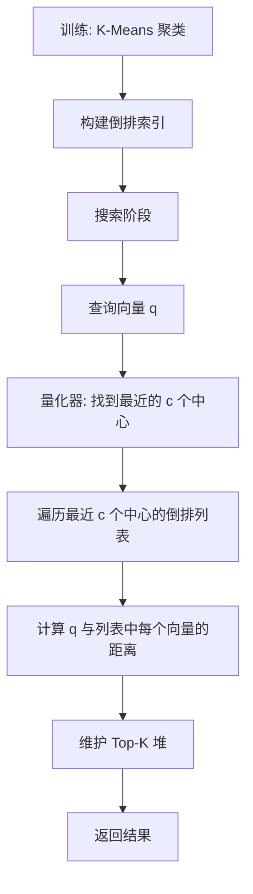
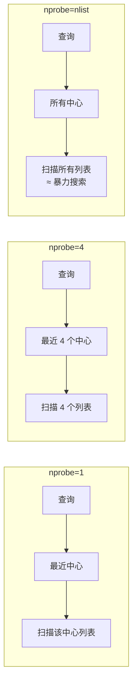
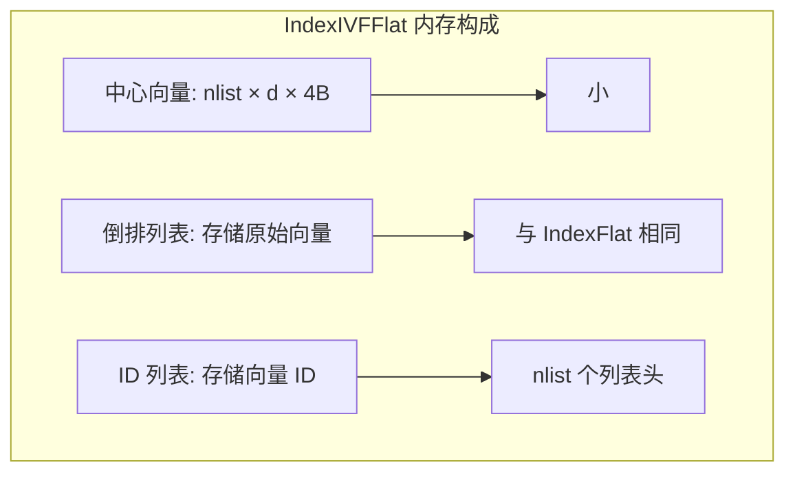

# 核心算法 — IVF 倒排索引

## 学习目标

- 理解 IVF（Inverted File Index）算法的原理
- 掌握 IVF 在 Faiss 中的实现和参数调优

## 原理

IVF 通过聚类将向量空间划分为 Voronoi 单元，搜索时只访问最近的几个单元：


### 算法流程



### 参数

- **nlist**：聚类中心数量，控制倒排列表数
- **nprobe**：搜索时访问的中心数，控制精度-速度权衡

## nprobe 的影响



精度-速度曲线：

| nprobe | 速度提升 | 召回率 |
|--------|---------|--------|
| 1 | 100x | ~60% |
| 10 | 10x | ~90% |
| 100 | 1x | ~99% |

## Faiss 实现

```python
import faiss
import numpy as np

d = 128
nlist = 100  # 聚类中心数

# 创建量化器 (用于搜索时确定最近中心)
quantizer = faiss.IndexFlatL2(d)

# 创建 IVF 索引
index = faiss.IndexIVFFlat(quantizer, d, nlist, faiss.METRIC_L2)

# 训练
xb = np.random.random((50000, d)).astype('float32')
index.train(xb)
index.add(xb)

# 搜索
index.nprobe = 10  # 搜索时访问 10 个中心
xq = np.random.random((10, d)).astype('float32')
D, I = index.search(xq, k=5)
```

## 内存与性能



| 索引类型 | 内存 | 搜索速度 | 精度 |
|---------|------|---------|------|
| IndexFlat | N × D × 4B | 慢 | 精确 |
| IndexIVFFlat | N × D × 4B + 中心 | 快 10-100x | ~90%+ |
| IndexIVFPQ | N × code_size | 快 10-100x | ~80-95% |

## 要点总结

- IVF 通过 K-Means 聚类 + 倒排列表实现快速近似搜索
- nlist 控制训练时的聚类数，nprobe 控制搜索时的访问范围
- IndexIVFFlat 不压缩向量，精度损失来自 nprobe 限制
- 速度和精度通过 nprobe 参数连续调节

## 思考题

1. nlist 设置过大或过小各有什么影响？
2. IVF 训练时 K-Means 的迭代次数对搜索结果有什么影响？
3. 如果数据分布极不均匀，IVF 的倒排列表长度差异很大，如何优化？