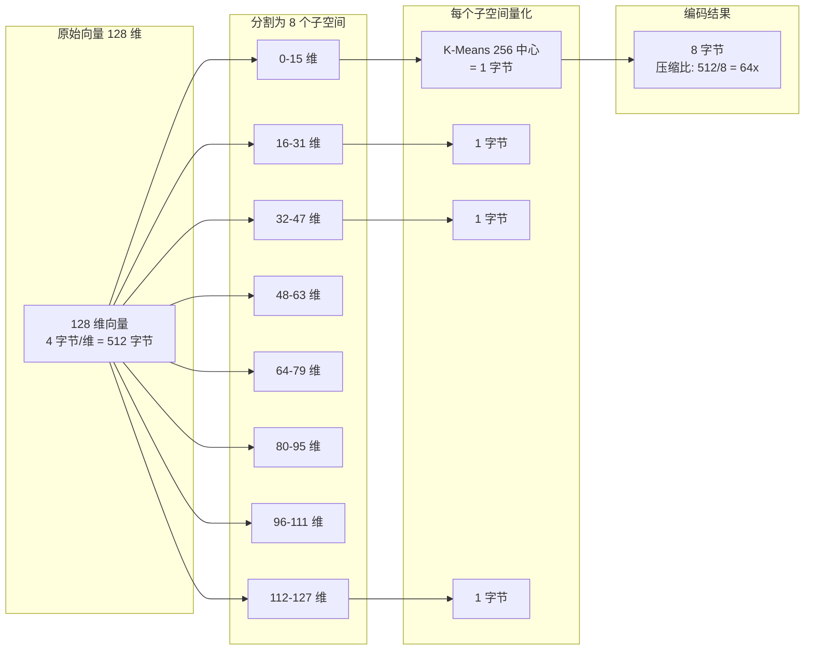
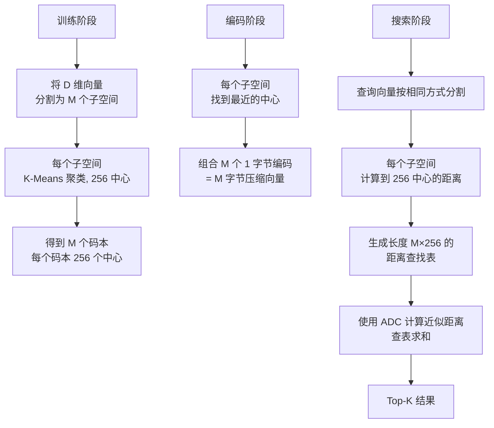
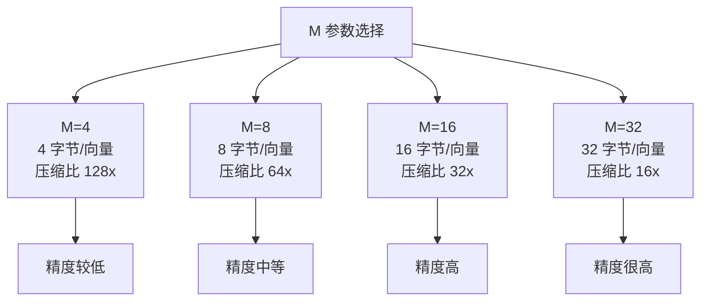
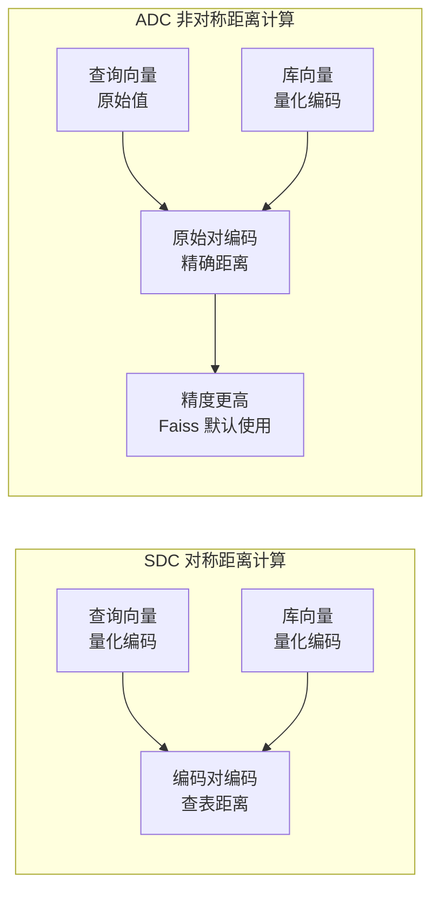

# 核心算法 — PQ 乘积量化

## 学习目标

- 理解乘积量化（Product Quantization）的原理
- 掌握 PQ 在 Faiss 中的实现和参数配置

## 原理

乘积量化将高维向量分割为多个子空间，分别量化后拼接编码：



### 算法流程



## 参数选择

- **M**：子空间数（编码字节数）
- **nbits**：每个子空间的量化位数（通常 8）



## PQ 搜索: SDC vs ADC



## Faiss 实现

```python
import faiss
import numpy as np

d = 128
m = 8  # 8 字节编码

# 纯 PQ 索引
index = faiss.IndexPQ(d, m, faiss.METRIC_L2)

# 训练
xb = np.random.random((50000, d)).astype('float32')
index.train(xb)
index.add(xb)

# 搜索
xq = np.random.random((10, d)).astype('float32')
D, I = index.search(xq, k=5)

# IVF + PQ 组合
quantizer = faiss.IndexFlatL2(d)
index_ivfpq = faiss.IndexIVFPQ(quantizer, d, nlist=100, m=m, nbits=8)
index_ivfpq.train(xb)
index_ivfpq.add(xb)
index_ivfpq.nprobe = 10
D, I = index_ivfpq.search(xq, k=5)
```

## PQ 内存压缩

| 索引类型 | 内存/向量 | 1M 向量内存 |
|---------|-----------|------------|
| IndexFlat | 512字节（128维） | 512MB |
| IndexPQ (m=8) | 8字节 | 8MB |
| IndexPQ (m=16) | 16字节 | 16MB |
| IndexIVFPQ (m=8) | 8字节 + IVF头 | ~10MB |

## 要点总结

- PQ 将高维空间分割为子空间分别量化，大幅压缩向量
- 搜索时使用 ADC（非对称距离计算），保持较高精度
- PQ 编码长度 M 控制压缩比和精度之间的权衡
- IVF + PQ 组合（IndexIVFPQ）是 Faiss 最常用的高配方案

## 思考题

1. PQ 的 M 参数选择与向量维度 D 之间有什么关系？为什么 M 需要能整除 D？
2. ADC 比 SDC 精度更高，原因是什么？
3. PQ 量化对哪些数据分布特别有效？对哪些分布效果较差？