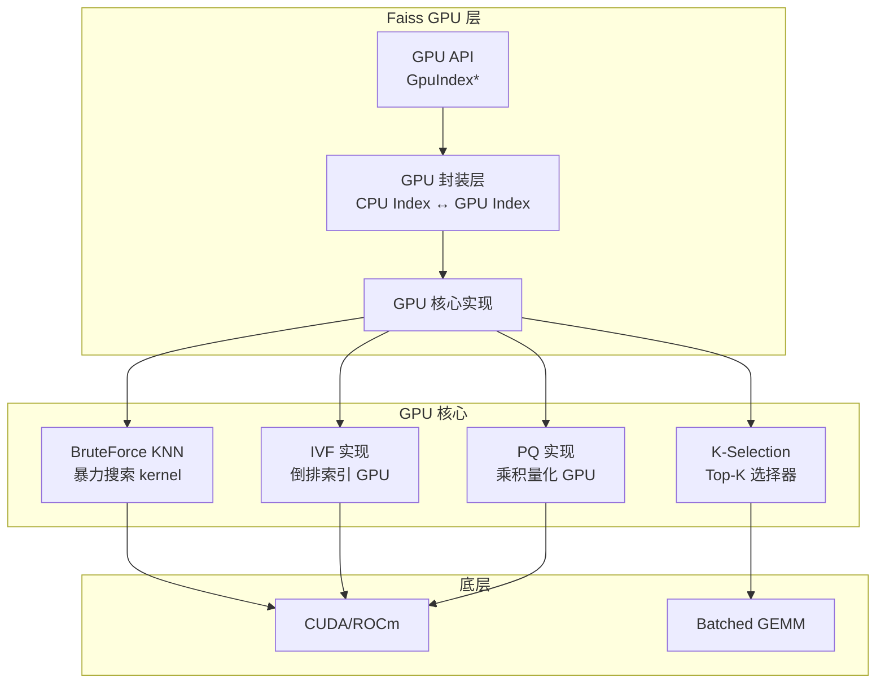
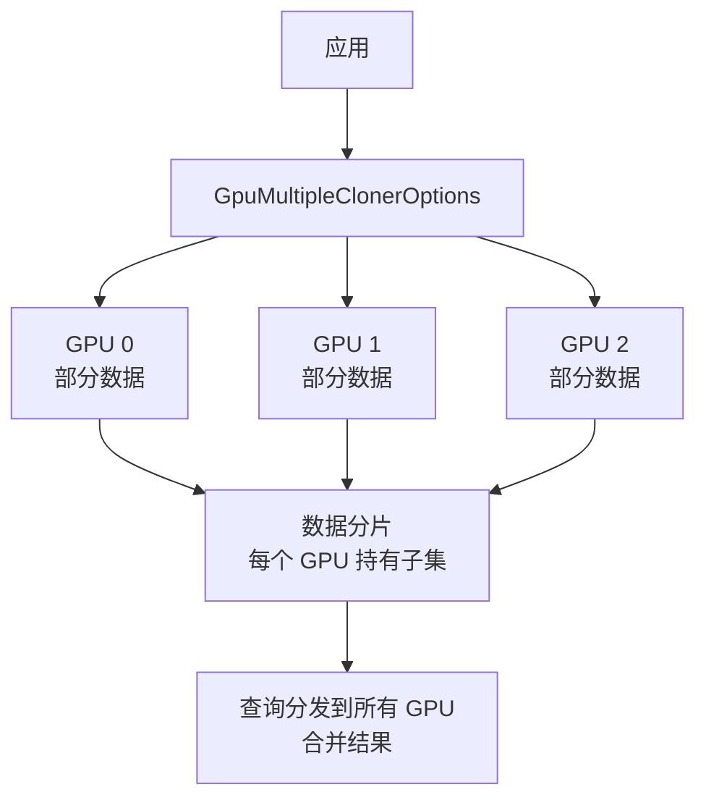
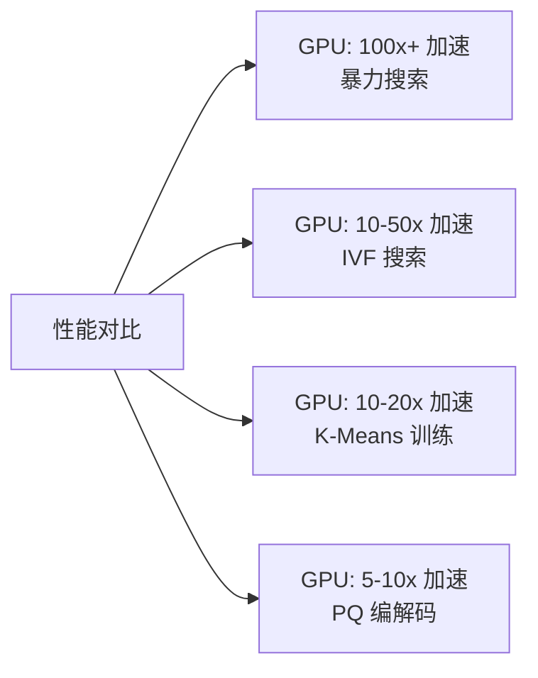

# GPU 加速

## 学习目标

- 理解 Faiss GPU 实现的架构设计
- 掌握 GPU 索引的创建和使用方法

## GPU 架构

Faiss 的 GPU 实现支持 CUDA 和 ROCm：



## CPU/GPU 索引映射

Faiss 提供 CPU/GPU 透明替换：

```python
import faiss

d = 128

# CPU 索引
cpu_index = faiss.IndexFlatL2(d)

# GPU 索引 (替换方式相同)
gpu_index = faiss.GpuIndexFlatL2(d)

# 或通过标准方式转换
res = faiss.StandardGpuResources()
gpu_index = faiss.index_cpu_to_gpu(res, 0, cpu_index)

# 转回 CPU
cpu_index2 = faiss.index_gpu_to_cpu(gpu_index)
```

## 多 GPU 支持



```python
# 多 GPU
ngpus = faiss.get_num_gpus()
gpu_options = []
for i in range(ngpus):
    gpu_options.append(faiss.GpuClonerOptions())
    gpu_options[i].useFloat16CoarseQuantizer = True  # 节省显存

index_gpu = faiss.index_cpu_to_all_gpus(
    cpu_index,
    gpu_options=gpu_options
)
```

## GPU 加速效果



| 操作 | CPU 时间 | GPU 时间 | 加速比 |
|------|---------|---------|-------|
| 1M 向量暴力搜索 | 500ms | 5ms | 100x |
| IVFPQ 搜索 | 20ms | 2ms | 10x |
| K-Means 训练 (100K) | 60s | 3s | 20x |
| PQ 编码 (1M) | 10s | 1s | 10x |

## 内存管理

```python
# GPU 内存配置
res = faiss.StandardGpuResources()

# 设置临时内存
res.setTempMemory(512 * 1024 * 1024)  # 512 MB

# 禁用临时内存（节省显存但降低性能）
res.noTempMemory()

# Pin 内存（加速 CPU↔GPU 传输）
res.setPinnedMemory(256 * 1024 * 1024)  # 256 MB
```

## 要点总结

- Faiss GPU 实现提供 CPU/GPU 透明替换，接口一致
- 支持多 GPU 分片，数据自动分发和结果合并
- 暴力搜索 GPU 加速可达 100x+，K-Means 训练 20x
- 需注意 GPU 显存限制，可通过 FP16 量化器节省显存

## 思考题

1. 为什么暴力搜索在 GPU 上加速效果最好（100x+）？
2. 在多 GPU 场景下，数据分片和结果合并的开销如何？
3. 对于显存有限的 GPU，哪些索引类型最适合？