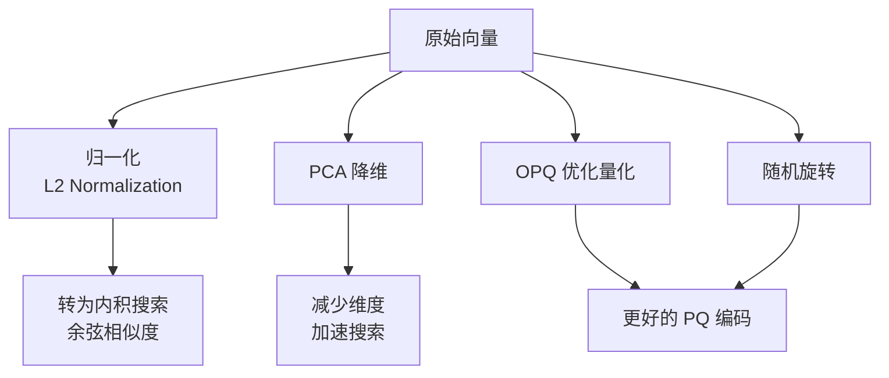
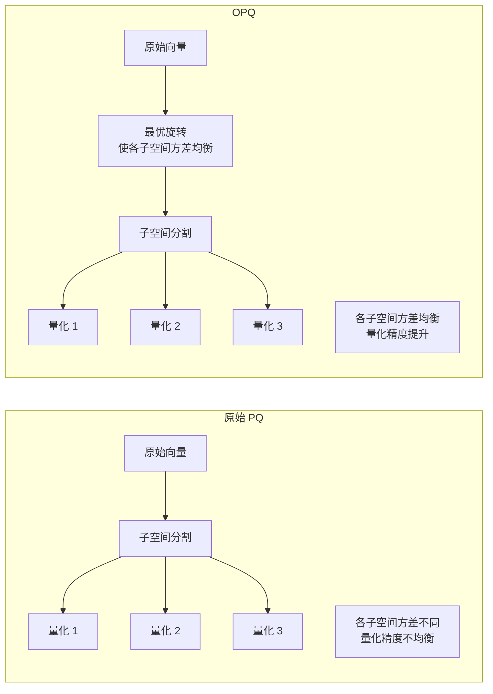

# 预处理与索引优化

## 学习目标

- 掌握 Faiss 的向量预处理技术
- 理解索引参数调优的基本原则

## 预处理方法



### L2 归一化

将向量归一化为单位长度，使内积等价于余弦相似度：

```python
import numpy as np

# L2 归一化
xb = np.random.random((10000, 128)).astype('float32')
faiss.normalize_L2(xb)  # in-place

# 使用内积距离搜索
index = faiss.IndexFlatIP(128)
index.add(xb)
```

### PCA 降维

```python
# PCA 降维: 128 维 → 64 维
pca_matrix = faiss.PCAMatrix(128, 64)
pca_matrix.train(xb)
xb_pca = pca_matrix.apply(xb)

# 可同时做归一化
pca_matrix.parameterset("eigen_power", 1)  # 白化
```

### OPQ（Optimized Product Quantization）

OPQ 通过旋转优化 PQ 的量化效果：



```python
# OPQ 预处理
opq = faiss.OPQMatrix(128, 8)  # 128 维, 8 子空间
opq.train(xb)
xb_opq = opq.apply(xb)
```

## 索引参数调优

### 自动调优工具

Faiss 提供 `AutoTune` 模块自动搜索最佳参数：

```python
# 定义参数空间
params = faiss.ParameterSpace()
params.initialize(index)

# 自动调优
params.explore(index, xb, xq, k=10)
```

### 手动调优指南

| 场景 | 推荐索引 | 参数建议 |
|------|---------|---------|
| 小数据 (<10K) | Flat | - |
| 中数据 (<1M) | HNSW32Flat | efSearch=64-128 |
| 大数据 (<10M) | IVFPQ | nlist=sqrt(N), nprobe=10-50 |
| 超大 (<100M) | IVFPQ+OPQ | m=8-32, nbits=8 |
| 极高精度 | IVF4096,Flat | nprobe=100+ |
| 极低内存 | PQ (m=4) | 压缩比 128x |

### 调优流程

```mermaid
flowchart TD
    START[确定数据集和精度要求] --> SELECT[选择索引类型<br/>Flat/IVF/HNSW/PQ]
    SELECT --> INIT[初始参数<br/>默认值]
    INIT --> EVAL[评估召回率@K<br/>和 QPS]
    EVAL --> SAT{满足要求?}
    SAT -->|否| ADJUST[调整参数<br/>nprobe/M/efSearch]
    ADJUST --> EVAL
    SAT -->|是| DONE[确定参数配置]
```

## 混合搜索策略

```python
# 先粗筛再精排
coarse_index = faiss.IndexIVFPQ(quantizer, d, nlist=100, m=8, nbits=8)
coarse_index.nprobe = 20

# 第一轮: 粗筛获取 1000 个候选
D, I = coarse_index.search(xq, k=1000)

# 第二轮: 用原始向量精排
exact_index = faiss.IndexFlatL2(d)
exact_index.add(original_vectors)
re_ranked_D, re_ranked_I = exact_index.search(xq, k=10)

# 或用 reconstruct 精排
for i in I[0]:
    reconstructed = coarse_index.reconstruct(i)
    exact_dist = np.linalg.norm(xq[0] - reconstructed)
```

## 要点总结

- 预处理（归一化/PCA/OPQ）可以显著提升搜索精度
- OPQ 通过旋转使 PQ 量化更均衡
- AutoTune 模块可自动搜索最佳参数组合
- 粗筛 + 精排的两阶段策略兼顾速度和精度

## 思考题

1. OPQ 的旋转矩阵是如何优化得到的？与 PCA 的关系是什么？
2. 归一化后使用 IP 距离与直接使用余弦相似度有什么区别？
3. 在两阶段搜索中，第一轮返回多少候选比较合理？