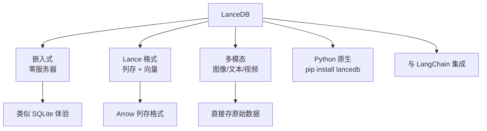

# LanceDB 项目概览

## 学习目标

- 了解 LanceDB 的开发者友好嵌入式向量数据库定位
- 掌握 LanceDB 基于 Lance 列存格式的设计

## 项目定位

> LanceDB 是一个开发者友好的嵌入式向量数据库，基于 Lance 列存格式构建，支持多模态数据。

**基本信息**：
- 开发方：LanceDB 社区
- 首次发布：2023 年
- 开源协议：Apache 2.0
- GitHub Stars：约 5k

## 核心设计



```python
import lancedb

db = lancedb.connect("./lancedb_data")
table = db.create_table("images", [
    {"vector": [0.1]*128, "image_uri": "img1.jpg"},
    {"vector": [0.2]*128, "image_uri": "img2.jpg"},
])
table.search([0.1]*128).limit(5).to_pandas()
```

## 要点总结

- 嵌入式，类似 SQLite 的体验
- 基于 Lance 列存格式，支持多模态
- 与 LangChain 等框架集成
- 适合原型和中小规模应用