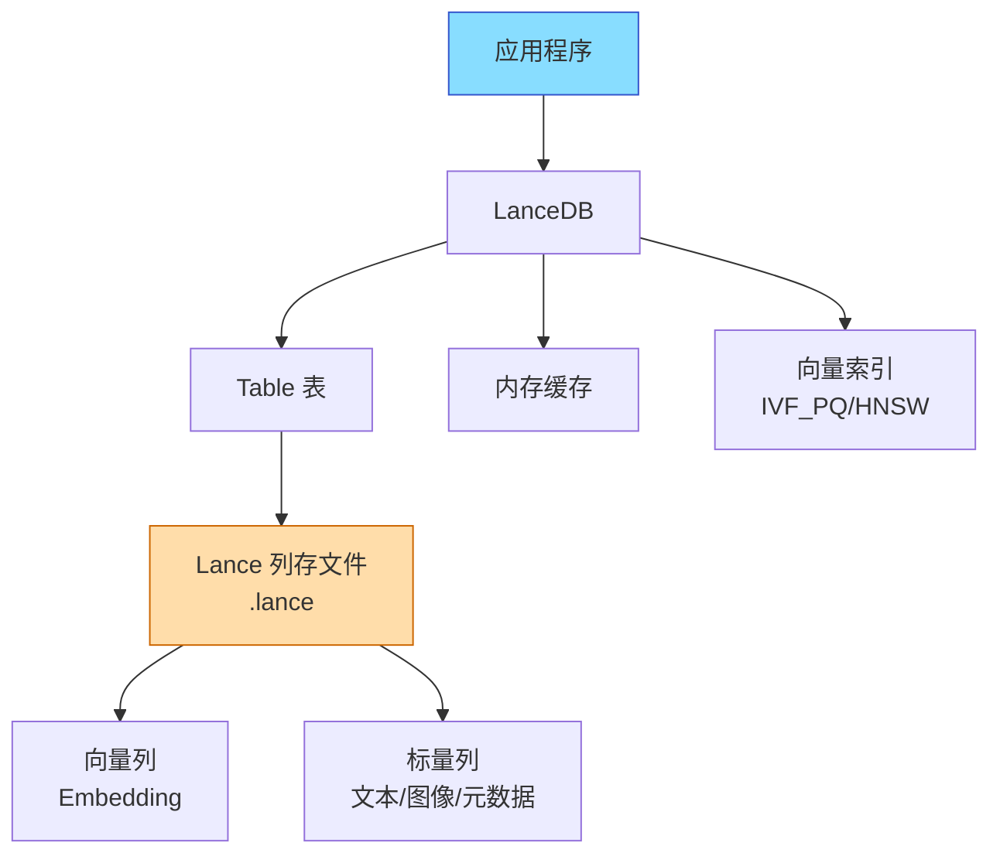
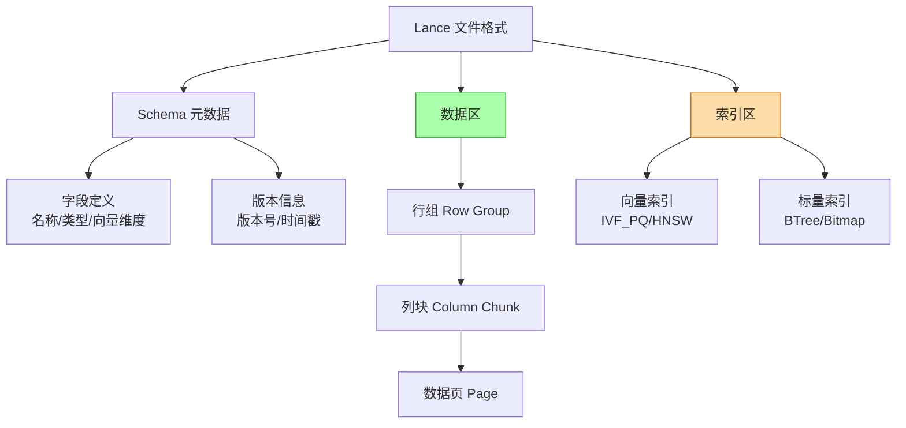
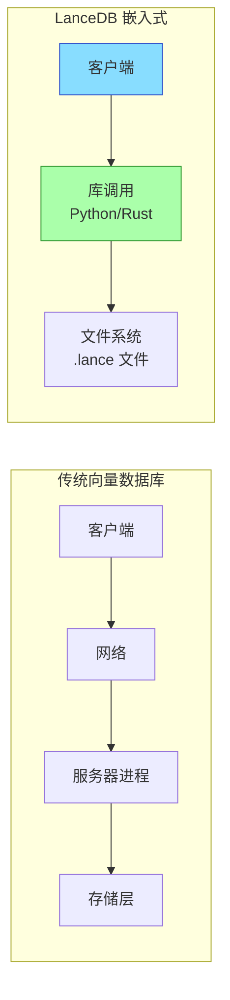
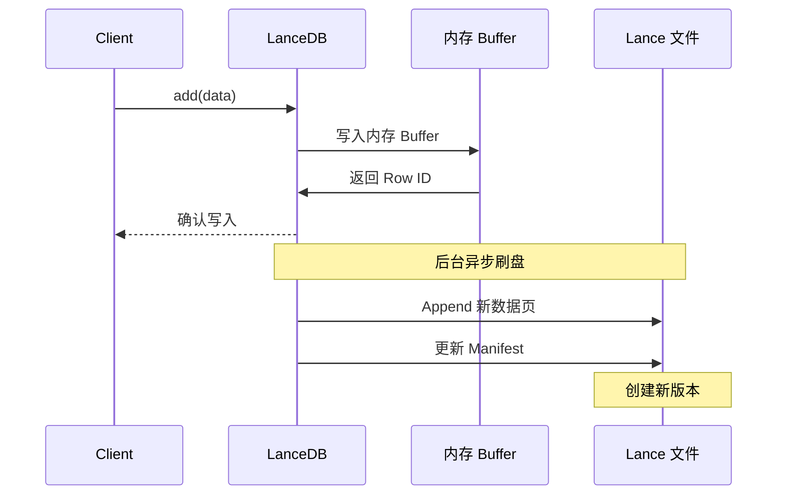
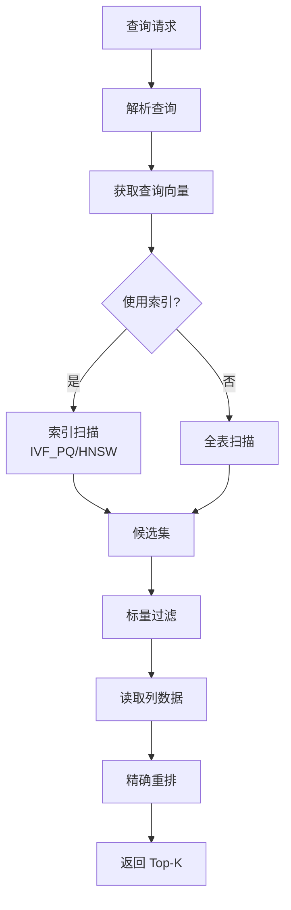
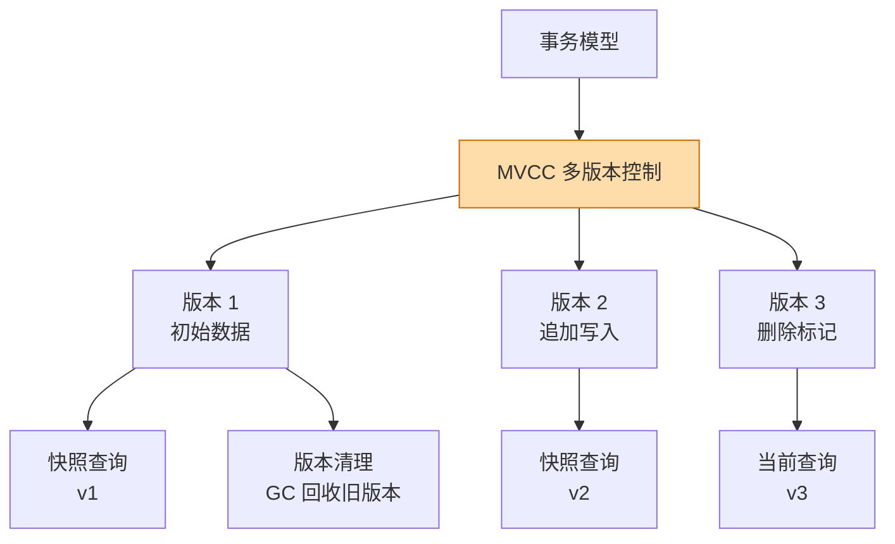
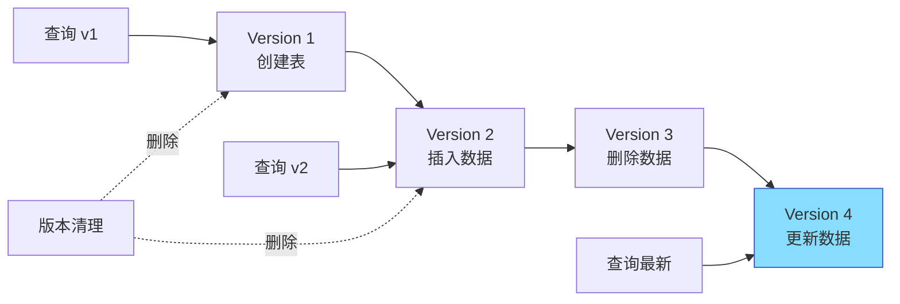

# LanceDB 整体架构

## 学习目标

- 理解 LanceDB 的嵌入式零服务器架构设计
- 掌握 Lance 列存格式的核心设计理念
- 了解数据读写路径和事务模型

## 核心概念

- **嵌入式架构**：类似 SQLite，无需独立服务器进程
- **Lance 格式**：专为向量数据设计的列存格式
- **Table**：数据表，包含多个列（向量列 + 标量列）
- **Version**：数据版本，支持 Time Travel 查询

## 架构总览

## Lance 列存格式设计

### Lance 与 Parquet 对比

| 特性 | Lance | Parquet |
|------|-------|---------|
| 向量列支持 | 原生支持 | 需自定义类型 |
| 随机访问 | O(1) 定位 | 需扫描 Row Group |
| 增量更新 | 支持 Append/Delete | 需重写整个文件 |
| 索引集成 | 向量索引内置 | 无内置索引 |
| 多模态数据 | 原生支持图像/视频 | 仅结构化数据 |

## 嵌入式架构设计

**嵌入式优势**：
- 零运维：无需部署、监控服务器
- 低延迟：无网络开销，直接文件访问
- 简单部署：`pip install lancedb` 即可
- 数据安全：数据文件可随应用分发

## 数据写入路径

## 数据读取路径

## 事务模型

**事务特性**：
- **快照隔离**：读操作看到某一版本的快照
- **单写多读**：同一时刻只有一个写事务
- **Time Travel**：可查询任意历史版本

## 版本管理

## 要点总结

- LanceDB 采用嵌入式架构，无服务器进程，类似 SQLite
- Lance 列存格式专为向量和多模态数据设计
- MVCC 多版本控制支持 Time Travel 查询
- 数据以文件形式存储，支持增量更新

## 思考题

1. Lance 列存格式相比 Parquet，在向量数据场景有哪些优势？
2. 嵌入式架构的优缺点是什么？什么场景适合使用？
3. MVCC 版本管理如何平衡存储空间和查询性能？