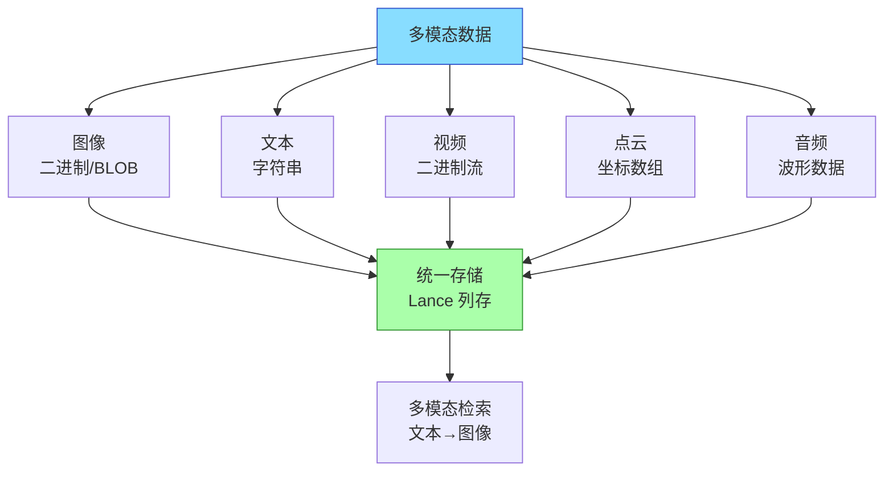
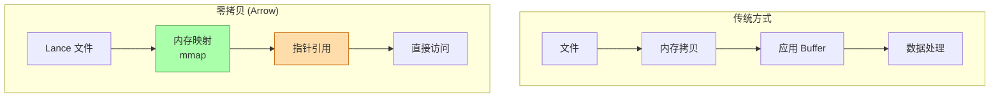
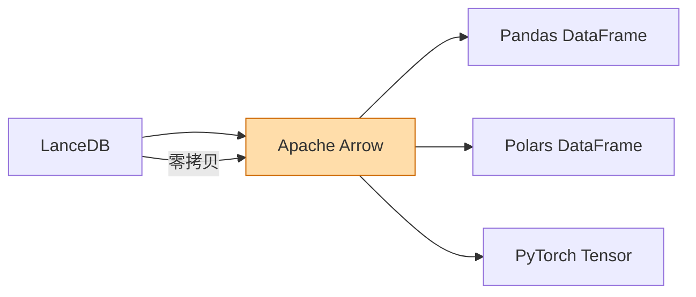
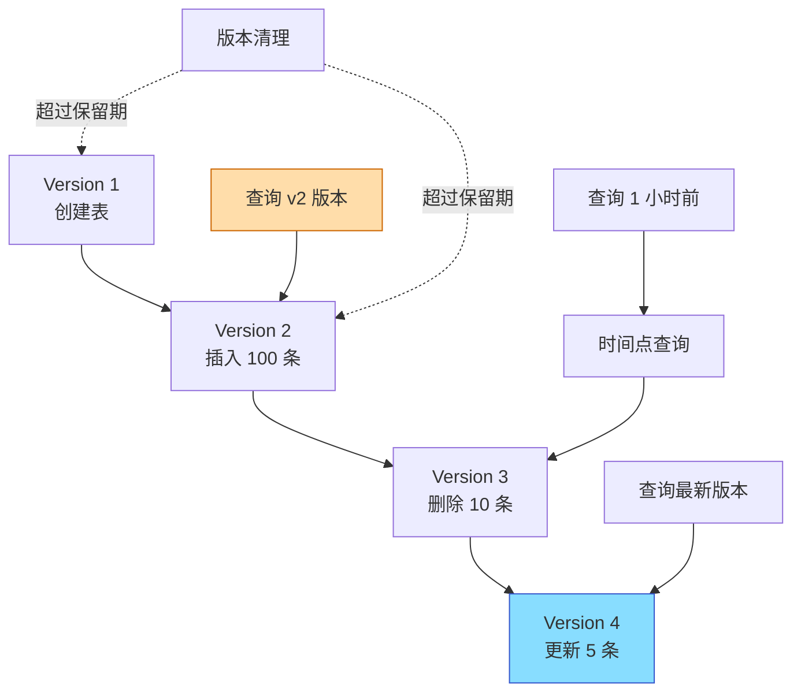
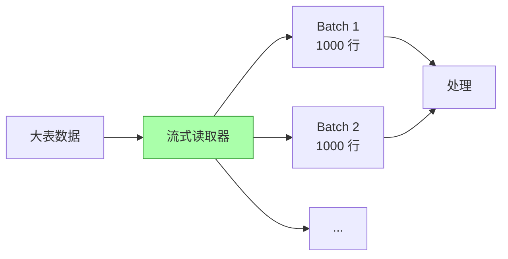

# LanceDB 关键特性

## 学习目标

- 掌握 LanceDB 的核心差异化特性
- 理解多模态数据支持和零拷贝读取的技术原理

## 多模态数据支持

LanceDB 原生支持多种数据类型，可直接存储原始数据：



```python
import lancedb

db = lancedb.connect("./multimodal_db")

# 创建多模态表
table = db.create_table("images", [
    {
        "vector": [0.1] * 512,        # 图像嵌入向量
        "image_uri": "s3://bucket/img1.jpg",
        "image_bytes": b"...",         # 原始图像数据
        "caption": "一只猫在草地上",
        "width": 1920,
        "height": 1080,
        "created_at": "2024-01-01"
    }
])

# 文本→图像检索
results = table.search(text_embedding) \
    .where("width > 1000") \
    .limit(10) \
    .to_pandas()
```

## 零拷贝读取



**零拷贝优势**：
- 内存效率：无需额外拷贝，节省内存
- 延迟降低：减少数据移动开销
- 大数据处理：TB 级数据可直接映射访问

## 与 Arrow/Pandas 集成



```python
import lancedb
import pandas as pd

db = lancedb.connect("./data")
table = db.open_table("vectors")

# 直接转换为 Pandas（零拷贝）
df = table.to_pandas()

# 从 Pandas 导入（零拷贝）
new_df = pd.DataFrame({
    "vector": [[0.1] * 128 for _ in range(100)],
    "label": [f"label_{i}" for i in range(100)]
})
table.add(new_df)

# Arrow 表直接访问
arrow_table = table.to_arrow()
```

## 版本控制（Time Travel）



```python
# 查看版本历史
versions = table.list_versions()
for v in versions:
    print(f"Version: {v.version}, Time: {v.timestamp}")

# 查询历史版本
old_table = db.open_table("vectors", version=2)
old_results = old_table.search(query_vec).limit(10)

# 按时间点查询
import datetime
past_table = db.open_table(
    "vectors",
    version=datetime.datetime.now() - datetime.timedelta(hours=1)
)
```

## 流式读取



```python
# 流式读取大数据
for batch in table.scanner(batch_size=10000):
    # 每次处理 10000 行
    process_batch(batch)

# 使用 Arrow 扫描器
scanner = table.scanner(
    columns=["vector", "label"],
    filter="label = 'A'",
    batch_size=5000
)

for batch in scanner.to_reader():
    # Arrow RecordBatch 流式处理
    vectors = batch.column("vector")
```

## 向量索引支持

| 索引类型 | 适用场景 | 特点 |
|---------|---------|------|
| IVF_PQ | 大规模数据 | 内存占用低，速度快 |
| HNSW | 高精度需求 | 极快查询，内存占用高 |
| IVF_HNSW | 平衡方案 | 折中精度和内存 |
|自定义| 灵活扩展| 支持自定义索引 |

```python
# 创建索引
table.create_index(
    "vector",
    index_type="IVF_PQ",
    metric="cosine",
    num_partitions=256,
    num_sub_vectors=16
)

# 搜索时自动使用索引
results = table.search(query_vec).limit(10)
```

## 要点总结

- 多模态数据支持：图像/文本/视频可直接存储
- 零拷贝读取：基于 Arrow 内存映射，高效访问
- 版本控制：Time Travel 查询历史版本
- 流式读取：支持大数据批量处理
- 多种索引：IVF_PQ/HNSW 适应不同场景

## 思考题

1. 多模态数据直接存储在向量数据库中，与传统分离存储方案相比有何优劣？
2. 零拷贝读取在什么场景下性能提升最明显？
3. 版本控制的历史版本保留策略如何设计？