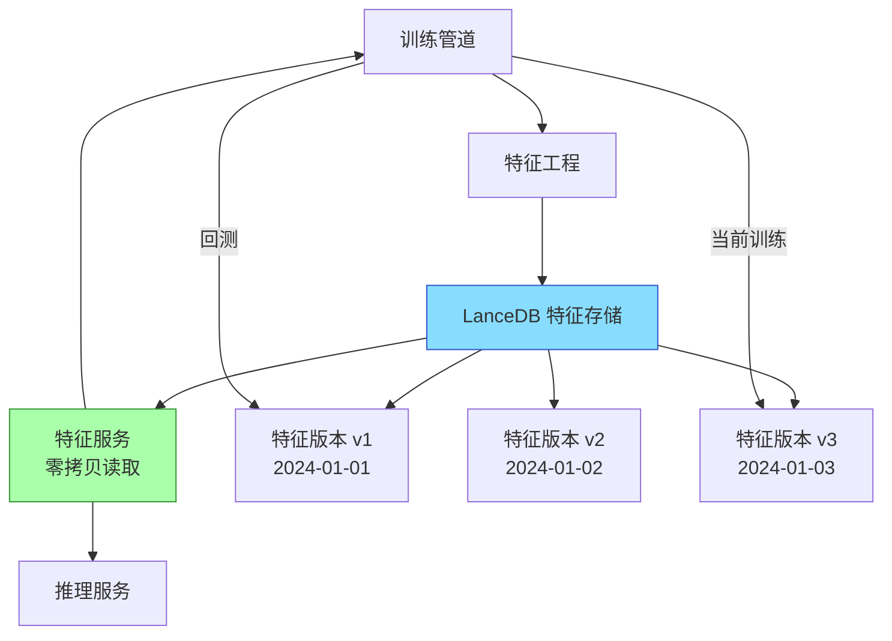
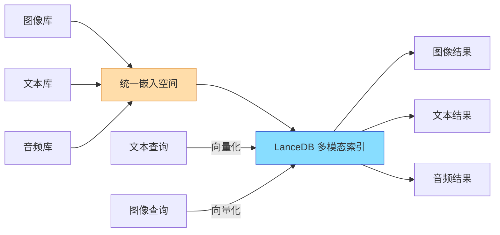
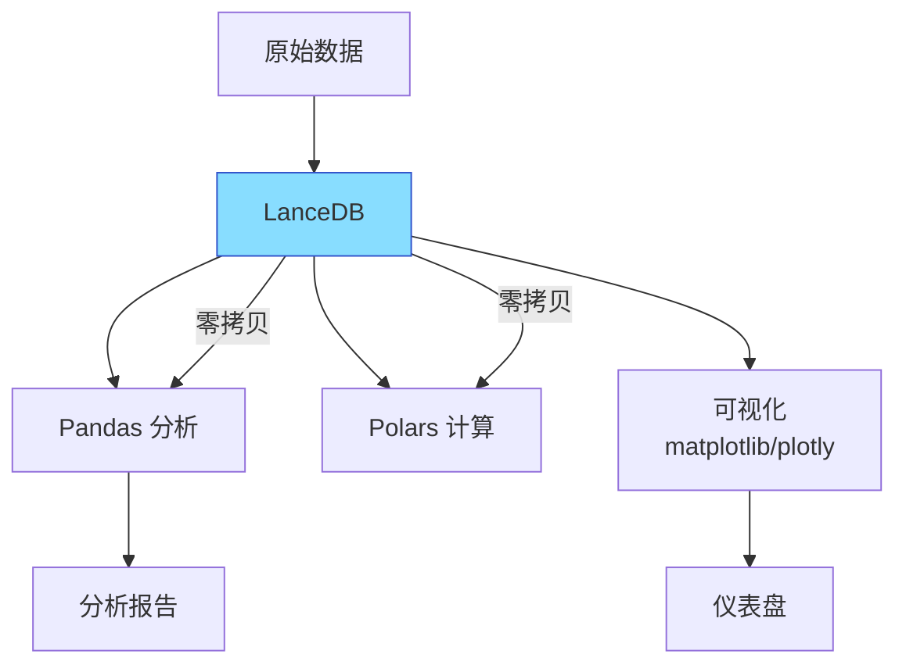
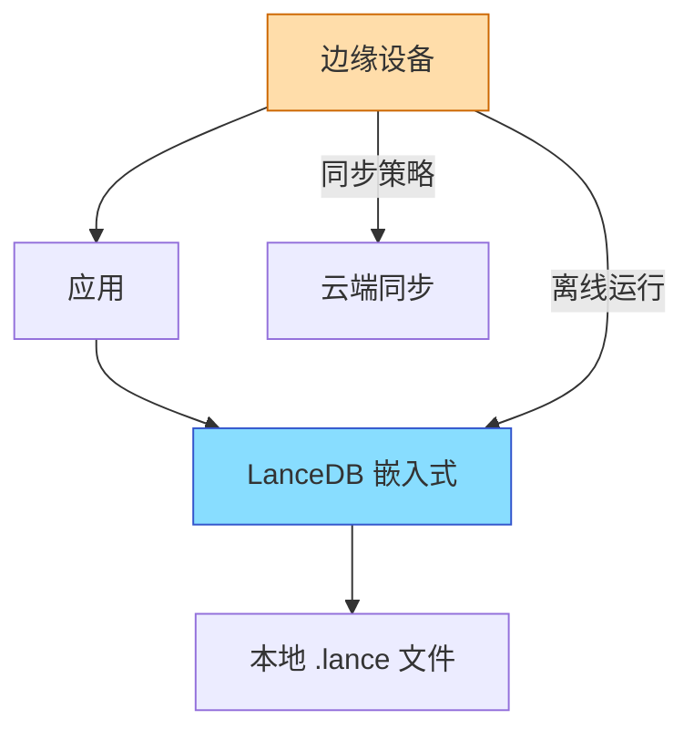

# LanceDB 使用场景

## 学习目标

- 掌握 LanceDB 的典型应用场景
- 理解场景与特性的对应关系

## ML 特征存储



**ML 特征存储场景**：
- 训练和推理共享相同特征管道
- 时间旅行回测历史特征
- 大模型训练数据管道

```python
import lancedb
import pandas as pd
from sklearn.model_selection import train_test_split

db = lancedb.connect("./feature_store")

# 写入特征
features = pd.DataFrame({
    "user_id": range(1, 10001),
    "embedding": [compute_embedding(uid) for uid in range(1, 10001)],
    "age_feature": [random.randint(18, 60) for _ in range(10000)],
    "click_count": [random.randint(0, 1000) for _ in range(10000)],
    "date": "2024-01-01"
})

table = db.create_table("user_features", features)

# 版本管理：每日特征快照
table_prev = db.create_table("user_features_prev", features_prev_day)

# 回测：加载历史特征
historical_features = db.open_table("user_features", version=2)
X_train, X_test = train_test_split(historical_features.to_pandas())
```

## 多模态搜索



```python
# 图像+文本混合检索
table = db.create_table("catalog", [
    {
        "vector": img_embedding,
        "image_url": "s3://products/chair.jpg",
        "title": "现代简约办公椅",
        "price": 299.0,
        "category": "家具"
    },
    {
        "vector": text_embedding,
        "image_url": "s3://products/desk.jpg",
        "title": "升降桌",
        "price": 599.0,
        "category": "家具"
    },
])

# 图文互搜
results = table.search(
    "舒适的办公椅"  # 自动文本向量化
).limit(10).to_pandas()
```

## 数据科学分析



**数据分析场景**：
- 10 亿行级别数据探索
- 向量相似性 + 标量聚合分析
- 大模型嵌入分析和可视化

```python
import lancedb
import plotly.express as px

db = lancedb.connect("./analytics")
table = db.open_table("logs")

# 零拷贝加载到 Pandas
df = table.to_pandas()

# 聚合分析
agg_df = df.groupby("category").agg({
    "vector_mean": "mean",
    "count": "count"
})

# 向量相似性分析
similar = table.search(query_vector).limit(100).to_pandas()
fig = px.scatter_3d(similar, x="dim1", y="dim2", z="dim3", color="category")
```

## 嵌入式应用



**嵌入式场景**：
- 移动端/边缘设备离线搜索
- 浏览器端 WASM 向量检索
- 桌面应用本地数据管理

```python
# 嵌入式应用：离线推荐
db = lancedb.connect("./local_recommendations")
table = db.create_table("local_recommendations", [
    {"vector": item_vec, "item_id": "item_1", "title": "本地文章"},
    {"vector": item_vec, "item_id": "item_2", "title": "缓存内容"},
])

# 离线推荐
results = table.search(user_embedding).limit(5).to_pandas()
```

## 场景选择矩阵

| 场景 | 使用特性 | 推荐理由 |
|------|---------|---------|
| ML 特征存储 | 版本控制 + 零拷贝 | 历史回测 + 高效特征读取 |
| 多模态搜索 | 多模态列存 + 向量索引 | 图文音视频统一存储检索 |
| 数据分析 | Arrow 集成 + 零拷贝 | 零拷贝对接 Pandas/Polars |
| 嵌入式应用 | 零服务器 + 轻量 | 免运维，离线可用 |
| 原型验证 | 快速部署 | `pip install` 即刻使用 |

## 要点总结

- ML 特征存储：版本控制支持回测，零拷贝支持高效读取
- 多模态搜索：图文音视频统一存储和检索
- 数据分析：零拷贝对接 Pandas/Polars，适合大数据分析
- 嵌入式应用：零服务器设计适合边缘设备
- 场景选择：根据部署方式、数据规模和性能需求选择

## 思考题

1. ML 特征存储场景中，版本控制如何保证训练和推理的特征一致性？
2. 多模态搜索中，不同模态的向量如何对齐到同一语义空间？
3. 嵌入式场景中，大量数据如何与云端同步？