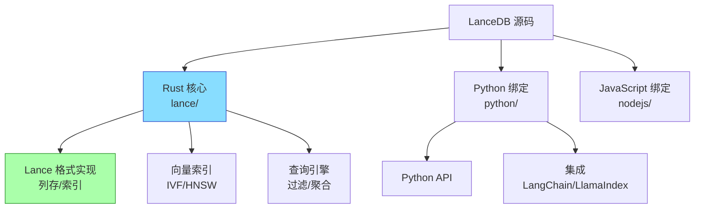
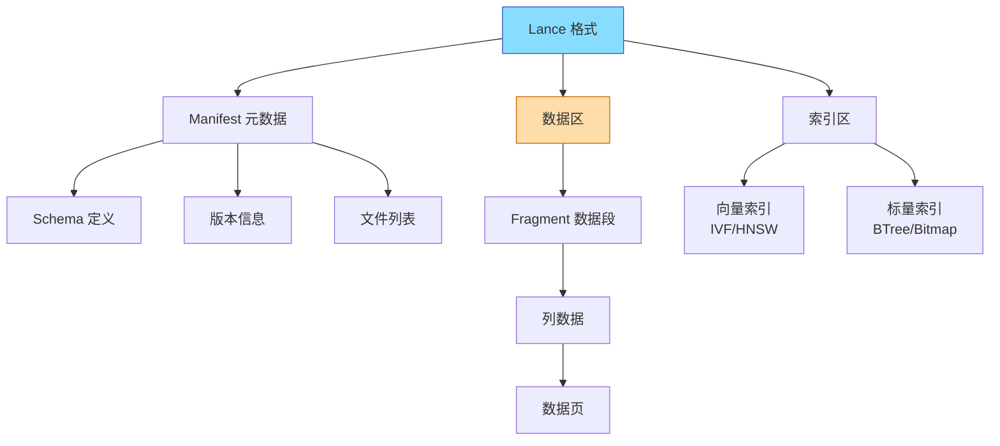
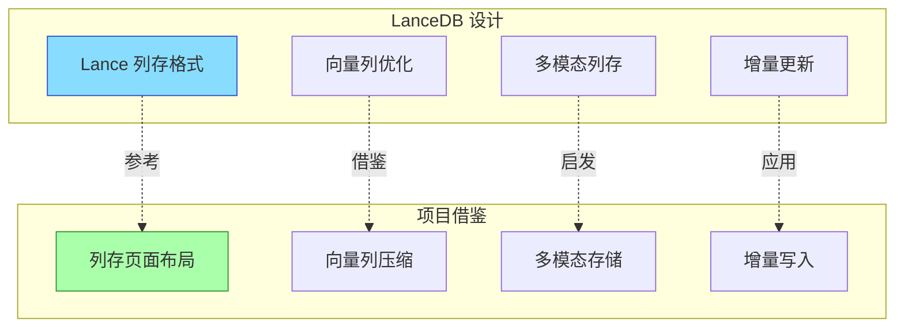
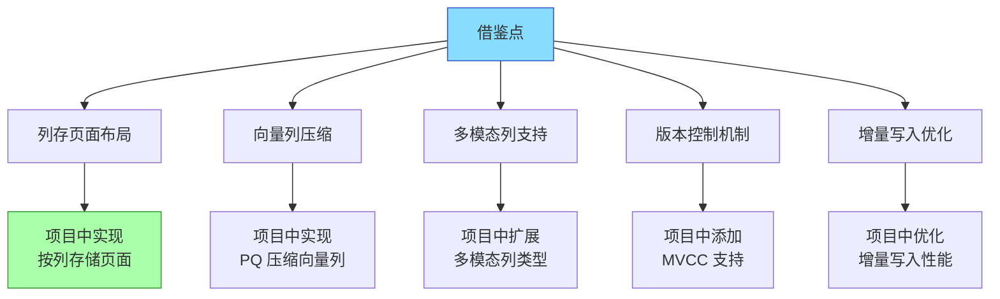

# LanceDB 学习资源与项目关联

## 学习目标

- 获取 LanceDB 的学习资源
- 分析 LanceDB 设计对项目的启发

## 学习资源

### 官方资源

- **官方文档**：[https://lancedb.github.io/lancedb/](https://lancedb.github.io/lancedb/)
- **GitHub 仓库**：[https://github.com/lancedb/lancedb](https://github.com/lancedb/lancedb)
- **Lance 格式规范**：[https://lancedb.github.io/lance/](https://lancedb.github.io/lance/)

### 源码研读



### 核心源码目录

| 目录 | 说明 | 学习重点 |
|------|------|---------|
| `rust/lance/` | Lance 格式核心实现 | 列存编码、索引结构 |
| `rust/lance-index/` | 向量索引实现 | IVF_PQ、HNSW 算法 |
| `rust/lancedb/` | 数据库核心 | 查询优化、事务管理 |
| `python/lancedb/` | Python SDK | API 设计、集成方式 |

### 学习路径


## Lance 格式规范

Lance 是专为向量和多模态数据设计的列存格式：



### Lance 格式特点

| 特性 | 说明 | 优势 |
|------|------|------|
| 列存布局 | 按列存储向量数据 | 向量列高效压缩 |
| 随机访问 | O(1) 定位行 | 快速随机读取 |
| 增量更新 | Append/Delete 支持 | 无需重写文件 |
| 版本管理 | MVCC 多版本 | Time Travel 查询 |
| 索引集成 | 向量索引内置 | 搜索性能优化 |

## 项目启发

### 列存格式对存储布局的启发



```c
// 项目中可借鉴的列存页面设计
typedef struct {
    page_type_t type;           // 页面类型
    column_id_t column_id;      // 列 ID
    uint32_t row_count;         // 行数
    uint32_t compressed_size;   // 压缩后大小
    uint8_t data[];             // 列数据（压缩）
} column_page_t;

// 向量列压缩（借鉴 Lance 的 PQ 压缩）
typedef struct {
    uint8_t codebook_id;        // 码本 ID
    uint8_t codes[];            // PQ 编码后的向量
} compressed_vector_page_t;
```

### 多模态数据存储设计

```c
// 借鉴 LanceDB 的多模态列设计
typedef enum {
    COL_TYPE_VECTOR,    // 向量列
    COL_TYPE_IMAGE,     // 图像列（BLOB）
    COL_TYPE_TEXT,      // 文本列
    COL_TYPE_VIDEO,     // 视频列
    COL_TYPE_AUDIO,     // 音频列
    COL_TYPE_POINTCLOUD // 点云列
} multimodal_column_type_t;

typedef struct {
    column_id_t id;
    multimodal_column_type_t type;
    uint32_t dimension;     // 向量维度（仅向量列）
    compression_t compress; // 压缩方式
} multimodal_column_def_t;
```

### 嵌入式设计与项目向量引擎对比

| 设计要素 | LanceDB | 项目向量引擎 |
|---------|---------|-------------|
| 服务器模式 | 嵌入式，零服务器 | 支持嵌入式 + 服务器 |
| 数据格式 | Lance 列存 | 自定义页面格式 |
| 索引实现 | Rust 实现 | C 实现 |
| 多模态支持 | 原生支持 | 规划中 |
| 版本控制 | MVCC 内置 | 待实现 |

### 可借鉴的设计模式



## 要点总结

- LanceDB 源码结构清晰，核心在 Rust 实现
- Lance 格式是专为向量设计的列存格式
- 列存布局对项目的存储引擎页面设计有启发
- 多模态列支持可直接借鉴到项目中
- 嵌入式架构设计适合边缘计算场景