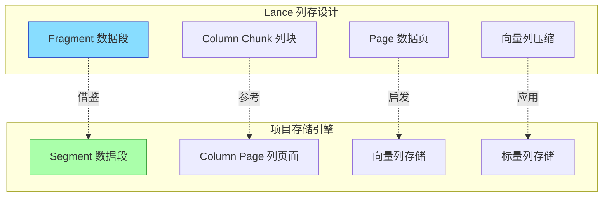
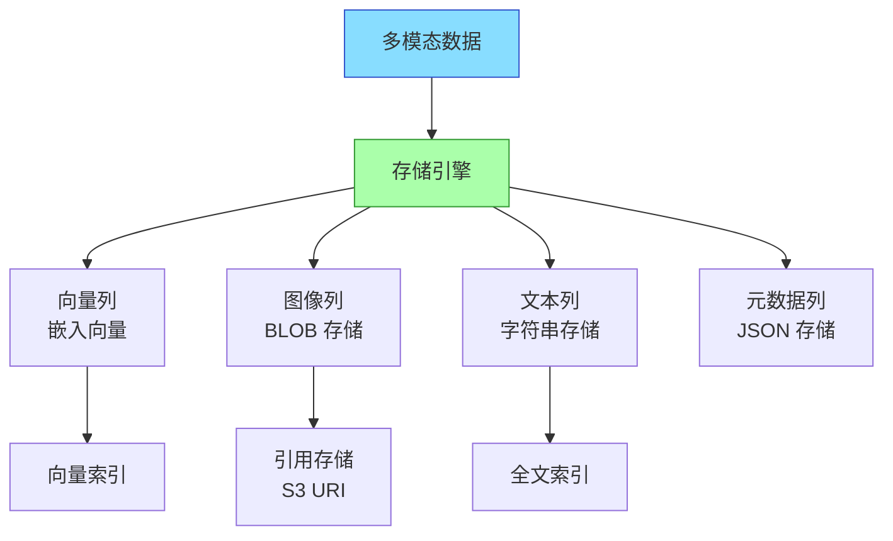
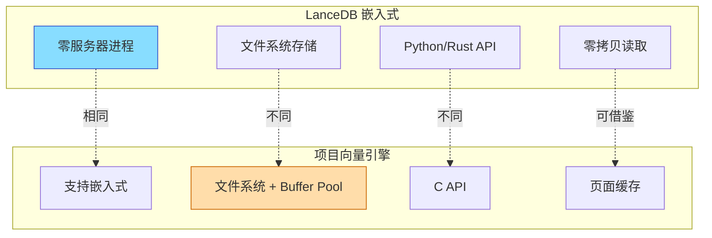

# 与项目关联

## 学习目标

- 分析 LanceDB 设计对项目存储引擎的启发性
- 找出项目中可借鉴的关键技术点

## Lance 列存格式对项目存储布局的启发

LanceDB 的 Lance 列存格式对项目存储引擎的页面布局设计有直接参考意义：



### 当前后端页面设计

```c
// 项目当前的页面结构（行存为主）
typedef struct {
    page_header_t header;
    tuple_id_t tuple_count;
    char data[PAGE_SIZE - sizeof(page_header_t)];
} heap_page_t;

// 借鉴 Lance 列存设计后的页面结构
typedef struct {
    page_header_t header;
    column_id_t column_id;      // 列 ID
    uint32_t row_count;         // 行数
    uint32_t null_count;        // NULL 数量
    uint32_t compressed_size;   // 压缩后大小
    compression_type_t compress;// 压缩方式
    char data[];                // 列数据
} columnar_page_t;
```

### 向量列存储设计

```c
// 借鉴 Lance 的向量列设计
typedef struct {
    columnar_page_t base;
    
    // 向量列特有字段
    uint32_t dimension;         // 向量维度
    vector_type_t vec_type;     // 向量类型（FLOAT32/INT8/BINARY）
    distance_metric_t metric;   // 距离度量（COSINE/L2/IP）
    
    // 压缩信息（如果启用）
    pq_codebook_t *codebook;    // PQ 码本（可选）
    uint8_t pq_codes[];         // PQ 编码后的向量
} vector_column_page_t;
```

## 多模态数据直接存储的设计

LanceDB 支持直接存储图像/文本/视频等原始数据，项目中可借鉴此设计：



```c
// 项目中多模态列的定义
typedef enum {
    COL_TYPE_VECTOR,        // 向量列
    COL_TYPE_IMAGE_BLOB,    // 图像 BLOB
    COL_TYPE_IMAGE_URI,     // 图像 URI（外部存储引用）
    COL_TYPE_TEXT,          // 文本
    COL_TYPE_VIDEO_URI,     // 视频 URI
    COL_TYPE_AUDIO_BLOB,    // 音频 BLOB
    COL_TYPE_JSON           // JSON 元数据
} multimodal_column_type_t;

typedef struct {
    column_id_t id;
    char name[64];
    multimodal_column_type_t type;
    
    // 向量列特有
    uint32_t dimension;
    distance_metric_t metric;
    
    // 文本列特有
    bool enable_fulltext;
    
    // 元数据
    bool nullable;
    compression_type_t compression;
} multimodal_column_def_t;
```

## 嵌入式设计与项目向量引擎的对比



### 对比分析

| 设计要素 | LanceDB | 项目向量引擎 | 差异分析 |
|---------|---------|-------------|---------|
| 部署模式 | 纯嵌入式 | 嵌入式 + 服务器 | 项目更灵活 |
| 存储格式 | Lance 列存 | 页面格式 | 需优化列存支持 |
| 索引实现 | Rust HNSW/IVF | C HNSW | 语言不同，算法可借鉴 |
| 多模态支持 | 原生支持 | 规划中 | 需实现列类型扩展 |
| 版本控制 | MVCC 内置 | 无 | 需实现 Time Travel |
| 零拷贝 | Arrow mmap | Buffer Pool | 可借鉴 mmap 方案 |

## 可借鉴的技术点

### 1. 列存页面布局

```c
// 借鉴 Lance 的列存页面设计
typedef struct column_page {
    page_header_t header;
    column_id_t column_id;
    uint32_t row_count;
    
    // 列统计信息（用于查询优化）
    min_max_t min_max;       // 最小/最大值
    null_bitmap_t nulls;     // NULL 位图
    
    // 数据压缩
    compression_type_t type;
    uint32_t uncompressed_size;
    char compressed_data[];
} column_page_t;

// 向量列页面（支持 PQ 压缩）
typedef struct vector_column_page {
    column_page_t base;
    uint32_t dimension;
    pq_codebook_t codebook;  // PQ 码本
    uint8_t pq_codes[];      // 压缩后的向量编码
} vector_column_page_t;
```

### 2. MVCC 版本控制

```c
// 借鉴 Lance 的版本控制设计
typedef struct {
    version_t version;           // 版本号
    timestamp_t created_at;      // 创建时间
    operation_t operation;       // 操作类型（CREATE/INSERT/DELETE）
    file_manifest_t *manifest;   // 文件清单
    version_t parent_version;    // 父版本
} version_info_t;

typedef struct {
    version_info_t *versions;    // 版本链
    uint32_t count;
    version_t current_version;   // 当前版本
} version_chain_t;

// 快照读取
table_snapshot_t *table_open_snapshot(table_t *table, version_t version);
```

### 3. 多模态列支持

```c
// 扩展项目的列类型定义
typedef enum {
    // 原有类型
    COL_TYPE_INT,
    COL_TYPE_FLOAT,
    COL_TYPE_DOUBLE,
    COL_TYPE_VARCHAR,
    
    // 新增多模态类型
    COL_TYPE_VECTOR,         // 向量
    COL_TYPE_BLOB,           // 二进制（图像/视频）
    COL_TYPE_JSON,           // JSON
    COL_TYPE_URI,            // URI 引用
} column_type_t;

// 表定义扩展
typedef struct {
    char name[64];
    column_type_t type;
    
    // 向量列参数
    struct {
        uint32_t dimension;
        distance_metric_t metric;
    } vector_params;
    
    // BLOB 列参数
    struct {
        uint32_t max_size;
        bool external_ref;   // 外部引用
    } blob_params;
} column_def_t;
```

### 4. 零拷贝读取

```c
// 借鉴 Lance 的 mmap 零拷贝设计
typedef struct {
    int fd;                  // 文件描述符
    void *mapped_addr;       // mmap 地址
    size_t mapped_size;      // 映射大小
    column_page_t *page;     // 页面指针
} zero_copy_page_t;

// 零拷贝页面访问
zero_copy_page_t *zero_copy_get_page(
    buffer_pool_t *pool,
    page_id_t page_id
) {
    // 检查是否已映射
    zero_copy_page_t *zc = find_mapped_page(pool, page_id);
    if (zc) return zc;
    
    // mmap 文件
    int fd = open_page_file(page_id);
    void *addr = mmap(NULL, PAGE_SIZE, PROT_READ, MAP_PRIVATE, fd, offset);
    
    return register_mapped_page(pool, page_id, fd, addr);
}
```

## 要点总结

- Lance 列存格式对项目的页面布局设计有直接启发
- 多模态列支持可扩展项目的列类型定义
- MVCC 版本控制支持 Time Travel 查询
- 零拷贝读取可优化项目的 Buffer Pool 访问

## 思考题

1. 项目中如果实现列存页面布局，需要修改哪些模块？
2. 多模态列存储与现有的行存页面如何兼容？
3. MVCC 版本控制在项目中的实现难点是什么？