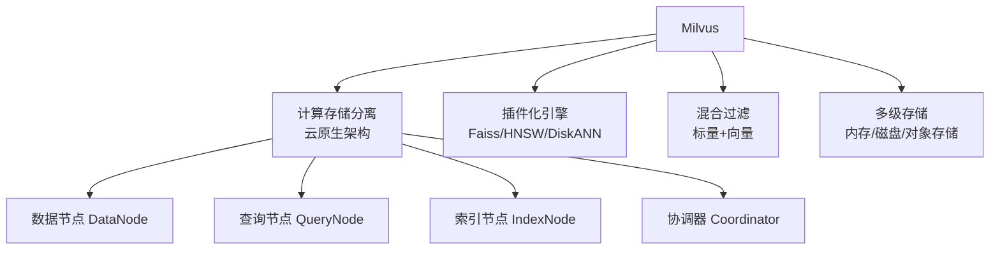
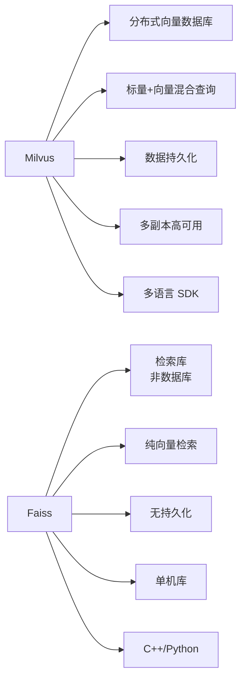
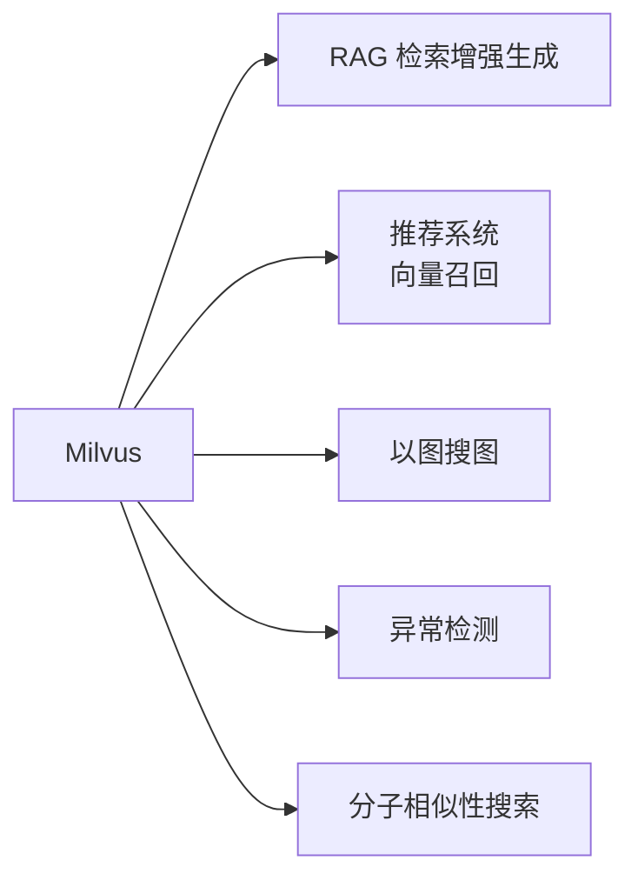
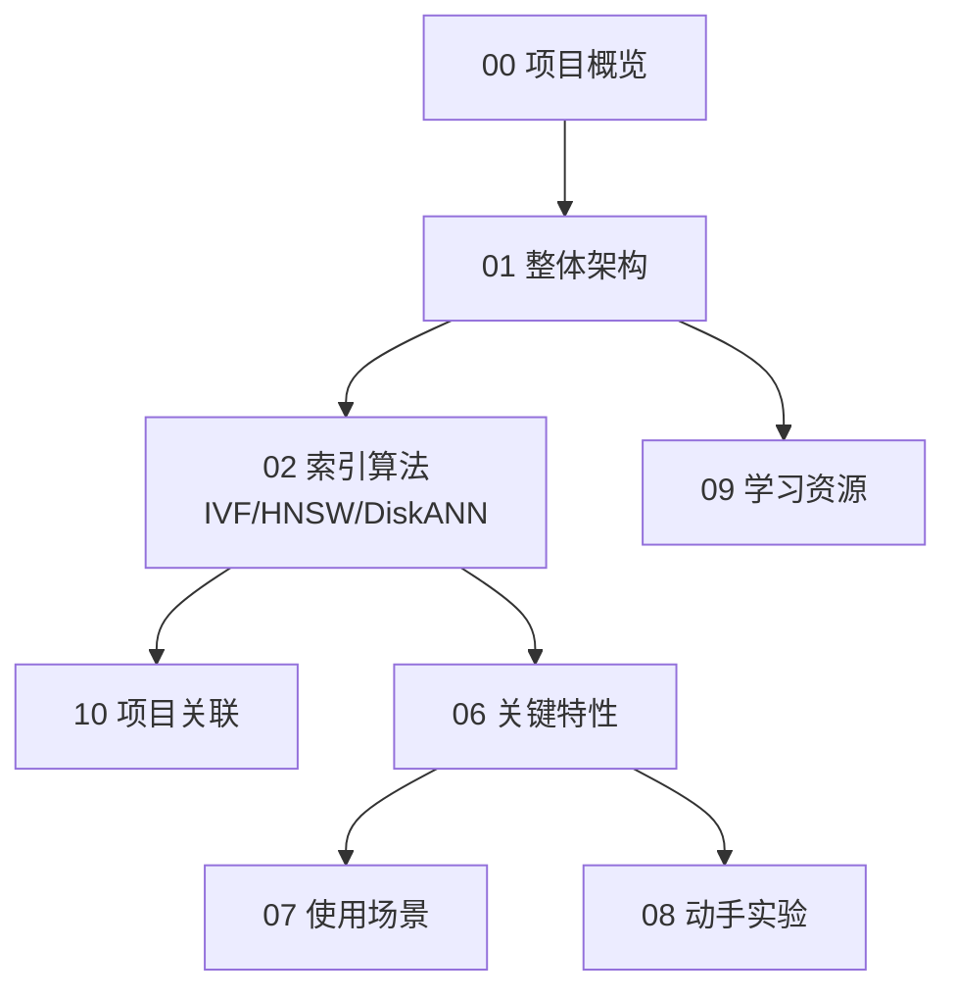

# Milvus 项目概览

## 学习目标

- 了解 Milvus 的项目定位、历史脉络与社区生态
- 掌握 Milvus 的核心设计理念与适用场景

## 项目定位

> Milvus 是一个开源的、云原生的向量数据库，专为向量相似性搜索和 AI 应用设计，由 Zilliz 开发维护。

**基本信息**：

- 开发方：Zilliz
- 首次发布：2019 年
- 开源协议：Apache 2.0
- 最新版本：2.5.x（截至 2026 年）
- GitHub Stars：约 33k（[milvus-io/milvus](https://github.com/milvus-io/milvus)）
- 官方网站：[https://milvus.io](https://milvus.io)

## 核心设计理念

Milvus 的设计围绕四个核心理念：**云原生分离架构**、**插件化向量引擎**、**标量向量混合过滤**、**多级存储分层**。

第一，**云原生分离架构**。Milvus 2.x 采用计算存储分离架构，将数据面（存储/索引）和控制面（协调/调度）分离，各组件独立扩缩容。

第二，**插件化向量引擎**。Milvus 内部集成多个向量检索引擎（Faiss、HNSWlib、DiskANN 等），用户可根据场景选择最优索引。

第三，**标量向量混合过滤**。Milvus 支持在向量搜索的同时进行标量字段过滤（Attribute Filtering），且过滤下推到存储层。

第四，**多级存储分层**。数据在内存、磁盘、对象存储之间分级，冷热分离降低成本。

## 与 Faiss 的对比

## 适用场景

- **RAG**：存储文档嵌入，检索后生成 LLM 上下文
- **推荐系统**：用户嵌入向量相似性匹配
- **图像/视频检索**：以图搜图、视频帧检索
- **多模态搜索**：文本+图像联合检索

## 学习路线图

## 要点总结

- Milvus 是云原生向量数据库，采用计算存储分离架构
- 内部集成多种向量索引引擎，灵活切换
- 支持标量过滤 + 向量搜索的混合查询
- 适合 AI 应用中的大规模向量检索场景

## 思考题

1. Milvus 2.x 的计算存储分离架构相比 1.x 的整体架构有什么优势？
2. 插件化引擎设计如何影响查询性能和索引构建？
3. Milvus 的标量过滤下推是如何实现的？