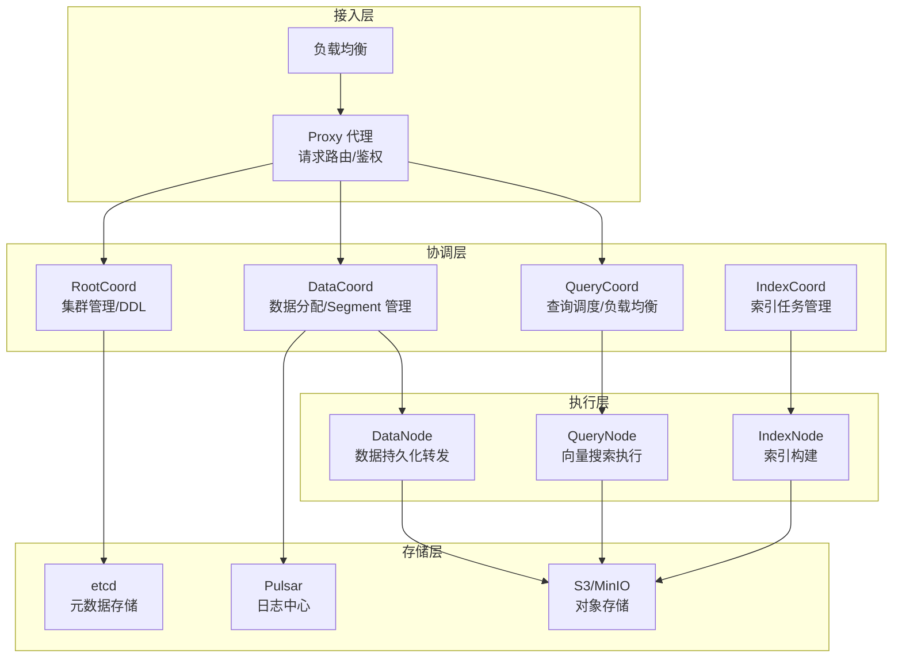
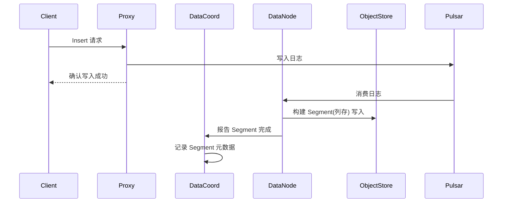
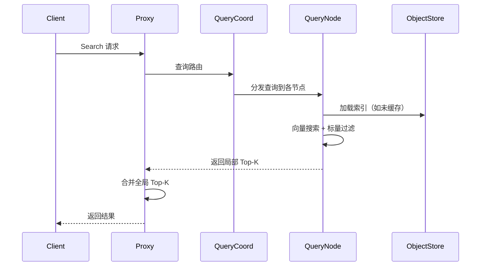
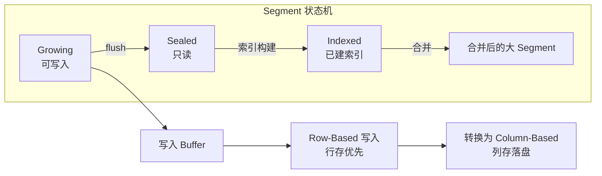

# Milvus 整体架构

## 学习目标

- 理解 Milvus 的云原生分层架构
- 掌握各组件职责和数据流转

## 核心概念

- **计算存储分离**：查询/索引/数据节点独立扩缩容
- **日志中心**：Pulsar 作为变更日志中心
- **元数据存储**：etcd 存储集群元数据
- **对象存储**：MinIO/S3 存储数据文件和索引
- **Segment**：数据管理单元，类似 LSM-Tree 的 SSTable

## 架构总览

## 数据写入流程

## 查询流程

## Segment 管理

## 要点总结

- Milvus 采用四层架构：接入层 → 协调层 → 执行层 → 存储层
- Pulsar 作为日志中心，解耦写入和索引构建
- 数据以 Segment 为单位管理，支持冷热分层
- 各组件可独立扩缩容，实现资源隔离

## 思考题

1. Pulsar 在 Milvus 中扮演什么角色？如果替换为 Kafka 会有什么影响？
2. QueryNode 如何管理内存中的索引？当索引超过内存大小时怎么办？
3. Segment 的 Growing → Sealed → Indexed 状态转换由谁触发？