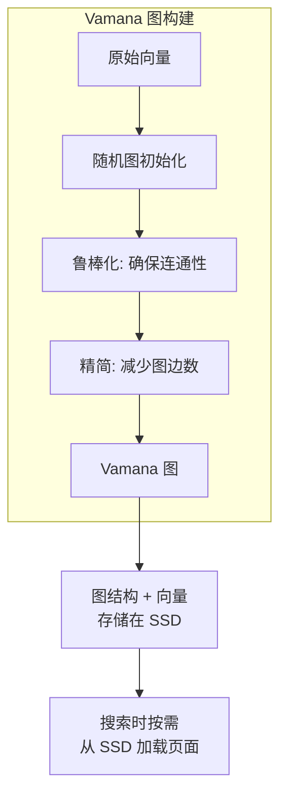
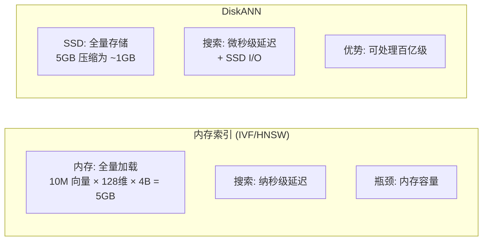

# Milvus DiskANN 索引

## 学习目标

- 理解 DiskANN 磁盘索引的设计原理
- 掌握 DiskANN 在大规模向量检索中的应用

## 原理

DiskANN 是微软提出的磁盘友好型 ANN 算法，核心使用 Vamana 图：



## DiskANN vs 内存索引



## 使用场景

```python
index_params = {
    "metric_type": "L2",
    "index_type": "DISKANN",
    "params": {
        "search_list": 100  # 构建搜索范围
    }
}
```

| 场景 | 推荐 |
|------|------|
| 数据量 > 内存容量 | ✅ DiskANN |
| 单机百亿级向量 | ✅ DiskANN |
| 延迟要求 < 10ms | ⚠️ 可能不满足 |
| 高并发 QPS | ⚠️ I/O 瓶颈 |

## 要点总结

- DiskANN 将图结构和向量存储在 SSD，按需加载
- Vamana 图设计为磁盘友好的图结构（连续页面访问）
- 适合超大规模（百亿级）向量的近似搜索
- 搜索延迟受 SSD 随机 I/O 限制

## 思考题

1. DiskANN 的 Vamana 图和 HNSW 的层次图相比，核心区别是什么？
2. 为什么 DiskANN 适合 SSD 顺序访问？
3. Milvus 中 DiskANN 索引在搜索时如何缓存热点页面？