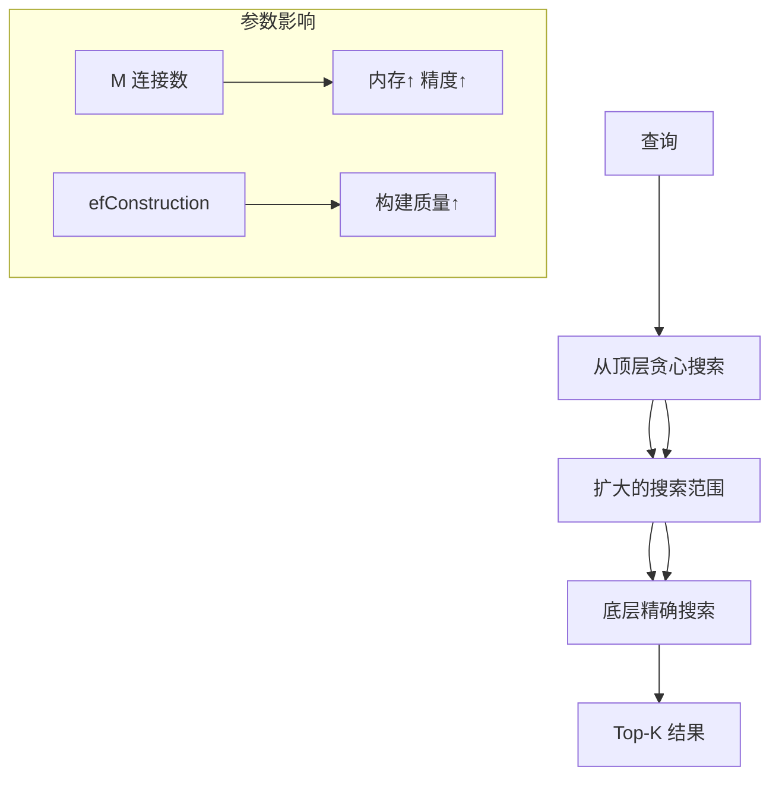
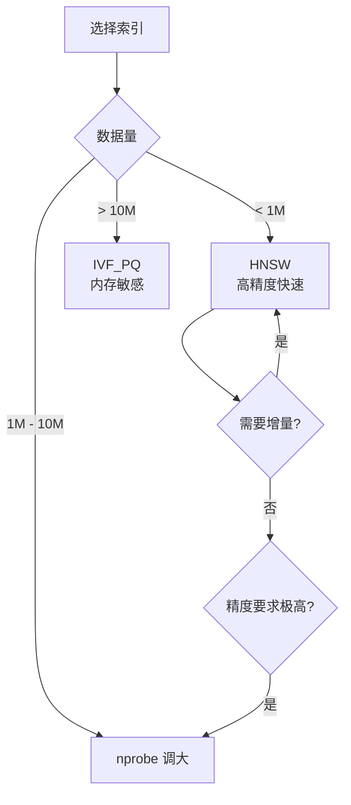

# Milvus HNSW 索引

## 学习目标

- 理解 Milvus 中 HNSW 索引的实现
- 掌握 HNSW 参数配置场景

## HNSW 原理

Milvus 集成了基于 HNSWlib 的 HNSW 实现，HNSW 是当前最流行的图索引之一：



## 参数配置

```python
index_params = {
    "metric_type": "L2",
    "index_type": "HNSW",
    "params": {
        "M": 32,                # 最大连接数，默认 32
        "efConstruction": 200   # 构建搜索范围，默认 200
    }
}

search_params = {
    "metric_type": "L2",
    "params": {"ef": 64}        # 搜索范围，越大越精确
}
```

## IVF vs HNSW 对比

| 维度 | IVF_FLAT | HNSW |
|------|---------|------|
| 训练 | 需要 K-Means 训练 | 无需训练 |
| 增量添加 | 需重建索引 | 原生支持 |
| 搜索速度 | 中等（依赖 nprobe） | 快（对数级） |
| 内存占用 | 中（存储原始向量） | 高（存图结构 + 向量） |
| 高精度 | nprobe 大时可达 | ef 大时可达 |
| 大数据集 | 适合（可配合 PQ） | 内存瓶颈 |

## 使用建议



## 要点总结

- HNSW 无需训练，支持增量添加向量
- M 控制图连接密度（内存-精度权衡）
- ef 在搜索时动态调节精度
- 适合中等规模（百万级）高精度场景

## 思考题

1. 当数据集持续增大时，HNSW 的搜索时间复杂度如何增长？
2. M=16 和 M=64 的场景分别适用于什么情况？
3. 在 Milvus 中，HNSW 索引构建支持分布式吗？