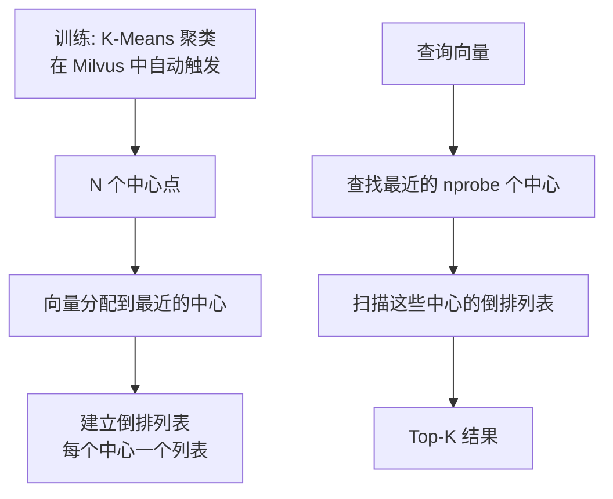
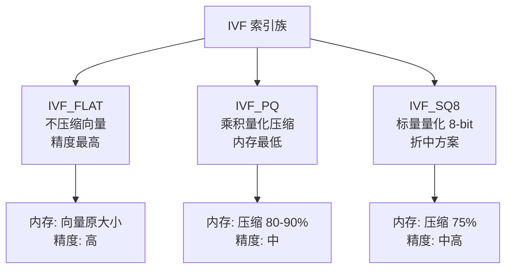
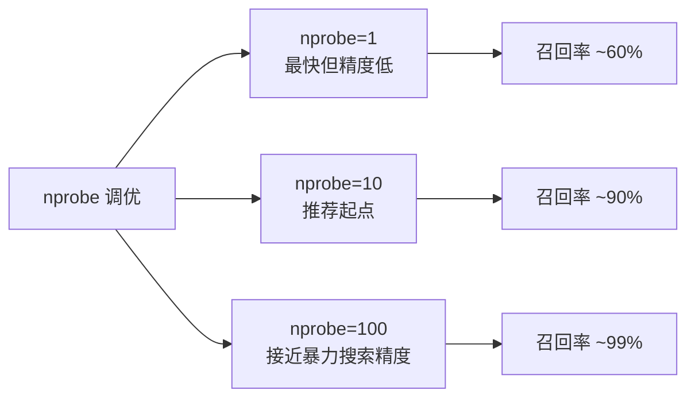

# Milvus IVF 索引

## 学习目标

- 理解 Milvus 中 IVF 索引的实现方式
- 掌握 IVF 参数配置和调优方法

## IVF 原理

Milvus 中的 IVF（Inverted File）索引基于 Faiss 的 IVF 实现，但在集群环境下增加了分布式支持：



## 参数配置

```python
from pymilvus import Collection

# IVF 索引参数
index_params = {
    "metric_type": "L2",
    "index_type": "IVF_FLAT",   # 或 IVF_PQ, IVF_SQ8
    "params": {"nlist": 1024}
}

# 搜索参数
search_params = {
    "metric_type": "L2",
    "params": {"nprobe": 10}
}

collection.create_index("embedding", index_params)
collection.search(query_vectors, "embedding", search_params, limit=10)
```

## IVF 系列变体



## 参数调优

| 参数 | 说明 | 推荐值 |
|------|------|--------|
| nlist | 聚类中心数 | 4×sqrt(N) |
| nprobe | 搜索访问中心数 | 10-50 |
| nbits (IVF_PQ) | 量化位数 | 8 |



## 要点总结

- Milvus 的 IVF 索引基于 Faiss，封装为分布式版本
- 三种变体：IVF_FLAT（高精度）、IVF_PQ（低内存）、IVF_SQ8（折中）
- nlist 控制训练时的聚类数，nprobe 控制搜索粒度
- 索引构建在 IndexNode 上异步执行

## 思考题

1. 为什么 nlist 推荐设置为 4×sqrt(N)？这个公式的由来？
2. IVF_PQ 中 PQ 量化对精度的影响有多大？如何选择合适的 m 值？
3. Milvus 中索引构建是异步的，在索引构建完成前如何保证搜索可用？