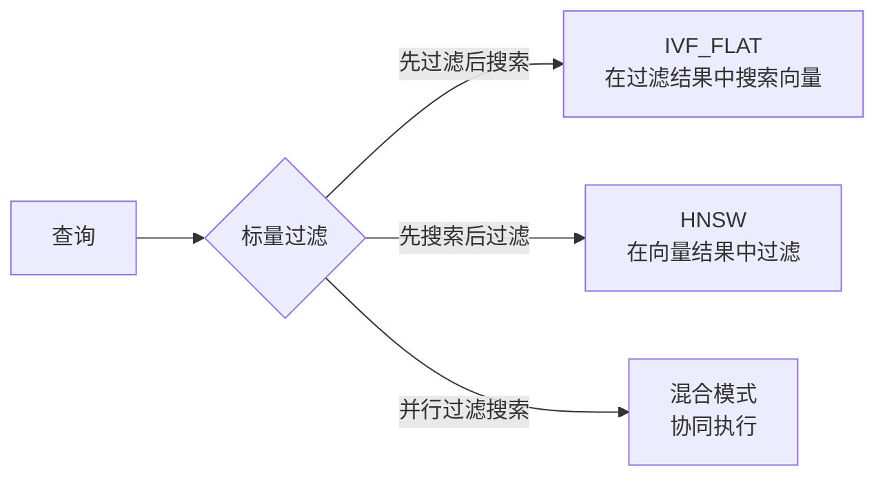
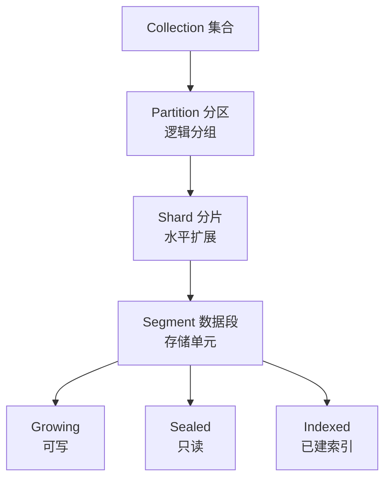

# Milvus 关键特性

## 学习目标

- 掌握 Milvus 的核心差异化特性
- 理解这些特性如何带来实际业务价值

## 混合查询

Milvus 同时支持向量相似性搜索和标量字段过滤：



```python
# 混合查询示例
results = collection.search(
    data=[query_vector],
    anns_field="embedding",
    param=search_params,
    limit=10,
    expr="price > 100 AND category IN ('A', 'B')"
)
```

| 过滤策略 | 场景 | 性能 |
|---------|------|------|
| 先过滤后搜索 | 过滤条件选择性高 | 快（候选集小） |
| 先搜索后过滤 | 向量搜索选择性高 | 快（向量精度高） |
| 协同执行 | 两者都重要 | 综合 |

## 索引类型一览

| 索引类型 | 适用场景 | 内存 | 速度 |
|---------|---------|------|------|
| FLAT | 小数据 (<10K) | 高 | 慢（精确） |
| IVF_FLAT | 中大数据 | 中 | 快 |
| IVF_PQ | 大数据内存敏感 | 低 | 快 |
| IVF_SQ8 | 大数据折中 | 中低 | 快 |
| HNSW | 高精度快速 | 高 | 极快 |
| DISKANN | 超大数据 (>内存) | 低(磁盘) | 中 |
| GPU_IVF_FLAT | GPU 加速 | GPU 显存 | 极快 |

## 数据管理



- **分区**：按日期/地域等逻辑分组，可指定分区搜索
- **分片**：每个分区可指定分片数，提高写入吞吐
- **别名**：零停机切换集合
- **TTL**：自动过期清理数据

## 一致性级别

```python
# 四种一致性
collection.search(
    data=[vec],
    search_params=search_params,
    consistency_level="Strong"  # Strong / Bounded / Session / Eventually
)
```

| 级别 | 说明 | 性能影响 |
|------|------|---------|
| Strong | 写后立即可见 | 较高延迟 |
| Bounded | 有界 staleness | 折中 |
| Session | 会话一致性 | 折中 |
| Eventually | 最终一致 | 最低延迟 |

## 要点总结

- 混合查询是 Milvus 的核心差异化特性
- 支持 10+ 索引类型，覆盖不同场景
- 分区和分片支持水平扩展
- 四种一致性级别满足不同需求

## 思考题

1. 在混合查询中，先过滤后搜索和先搜索后过滤各自的性能瓶颈在哪？
2. 分片数过多或过少对性能有什么影响？
3. Strong 一致性在分布式环境下的实现开销有多大？