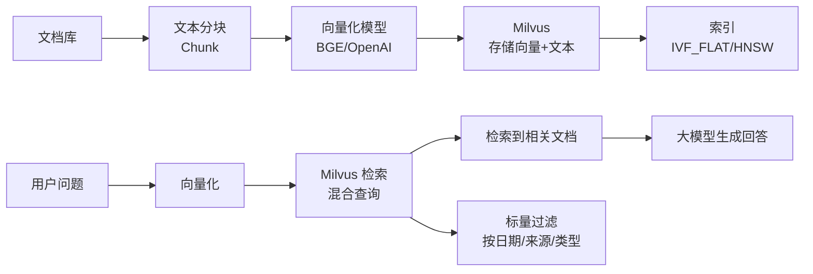
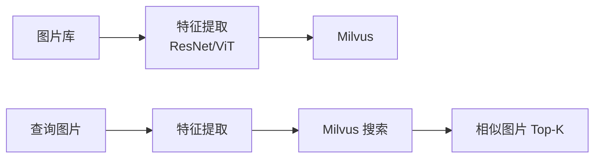
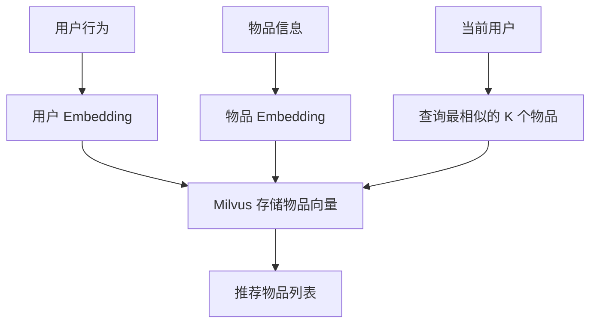

# Milvus 使用场景

## 学习目标

- 理解 Milvus 在各场景中的具体应用方式
- 掌握场景与 Milvus 特性的对应关系

## RAG 检索增强生成



```python
# RAG 查询
questions = ["Milvus 支持哪些索引类型?"]
results = collection.search(
    data=[embedding_model.encode(questions)],
    anns_field="embedding",
    param={"nprobe": 10},
    limit=5,
    expr="source_type = 'doc' AND date >= '2025-01-01'"
)
```

## 以图搜图



- 图像特征向量维度通常 512-2048
- 使用余弦距离衡量相似度
- 支持亿级图片库

## 推荐系统



## 异常检测

- 将正常行为编码为向量
- 查询最近邻的距离作为异常分数
- 距离远大于正常范围则判定为异常

## 要点总结

- RAG 是 Milvus 最热门的使用场景，结合 LLM 实现知识问答
- 以图搜图利用深度学习特征提取 + 向量检索
- 推荐系统通过行为向量实现物品召回
- 标量过滤让搜索更精准（按日期/类别/来源过滤）

## 思考题

1. RAG 场景中 Chunk 大小对检索效果有什么影响？
2. 以图搜图的特征向量维度过高或过低各有什么问题？
3. 推荐系统中的向量召回如何与精排阶段协作？