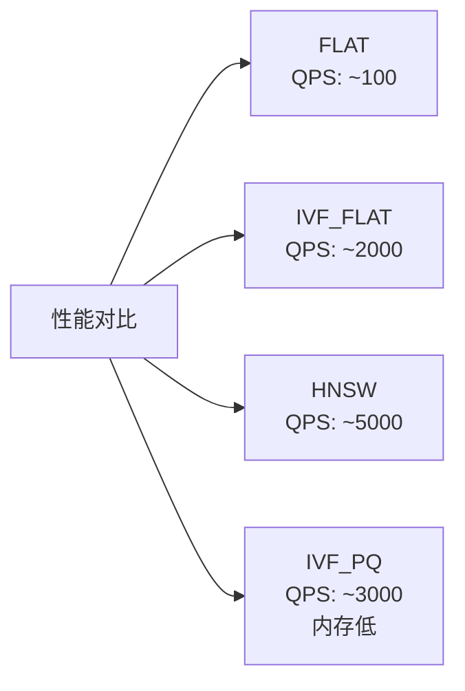

# 动手实验: Milvus 部署与使用

## 学习目标

- 能够快速部署和体验 Milvus
- 掌握基本的向量搜索操作

## Docker 部署

```bash
# 拉取 Milvus 单机版
wget https://github.com/milvus-io/milvus/releases/latest/download/milvus-standalone-docker-compose.yml
docker compose -f milvus-standalone-docker-compose.yml up -d

# 验证
docker compose ps

# 安装客户端
pip install pymilvus
```

## 基本操作

```python
from pymilvus import (
    connections, CollectionSchema, FieldSchema,
    DataType, Collection, utility
)
import numpy as np
import random

# 1. 连接
connections.connect("default", host="localhost", port="19530")

# 2. 定义 Schema
fields = [
    FieldSchema(name="id", dtype=DataType.INT64, is_primary=True, auto_id=True),
    FieldSchema(name="embedding", dtype=DataType.FLOAT_VECTOR, dim=128),
    FieldSchema(name="category", dtype=DataType.VARCHAR, max_length=100),
]
schema = CollectionSchema(fields, "向量搜索演示集合")

# 3. 创建集合
collection = Collection("demo", schema)

# 4. 插入数据
vectors = [[random.random() for _ in range(128)] for _ in range(1000)]
categories = [f"cat_{i % 10}" for i in range(1000)]
mr = collection.insert([vectors, categories])

# 5. 创建索引
index_params = {
    "index_type": "IVF_FLAT",
    "metric_type": "L2",
    "params": {"nlist": 100}
}
collection.create_index("embedding", index_params)

# 6. 加载
collection.load()

# 7. 搜索
search_params = {"metric_type": "L2", "params": {"nprobe": 10}}
query = [[random.random() for _ in range(128)]]
results = collection.search(
    data=query,
    anns_field="embedding",
    param=search_params,
    limit=5,
    expr="category == 'cat_1'"
)

for res in results:
    for hit in res:
        print(f"ID: {hit.id}, Distance: {hit.distance}, Category: {hit.entity.get('category')}")

# 8. 清理
collection.drop()
connections.disconnect("default")
```

## 索引类型对比实验

```python
# 对比不同索引的性能
import time

def test_index(index_type, index_params, search_params):
    collection = Collection(f"test_{index_type}")
    collection.create_index("embedding", index_params)
    collection.load()

    # 预热
    collection.search(data=[query], anns_field="embedding", param=search_params, limit=10)

    # 测试
    start = time.time()
    for _ in range(100):
        collection.search(data=[query], anns_field="embedding", param=search_params, limit=10)
    qps = 100 / (time.time() - start)

    # 清理
    collection.drop()
    return qps
```



## 可视化工具

```bash
# Milvus 提供 WebUI 监控
# 访问 http://localhost:9091/webui
```

## 要点总结

- Docker 方式 1 分钟即可部署 Milvus
- 操作流程：连接 → 创建集合 → 插入 → 建索引 → 加载 → 搜索
- 不同索引类型的 QPS 差距可达 50x
- 建议使用 VisualDL 等工具监控索引状态

## 思考题

1. 在实验中，为什么 FLAT 和 IVF_FLAT 的 QPS 差距如此之大？
2. 如果数据量从 1000 增加到 100 万，各索引的性能会如何变化？
3. 在生产环境中，索引构建期间如何保证查询可用？