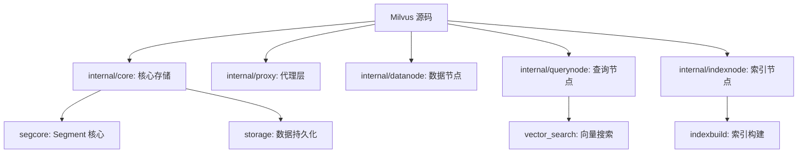

# Milvus 学习资源

## 学习目标

- 获取 Milvus 的优质学习资源
- 建立从入门到深入的学习路径

## 官方资源

- **文档**：[https://milvus.io/docs](https://milvus.io/docs)
- **GitHub**：[https://github.com/milvus-io/milvus](https://github.com/milvus-io/milvus)
- **博客**：[https://milvus.io/blog](https://milvus.io/blog)

## 源码研读路径

## 学习路径

1. **入门**：官方 Quick Start + Python SDK
2. **进阶**：架构文档 + 索引类型对比
3. **深入**：源码阅读（segcore 模块）
4. **生产**：集群部署 + 性能调优

## 要点总结

- 官方文档是最重要的学习入口
- 源码核心在 internal/core/ 目录
- 推荐先理解架构再深入索引细节