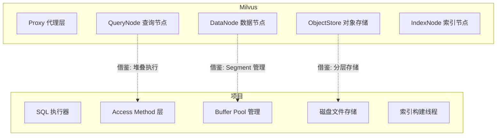

# Milvus 与项目关联

## 学习目标

- 分析 Milvus 设计对项目存储引擎的启发性
- 找出项目中可借鉴的技术点

## 架构对比



## 可借鉴设计

### 1. 插件化引擎架构

Milvus 内部集成多个索引引擎，通过统一接口切换：

| Milvus 设计 | 项目对应 | 可借鉴程度 |
|------------|---------|-----------|
| 插件化索引引擎 (Faiss/HNSW/DiskANN) | storage_engine_t 接口 | ⭐⭐⭐ |
| Segment 统一管理单元 | Buffer Pool + 页面管理 | ⭐⭐⭐ |
| 混合过滤下推 | 项目中待实现的过滤逻辑 | ⭐⭐ |
| 计算存储分离 | 项目单机架构，未来可演进 | ⭐ |

### 2. 索引调度

Milvus 的索引构建由 IndexNode 异步执行：

```c
// 项目现有: 同步索引构建
btree_build_index(btree, tuples);

// 借鉴 Milvus 异步模式: 索引任务队列
// index_task_t task = {.type = BTREE, .data = tuples};
// index_node_enqueue(task);  // 异步构建
```

### 3. Segment 管理

Milvus 的 Growing → Sealed → Indexed 状态机对项目中 Buffer Pool 的脏页管理有启发。

## 项目提升计划


## 要点总结

- Milvus 的插件化引擎架构对项目的多模态引擎设计有直接参考价值
- Segment 状态机可借鉴到 Buffer Pool 的页面管理
- 异步索引构建模式可提升项目索引吞吐
- 混合过滤是向量检索的必备能力，值得重点借鉴

## 思考题

1. 项目中 storage_engine_t 接口能否借鉴 Milvus 的插件化模式，支持动态加载索引算法？
2. 我们现有的 Buffer Pool 管理能否实现类似 Milvus Segment 的多级状态？
3. 异步索引构建有哪些实现难点（一致性、调度策略）？