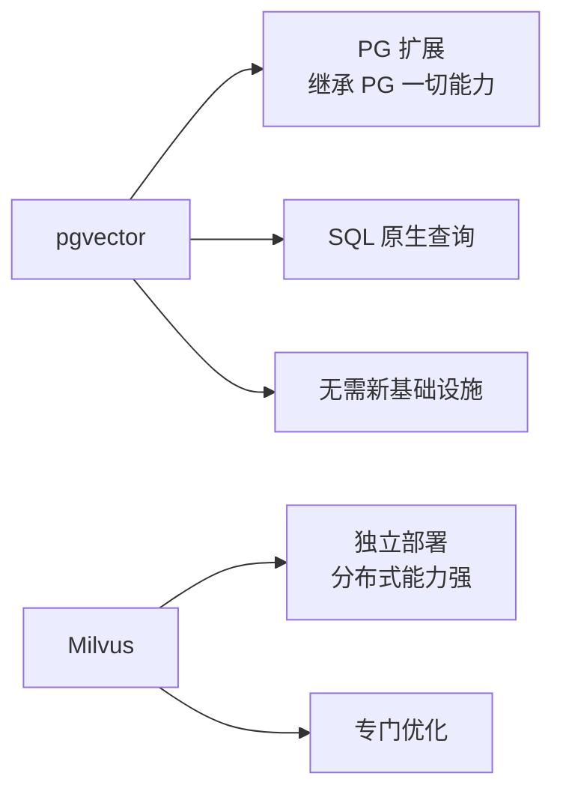

# pgvector 项目概览

## 学习目标

- 了解 pgvector 作为 PG 向量扩展的定位
- 掌握 pgvector "在 PostgreSQL 中扩展向量能力"的设计

## 项目定位

> pgvector 是 PostgreSQL 的向量相似性搜索扩展，让 PG 原生支持向量类型和 ANN 索引。

**基本信息**：

- 开发方：pgvector 开源社区
- 首次发布：2021 年
- 开源协议：PostgreSQL License
- GitHub Stars：约 14k（[pgvector/pgvector](https://github.com/pgvector/pgvector)）

## 核心设计理念

```mermaid
graph TD
    A[pgvector] --> B[PG 扩展<br/>CREATE EXTENSION vector]
    A --> C[向量类型<br/>vector(128) 数据类型]
    A --> D[距离运算符<br/><-> <#> <=>]
    A --> E[ANN 索引<br/>IVFFlat/HNSW]
    A --> F[PG 生态红利<br/>事务/备份/复制]

    B --> EXT[PG Extension API 钩子]
    C --> TYPE[自定义类型系统]
    D --> OPER[自定义运算符]
    E --> INDEX[PG Index AM 接口]
```

## 与其他向量数据库对比



## 要点总结

- PG 扩展，继承 PG 的稳定性和 SQL 能力
- 纯 SQL 接口，零学习成本
- 支持 L2/IP/余弦三种距离
- 适合已在用 PG 且有向量需求的团队

## 思考题

1. pgvector 作为 PG 扩展相比独立向量数据库的优势和劣势分别是什么？
2. PG 的索引框架（Index AM）如何被 pgvector 扩展？
3. pgvector 的搜索性能与 Milvus/Qdrant 相比如何？