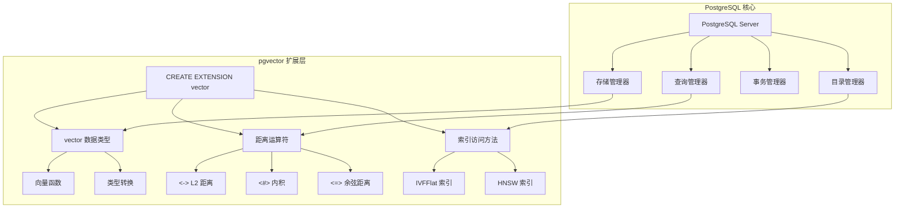
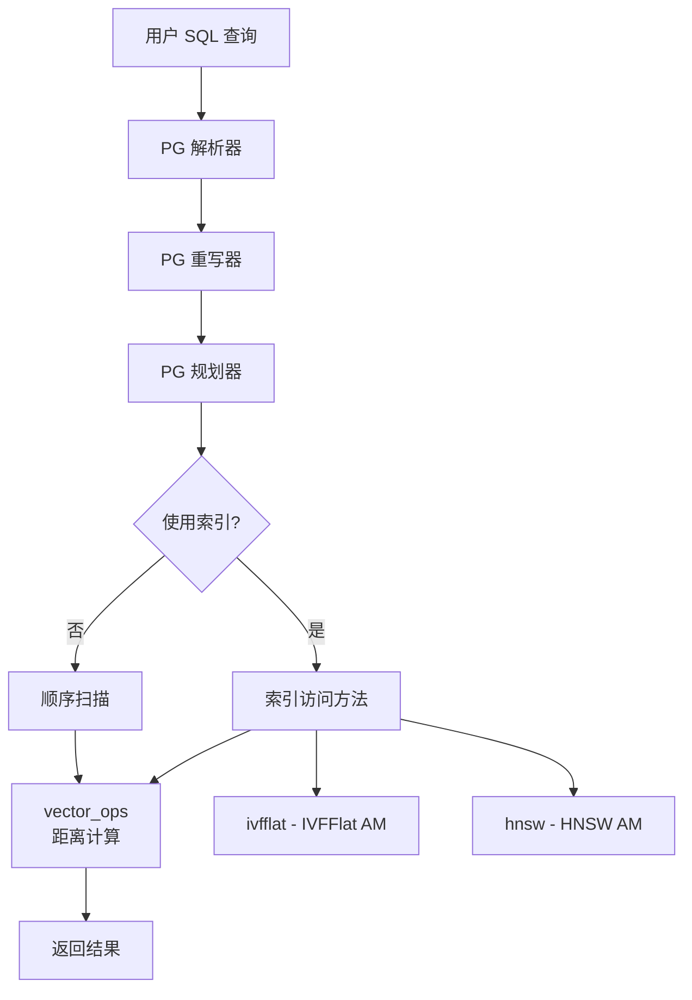
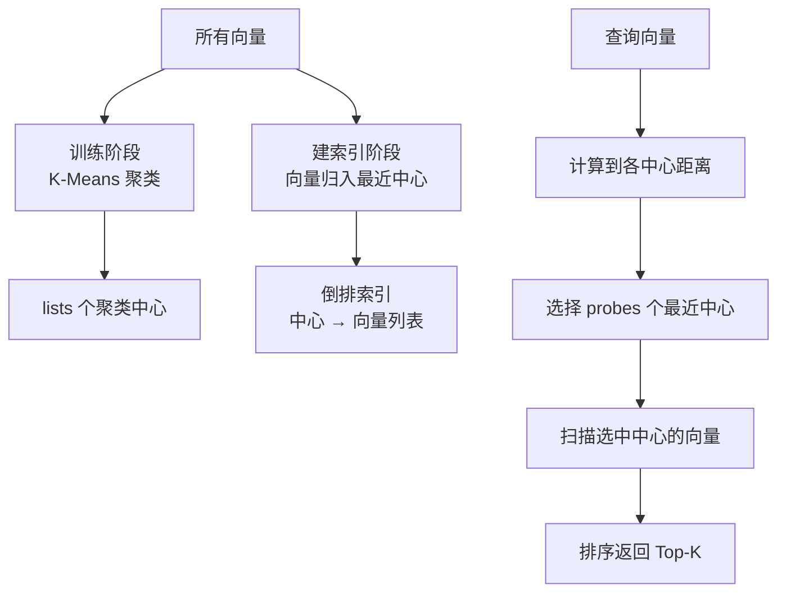
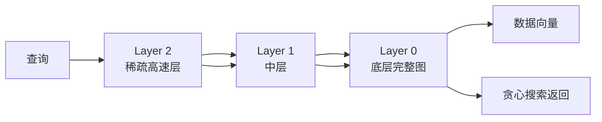
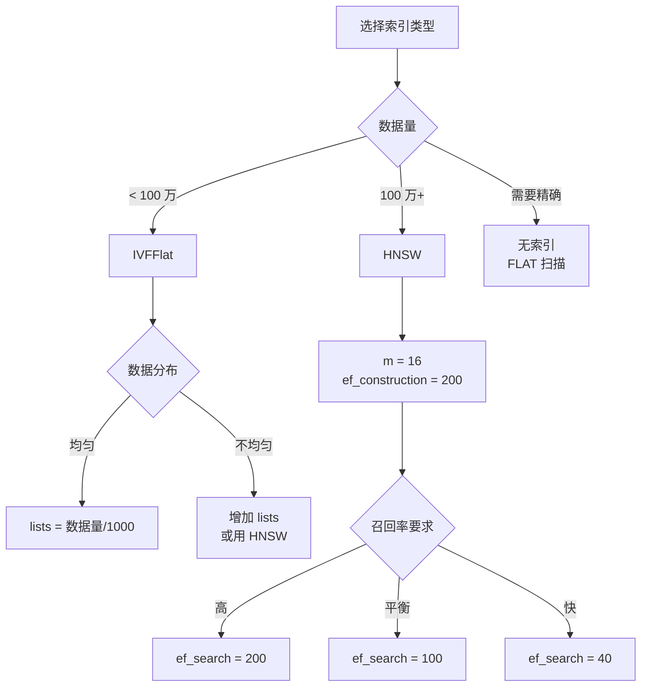

# pgvector 架构设计

## 学习目标

- 理解 pgvector 在 PostgreSQL 体系中的位置
- 掌握 pgvector 的类型系统和索引架构
- 理解向量搜索的执行流程

## 架构总览

pgvector 的核心设计是"将向量能力作为 PG 扩展实现"，充分利用 PostgreSQL 的基础设施：



## pgvector 在 PostgreSQL 体系中的位置

pgvector 通过 PG 的扩展机制（Extension）接入，其位置如下：



**关键点**：
- pgvector 使用 PG 的 Type System 定义 `vector` 类型
- 使用 PG 的 Operator System 定义 `<->` `<#>` `<=>` 运算符
- 使用 PG 的 Index Access Method 接口实现 ANN 索引

## 类型系统

`vector` 类型的实现采用固定维度数组：

```mermaid
graph LR
    A[vector(128)] --> B[float32 数组<br/>128 元素]
    B --> C[内存布局<br/>128 * 4 = 512 字节]

    D[vector(1536)] --> E[float32 数组<br/>1536 元素]
    E --> F[内存布局<br/>1536 * 4 = 6144 字节]
```

### 类型定义（概念层面）

```sql
-- 向量类型示例
CREATE TABLE items (
    embedding vector(128)      -- 128 维 float32 向量
);

CREATE TABLE documents (
    embedding vector(1536)   -- 1536 维（OpenAI text-embedding-3-large）
);
```

### 类型特性

| 特性 | 说明 |
|------|------|
| 维度 | 固定维度，建表时指定（1-65535） |
| 元素类型 | float32（4 字节） |
| 存储格式 | 连续内存块 |
| 维度限制 | 受 PG 单列大小限制，通常 < 10000 |

## 索引架构

### IVFFlat 索引

IVFFlat（Inverted File Index with Flat）是基于聚类的索引：



**关键参数**：
- `lists`：聚类中心数量（建索引时指定）
- `probes`：查询时探查的中心数（可运行时调整）

### HNSW 索引

HNSW（Hierarchical Navigable Small World）是图索引：



**关键参数**：
- `m`：每层最大连接数（默认 16）
- `ef_construction`：建索引时的搜索范围（默认 200）
- `ef_search`：查询时的搜索范围（默认 40，可调大提升精度）

## 搜索执行流程

完整的向量搜索流程：

```mermaid
sequenceDiagram
    participant U as 用户
    participant PG as PostgreSQL
    participant PAR as 解析器
    participant PLN as 规划器
    participant IDX as 索引引擎
    participant DIST as 距离计算

    U->>PG: SELECT * FROM items<br/>ORDER BY embedding <=> '[...]'<br/>LIMIT 10;

    PG->>PAR: SQL 解析
    PAR->>PLN: 生成查询计划
    PLN->>PLN: 选择索引（如果有）

    alt 有 HNSW/IVFFlat 索引
        PLN->>IDX: 索引扫描
        IDX->>IDX: 近似最近邻搜索
        IDX->>DIST: 候选向量
    else 无索引
        PLN->>DIST: 全表扫描
        DIST->>DIST: 计算所有距离
    end

    DIST->>PG: Top-K 结果
    PG->>U: 返回结果集
```

## 索引选择策略



## 与 PostgreSQL 生态的集成

pgvector 充分利用 PG 的现有能力：

| PG 能力 | pgvector 继承方式 |
|--------|------------------|
| 事务支持 | 向量操作可回滚 |
| ACID 特性 | 索引操作原子性 |
| 备份恢复 | pg_dump 全量支持 |
| 流复制 | 向量数据同步 |
| 分区表 | 支持分区向量化 |
| 触发器 | 向量字段触发器 |
| 视图 | 向量查询视图 |

## 要点总结

- pgvector 是 PG 扩展，通过 Type System、Operator System、Index AM 接入
- `vector(n)` 类型是固定维度 float32 数组
- IVFFlat 基于聚类，需训练，建索引快、查询需调参
- HNSW 基于图，无需训练，查询快、内存占用高
- 继承 PG 的事务、备份、复制等全部能力

## 思考题

1. pgvector 的 `<=>`（余弦距离）运算符在 PG 中是如何注册的？与普通运算符有何不同？
2. IVFFlat 的 `lists` 参数与 HNSW 的 `m` 参数，哪个对性能影响更大？
3. pgvector 的索引是最终一致的吗？在主从复制场景下有何注意事项？
