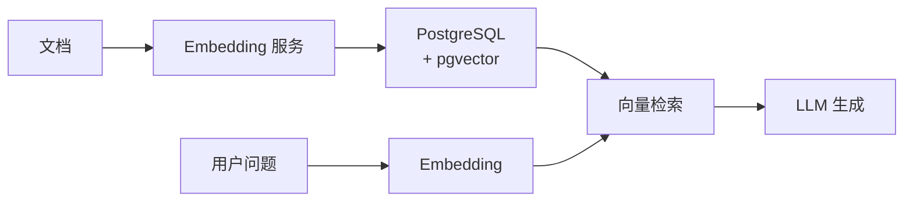

# pgvector 使用场景

## 学习目标

- 掌握 pgvector 的典型应用场景
- 理解 pgvector 与 PostgreSQL 生态集成的优势

## RAG 场景

pgvector 与 PostgreSQL 的组合是 RAG（检索增强生成）的经典架构：



### SQL 与向量的融合查询

```sql
-- 场景：从技术文档中检索，并按更新时间排序
WITH search_results AS (
    SELECT id, content, embedding,
           1 - (embedding <=> $1) AS similarity,
           updated_at
    FROM documents
    WHERE embedding <=> $1 < 0.3  -- 余弦距离阈值过滤
)
SELECT id, content, similarity, updated_at
FROM search_results
WHERE category = '技术文档'
ORDER BY similarity DESC, updated_at DESC
LIMIT 10;
```

**优势**：
- 向量相似度与 SQL 条件自由组合
- 利用 PG 的索引加速标量过滤
- 单数据库减少架构复杂度

## 推荐系统

在 PostgreSQL 中同时存储用户画像和向量，实现向量召回 + SQL 精排：

```sql
-- 用户向量召回
WITH user_embedding AS (
    SELECT embedding FROM users WHERE user_id = $1
),
candidates AS (
    SELECT p.id, p.title, p.price,
           p.embedding <=> (SELECT embedding FROM user_embedding) AS distance
    FROM products p
    WHERE p.category = '电子产品'
      AND p.price BETWEEN 1000 AND 5000
    ORDER BY p.embedding <=> (SELECT embedding FROM user_embedding)
    LIMIT 100
)
SELECT c.*,
       -- 精排分数（可在应用层计算）
       c.distance AS召回分数
FROM candidates c
ORDER BY c.distance;
```

### 协同过滤 + 向量

```sql
-- 基于购买历史的向量相似用户
SELECT u2.user_id,
       COUNT(*) AS common_items,
       u2.embedding <=> u1.embedding AS user_similarity
FROM orders o1
JOIN orders o2 ON o1.item_id = o2.item_id AND o1.user_id != o2.user_id
JOIN users u1 ON u1.id = o1.user_id
JOIN users u2 ON u2.id = o2.user_id
WHERE o1.user_id = $1
GROUP BY u2.user_id, u2.embedding, u1.embedding
ORDER BY user_similarity
LIMIT 20;
```

## 地理 + 向量混合查询

结合 PostGIS 实现地理位置与向量语义的双重检索：

```sql
-- 附近餐厅且口味相似
SELECT r.id, r.name,
       r.location,
       ST_Distance(r.location, ST_MakePoint(116.4, 39.9)::geography) AS distance_m,
       1 - (r.embedding <=> $1) AS taste_similarity
FROM restaurants r
WHERE ST_DWithin(
        r.location,
        ST_MakePoint(116.4, 39.9)::geography,
        5000  -- 5 公里范围
      )
  AND r.category = '中餐'
ORDER BY r.embedding <=> $1
LIMIT 20;
```

**前置条件**：

```sql
-- 安装扩展
CREATE EXTENSION postgis;
CREATE EXTENSION vector;

-- 建表（同时有地理位置和向量）
CREATE TABLE restaurants (
    id SERIAL PRIMARY KEY,
    name TEXT,
    location GEOGRAPHY(POINT, 4326),
    embedding vector(128)
);

-- 创建索引
CREATE INDEX ON restaurants USING gist (location);
CREATE INDEX ON restaurants USING hnsw (embedding vector_cosine_ops);
```

## 时序 + 向量（TimescaleDB + pgvector）

TimescaleDB 的时序能力与向量结合：

```sql
-- 传感器时序数据 + 异常模式向量匹配
SELECT time,
       sensor_id,
       value,
       pattern_embedding <=> $1 AS pattern_distance
FROM sensor_readings
WHERE time BETWEEN $start AND $end
  AND sensor_id IN ($sensor_ids)
  AND pattern_embedding <=> $1 < 0.2  -- 异常模式距离阈值
ORDER BY time DESC;
```

**优势**：
- TimescaleDB 的自动分区和压缩
- 压缩后的向量数据仍然可检索
- 时间范围查询自动利用分区剪枝

## 多模态搜索

利用 PG 的 JSONB 存储多模态向量：

```sql
-- 同时搜索文本和图像
CREATE TABLE multimodal_items (
    id SERIAL PRIMARY KEY,
    text_embedding vector(384),   -- 文本向量
    image_embedding vector(512),   -- 图像向量
    metadata JSONB
);

-- 文本相似度搜索
SELECT id, metadata,
       1 - (text_embedding <=> $text_vec) AS text_sim
FROM multimodal_items
WHERE text_embedding <=> $text_vec < 0.3;

-- 图像相似度搜索
SELECT id, metadata,
       1 - (image_embedding <=> $image_vec) AS image_sim
FROM multimodal_items
WHERE image_embedding <=> $image_vec < 0.3;

-- 跨模态搜索（文本找相似图像）
SELECT id, metadata,
       1 - (text_embedding <=> $text_vec) AS cross_sim
FROM multimodal_items
WHERE text_embedding <=> $text_vec < 0.2
ORDER BY text_embedding <=> $text_vec;
```

## 场景选择矩阵

| 场景 | pgvector 优势 | 配合扩展 | 注意事项 |
|------|--------------|---------|---------|
| RAG | SQL 融合查询 | - | 注意向量维度与 LLM 匹配 |
| 推荐系统 | 画像 + 向量同库 | - | 大规模需分区或分片 |
| 地理搜索 | PostGIS 集成 | PostGIS | 双重索引需优化查询 |
| 时序数据 | 分区压缩支持 | TimescaleDB | 向量压缩后精度下降 |
| 多模态 | JSONB 多向量 | - | 每种模态独立建索引 |

## 混合搜索最佳实践

```sql
-- 分阶段过滤：先 SQL 缩小范围，再向量排序
SELECT *,
       1 - (embedding <=> $1) AS similarity
FROM items
WHERE status = 'active'          -- SQL 过滤
  AND category_id = 123          -- SQL 过滤
  AND created_at > NOW() - INTERVAL '30 days'  -- SQL 过滤
ORDER BY embedding <=> $1        -- 向量排序
LIMIT 20;

-- 注意：SQL 条件尽量在向量索引前执行，减少搜索范围
```

## 要点总结

- pgvector 的核心优势是与 PG SQL 能力的深度集成
- RAG 场景可实现向量检索 + 元数据过滤 + 排序的融合查询
- 结合 PostGIS/TimescaleDB 可扩展地理/时序能力
- 多模态场景利用 JSONB 存储多种向量类型

## 思考题

1. 在 RAG 场景中，为什么推荐使用 `embedding <=> $threshold` 而不是直接 `ORDER BY ... LIMIT`？
2. 地理 + 向量双重索引（GiST + HNSW）的查询计划是什么样的？是否有优化空间？
3. TimescaleDB 的区间压缩会改变向量数据吗？压缩后检索精度会下降吗？
