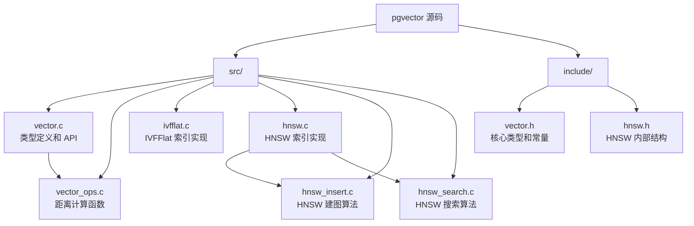
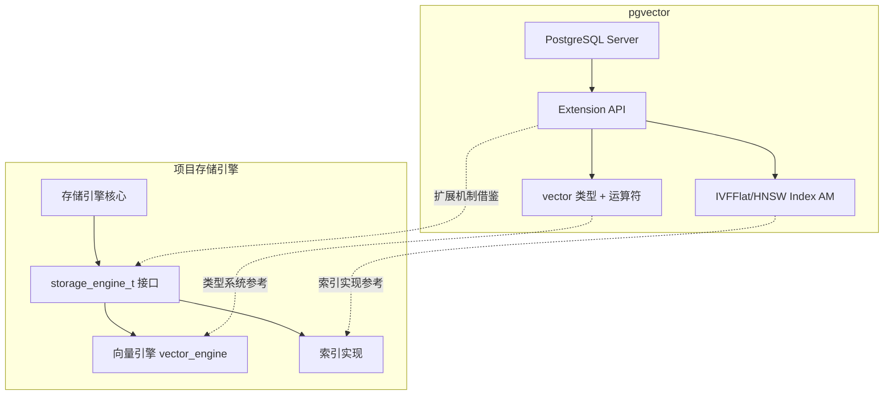

# pgvector 学习资源与项目关联

## 学习目标

- 获取 pgvector 的官方和社区资源
- 设计源码研读路径
- 分析 pgvector 设计对项目的启发

## 官方资源

### 文档与代码

| 资源 | 链接 |
|------|------|
| 官方文档 | https://pgvector.dev/ |
| GitHub 仓库 | https://github.com/pgvector/pgvector |
| 安装指南 | https://github.com/pgvector/pgvector#installation |
| 性能调优 | https://github.com/pgvector/pgvector#indexes |
| Release Notes | https://github.com/pgvector/pgvector/releases |

### 博客与教程

| 资源 | 说明 |
|------|------|
| Announcing pgvector 0.5 | HNSW 支持公告 |
| Vector 0.6 with halfvec | 半精度向量支持 |
| Vector 0.7 with sparse vectors | 稀疏向量支持 |

## 源码研读路径

pgvector 代码简洁，适合作为第一个向量化项目学习：



### 源码结构说明

```
pgvector/
├── src/
│   ├── vector.c          # 向量类型定义、SQL 函数
│   ├── vector_ops.c      # 距离计算实现
│   ├── ivfflat.c         # IVFFlat 索引 AM
│   ├── ivfflat_utils.c   # IVFFlat 辅助函数
│   ├── hnsw.c            # HNSW 索引 AM
│   ├── hnsw_insert.c     # HNSW 插入算法
│   ├── hnsw_search.c      # HNSW 搜索算法
│   ├── hnswvacuum.c      # HNSW 垃圾回收
│   └── utils.c           # 通用工具函数
├── include/
│   ├── vector.h          # 头文件
│   └── hnsw.h            # HNSW 内部结构
└── test/
    └── sql/              # 测试 SQL
```

### 推荐研读顺序

```
1. vector.h          → 了解向量类型结构
2. vector.c          → 理解 SQL 函数注册
3. vector_ops.c      → 距离计算（最简单）
4. ivfflat.c         → IVFFlat 索引（中等复杂度）
5. hnsw.c            → HNSW 索引入口
6. hnsw_insert.c     → HNSW 建图（核心算法）
7. hnsw_search.c     → HNSW 搜索（核心算法）
```

## 学习路径

### 入门阶段（1-2 周）

1. **安装使用**
   - Docker 部署 pgvector
   - 掌握 SQL 接口（建表、插入、搜索）
   - 理解三种距离运算符

2. **索引入门**
   - IVFFlat：理解聚类原理，调试 `lists` 和 `probes`
   - HNSW：理解多层图结构，理解 `m` 和 `ef`

3. **参考资料**
   - [pgvector 官方文档](https://pgvector.dev/)
   - 《Designing Data-Intensive Applications》第 3 章

### 进阶阶段（2-4 周）

1. **性能调优**
   - 索引参数对比实验
   - EXPLAIN ANALYZE 分析查询计划
   - 召回率 vs QPS 权衡

2. **扩展集成**
   - PostGIS + pgvector 地理搜索
   - TimescaleDB + pgvector 时序搜索
   - 分区表向量索引

3. **参考资料**
   - [pgvector GitHub Issues](https://github.com/pgvector/pgvector/issues)
   - ANN-Benchmarks 结果分析

### 深入阶段（持续）

1. **源码研读**
   - 向量类型的 PG 扩展机制
   - Index AM 接口实现
   - HNSW 图构建算法细节

2. **二次开发**
   - 贡献 pgvector 文档或代码
   - 集成到现有 PostgreSQL 项目
   - 自定义距离函数

3. **参考资料**
   - [PostgreSQL 扩展开发](https://www.postgresql.org/docs/current/xfunc.html)
   - [PGConf 视频](https://www.pgconf.io/)

## 项目关联

### 架构对比



### 可借鉴设计

| pgvector 组件 | 项目借鉴点 | 实现优先级 |
|--------------|----------|----------|
| vector 类型定义 | 统一向量类型 | ⭐⭐⭐ |
| 距离运算符注册 | SQL 距离函数 | ⭐⭐ |
| IVFFlat 索引 | IVF 索引参考 | ⭐⭐⭐ |
| HNSW Index AM | HNSW 图索引 | ⭐⭐⭐ |
| PG 扩展机制 | 引擎插件化 | ⭐⭐ |

### 启发点

1. **类型系统设计**：pgvector 的 `vector(n)` 固定维度设计简洁高效
2. **运算符即索引**：`<=>` 运算符自动选择最优索引是巧妙设计
3. **索引参数可调**：运行时调整 `ef_search` 提供了灵活性

## 要点总结

- pgvector 源码结构清晰，适合作为向量数据库入门学习
- 源码研读顺序：类型 → 距离 → IVFFlat → HNSW
- 学习路径：安装使用 → 性能调优 → 源码研读 → 二次开发
- 项目可借鉴：类型系统、距离函数注册、索引实现
