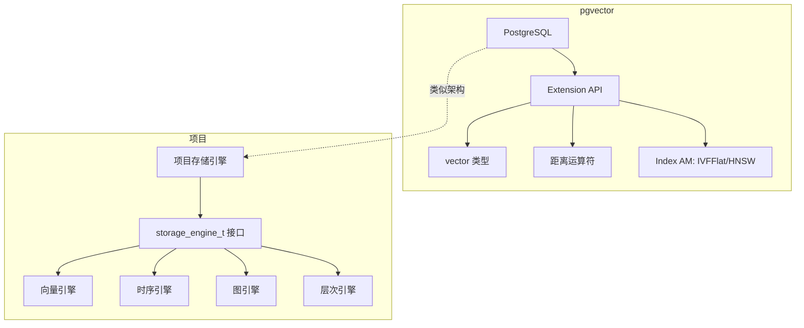

# pgvector 项目关联

## 学习目标

- 分析 pgvector 设计对项目的启发

## 扩展机制借鉴

pgvector 与本项目的设计思路最为接近——都在现有系统中通过扩展机制增加新能力：

## 可直接借鉴的设计

| pgvector 设计 | 项目借鉴 |
|-------------|---------|
| 自定义类型（vector） | 项目中已经实现的向量类型 |
| 距离运算符（<->/<=>） | 项目中待实现的距离函数 |
| IVFFlat 索引 | 项目中 IVF 实现参考 |
| PG Extension 机制 | 项目 storage_engine_t 接口 |

## 要点总结

- pgvector 的扩展机制与项目的引擎架构设计理念高度一致
- 距离运算符和索引实现可参考
- 项目中已经有多模态引擎，扩展方向正确

## 思考题

1. 项目中 storage_engine_t 的扩展方式与 PG Extension API 有何异同？
2. 我们是否需要实现类似 pgvector 的 SQL 距离运算符？