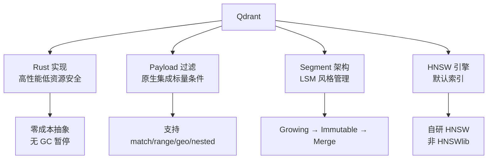
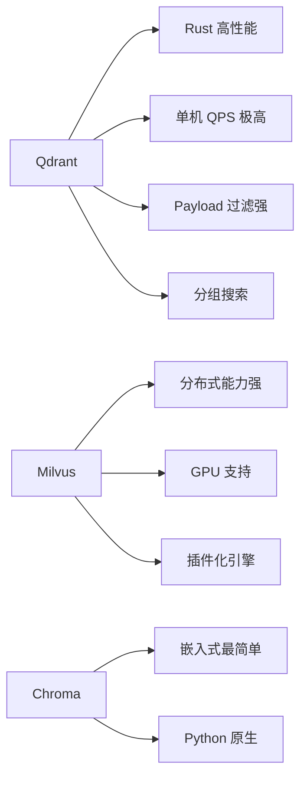
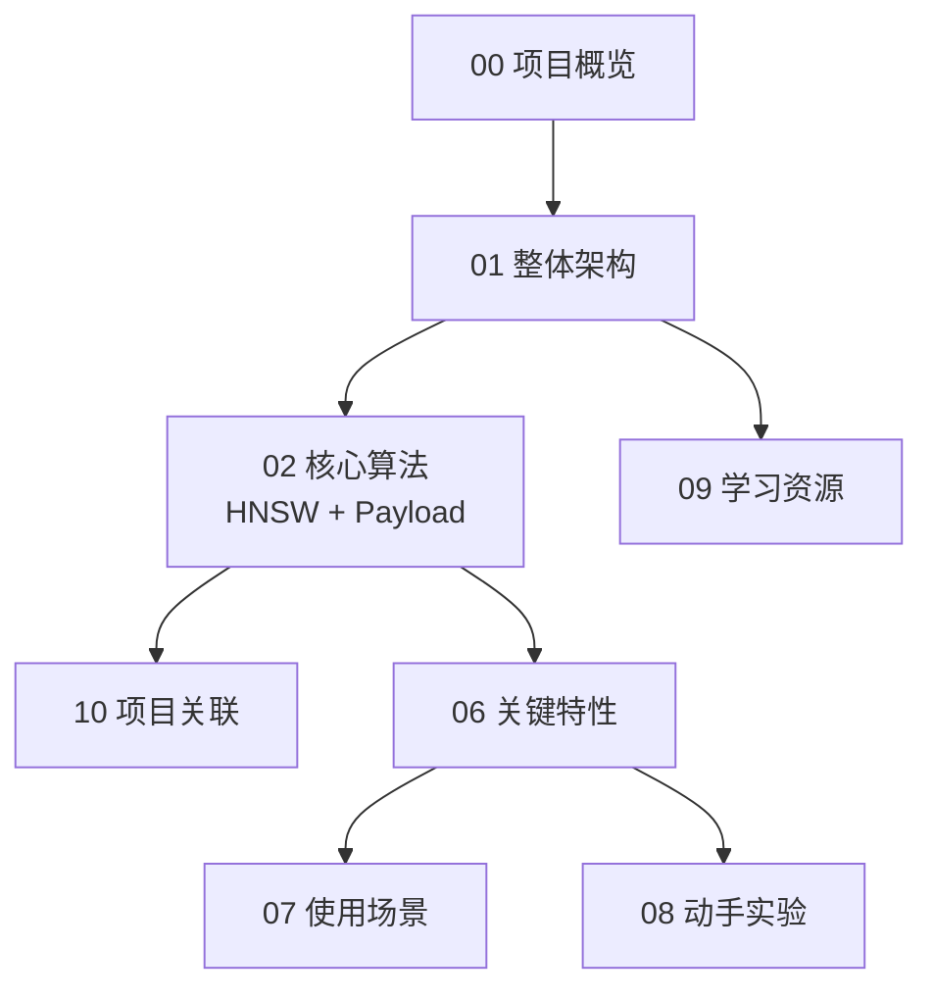

# Qdrant 项目概览

## 学习目标

- 了解 Qdrant 的项目定位与核心设计
- 掌握 Qdrant 在向量数据库领域的差异化特性

## 项目定位

> Qdrant 是一个用 Rust 编写的向量数据库，专注于高性能向量相似性搜索，提供丰富的标量过滤（Payload）能力。

**基本信息**：

- 开发方：Qdrant Solutions
- 首次发布：2020 年
- 开源协议：Apache 2.0
- 最新版本：1.13.x（截至 2026 年）
- GitHub Stars：约 24k（[qdrant/qdrant](https://github.com/qdrant/qdrant)）

## 核心设计理念

Rust 实现带来的高性能和安全性、Payload 过滤作为一等公民、Segment 架构管理数据、HNSW 作为默认索引。

## 与其他向量数据库对比

## 适用场景

- **低延迟高 QPS 搜索**：利用 Rust 性能优势
- **带条件的语义搜索**：Payload 过滤强
- **推荐多样性**：分组搜索原生支持
- **地理空间搜索**：原生地理过滤

## 学习路线图

## 要点总结

- Rust 实现，单机性能极高
- Payload 过滤是一等公民，丰富且高效
- Segment 架构支持增量数据管理
- 分组搜索是独特的差异化特性

## 思考题

1. Rust 实现向量数据库相比 Go/Java 在性能上的优势到底有多大？
2. Qdrant 的 Payload 过滤机制和 Milvus 的标量过滤有什么本质不同？
3. 分组搜索对推荐系统来说解决了什么问题？