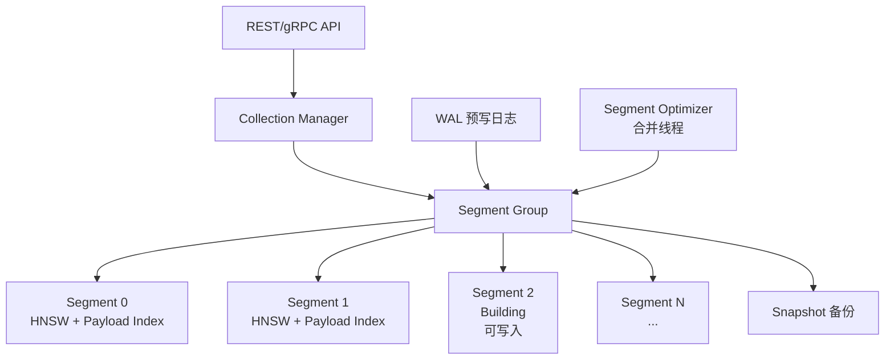
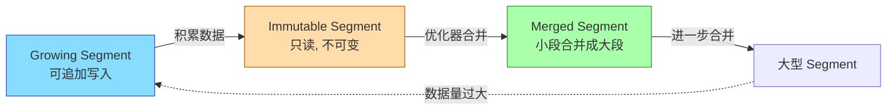
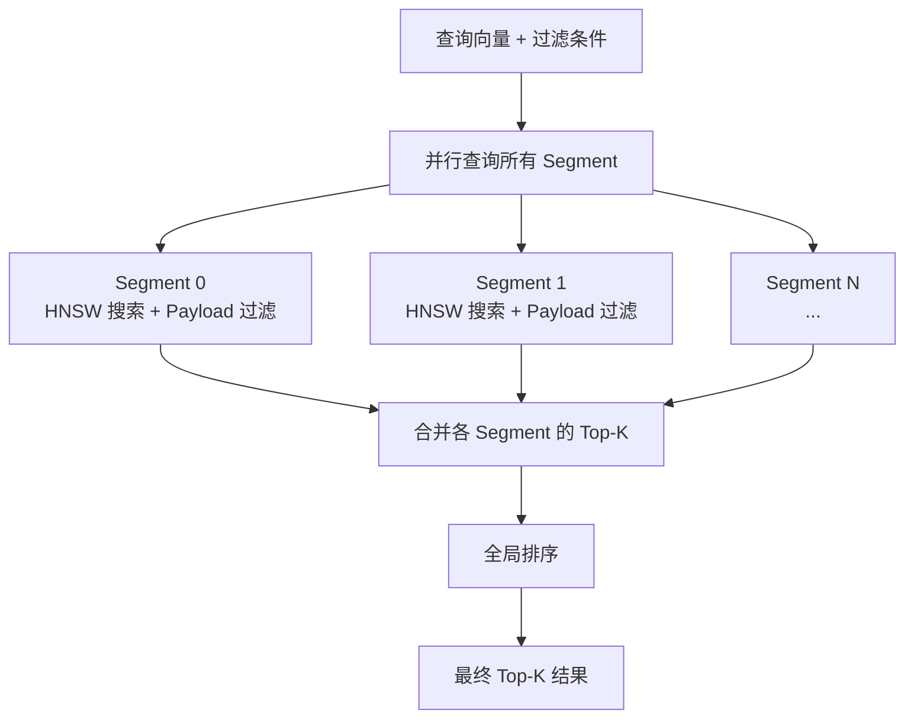

# Qdrant 整体架构

## 学习目标

- 理解 Qdrant 的 Segment 架构设计
- 掌握写入和查询的完整流程

## 核心概念

- **Collection**：集合，最上层数据组织单元
- **Segment**：数据存储单元，每个 Segment 包含独立的 HNSW 图和 Payload 索引
- **Point**：单条数据记录，含向量 + Payload
- **WAL**：预写日志，保证持久性

## 架构总览



## Segment 生命周期



## 写入路径

```mermaid
sequenceDiagram
    participant C as Client
    participant API as Qdrant API
    participant WAL as WAL
    participant SEG as Current Segment

    C->>API: Upsert Points
    API->>WAL: 写 WAL (保证持久)
    WAL-->>API: WAL 确认
    API->>SEG: 写入当前 Growing Segment
    C->>C: 超过内存阈值
    SEG->>SEG: Sealed (转为不可变)
    OPT->>SEG: 创建新 Growing Segment
```

## 查询路径



## 要点总结

- Qdrant 采用 Segment 架构，类似 LSM-Tree 的设计
- WAL 保证写入持久化
- 优化器（Optimizer）在后台合并 Segment
- 查询并行扫描所有 Segment 后合并结果

## 思考题

1. Segment 过多会有什么影响？优化器如何控制 Segment 数量？
2. 查询时需要扫描所有 Segment，如果 Segment 达到几百个，性能如何？
3. Qdrant 的分片（Shard）机制和 Segment 机制如何协同？