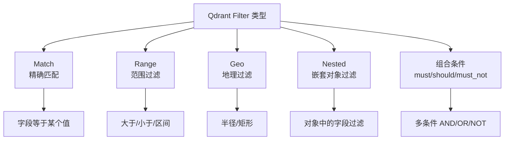
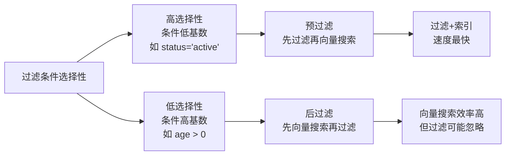

# Qdrant Payload 过滤

## 学习目标

- 理解 Qdrant Payload 过滤的丰富能力
- 掌握 Payload 索引的配置和优化

## Payload 类型

Qdrant 的 Payload（标量元数据）支持丰富的类型和过滤操作：

```python
from qdrant_client import models

# Payload 支持的字段类型
payload = {
    "name": "Alice",        # 字符串
    "age": 25,              # 整数
    "score": 85.5,          # 浮点数
    "tags": ["rust", "ai"], # 列表
    "location": {           # 地理坐标
        "lon": 116.4,
        "lat": 39.9
    },
    "active": True,         # 布尔
    "data": {"key": "val"}  # 嵌套对象
}
```

## 过滤操作



```python
# Payload 过滤示例
filter_condition = models.Filter(
    must=[
        models.FieldCondition(
            key="city",
            match=models.MatchValue(value="北京")
        ),
        models.FieldCondition(
            key="age",
            range=models.Range(
                gte=18,
                lte=60
            )
        )
    ],
    should=[
        models.FieldCondition(
            key="tags",
            match=models.MatchAny(any=["vip", "premium"])
        )
    ]
)

results = client.search(
    collection_name="users",
    query_vector=vec,
    query_filter=filter_condition,
    limit=10
)
```

## Payload 索引

为提高过滤性能，Qdrant 可以为 Payload 字段建立索引：

```python
# 创建 Payload 索引
client.create_payload_index(
    collection_name="demo",
    field_name="city",          # 字段名
    field_type=models.PayloadIndexType.KEYWORD  # 索引类型
)
client.create_payload_index(
    collection_name="demo",
    field_name="age",
    field_type=models.PayloadIndexType.INTEGER
)
client.create_payload_index(
    collection_name="demo",
    field_name="location",
    field_type=models.PayloadIndexType.GEO
)
```

| 索引类型 | 适用字段 | 支持的过滤 |
|---------|---------|-----------|
| KEYWORD | 字符串/枚举 | match |
| INTEGER | 整数 | match/range |
| FLOAT | 浮点数 | range |
| GEO | 地理坐标 | geo_radius/geo_boundingbox |
| TEXT | 长文本 | 全文搜索 (full-text) |

## 过滤性能



## 要点总结

- Payload 过滤是 Qdrant 的核心差异化能力
- 支持 match/range/geo/nested 四种基础过滤
- Payload 索引（KEYWORD/INTEGER/GEO 等）加速过滤
- 系统根据选择率自动选择预过滤/后过滤策略

## 思考题

1. 为什么 Payload 索引的 KEYWORD 和 INTEGER 比不索引快？
2. 地理过滤在实现上使用了什么空间索引结构？
3. 当过滤条件过多时，如何平衡过滤精度和搜索性能？