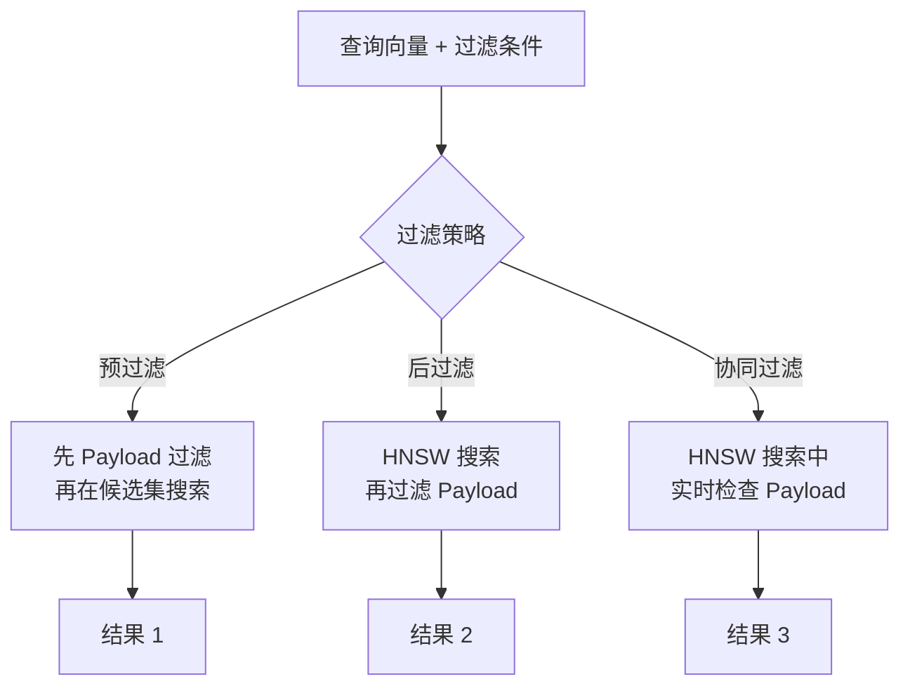
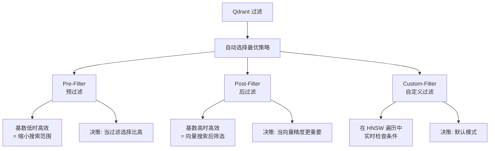

# Qdrant HNSW 索引

## 学习目标

- 理解 Qdrant 自研 HNSW 的实现特点
- 掌握 HNSW + Payload 过滤的协同机制

## 自研 HNSW

Qdrant 使用自研的 HNSW 实现（非 HNSWlib），深度集成 Payload 过滤：



## 三种过滤策略



## 参数配置

```python
from qdrant_client import QdrantClient, models

# 创建集合
client.create_collection(
    collection_name="demo",
    vectors_config=models.VectorParams(
        size=128,
        distance=models.Distance.COSINE
    ),
    optimizers_config=models.OptimizersConfigDiff(
        default_segment_number=2
    )
)

# HNSW 参数
client.update_collection(
    collection_name="demo",
    hnsw_config=models.HnswConfigDiff(
        m=32,               # 连接数
        ef_construct=200,    # 构建搜索范围
        full_scan_threshold=10000,  # 小于此阈值全表扫描
        max_indexing_threads=4
    )
)

# 搜索参数
results = client.search(
    collection_name="demo",
    query_vector=vec,
    search_params=models.SearchParams(
        hnsw_ef=128,        # 搜索范围
        exact=False         # 是否精确搜索
    ),
    limit=10
)
```

| 参数 | 说明 | 默认值 |
|------|------|--------|
| m | HNSW 最大连接数 | 32 |
| ef_construct | 构建时搜索范围 | 200 |
| ef (hnsw_ef) | 搜索时搜索范围 | 128 |
| full_scan_threshold | 回退到全表扫描的阈值 | 10K |

## 要点总结

- Qdrant 使用自研 HNSW，集成 Payload 过滤
- 三种过滤策略（前/后/协同），系统自动选择
- full_scan_threshold 在小数据时回退全表扫描
- HNSW 参数可动态调整

## 思考题

1. 自研 HNSW 相比使用 HNSWlib 有哪些优势和风险？
2. full_scan_threshold 阈值如何设置？太大会不会导致性能问题？
3. 协同过滤策略在 HNSW 图遍历中是如何实现的？