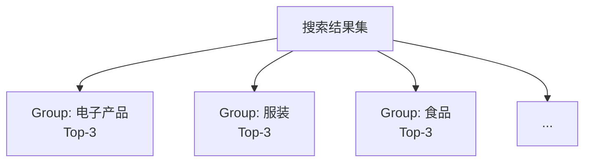
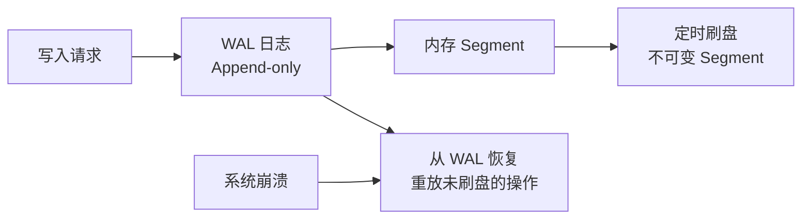
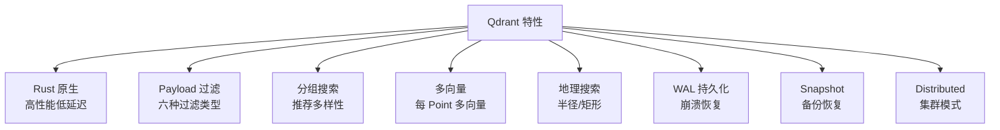

# Qdrant 关键特性

## 学习目标

- 掌握 Qdrant 的核心差异化特性
- 理解这些特性的实际价值

## 分组搜索 (Group By)

Qdrant 支持按某个字段分组返回 Top-K 结果：

```python
# 每个类别返回 Top-3 结果
results = client.search_groups(
    collection_name="products",
    query_vector=vec,
    group_by="category_id",
    group_size=3,
    limit=100
)
```



**应用场景**：推荐多样性——每个类别返回少量结果，避免推荐结果过于单一。

## 多向量 (Multi-Vector)

每个 Point 可关联多个命名向量：

```python
vectors_config = {
    "text_embedding": models.VectorParams(size=768, distance="COSINE"),
    "image_embedding": models.VectorParams(size=512, distance="COSINE"),
}

client.create_collection("multi_vector", vectors_config=vectors_config)

# 多向量搜索
results = client.search(
    collection_name="multi_vector",
    query_vector=("text_embedding", text_vec),
    limit=10
)
```

## 地理搜索

```python
results = client.search(
    collection_name="places",
    query_vector=vec,
    query_filter=models.Filter(
        must=[
            models.FieldCondition(
                key="location",
                geo_radius=models.GeoRadius(
                    center=models.GeoPoint(lon=116.4, lat=39.9),
                    radius=5000.0  # 5km
                )
            )
        ]
    )
)
```

## WAL 持久化



## 特性总览



## 要点总结

- 分组搜索：每组的 Top-K，保障推荐多样性
- 多向量：每个 Point 关联多个向量
- 地理搜索：经纬度半径/矩形查询
- WAL 持久化 + Snapshot 保障数据安全

## 思考题

1. 分组搜索和普通搜索后再分组，在性能上有哪些区别？
2. 多向量场景下，搜索时如何同时匹配多个向量？
3. 地理搜索的 Geo Radius 在底层使用了什么空间索引？