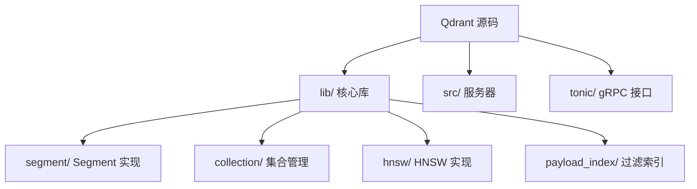
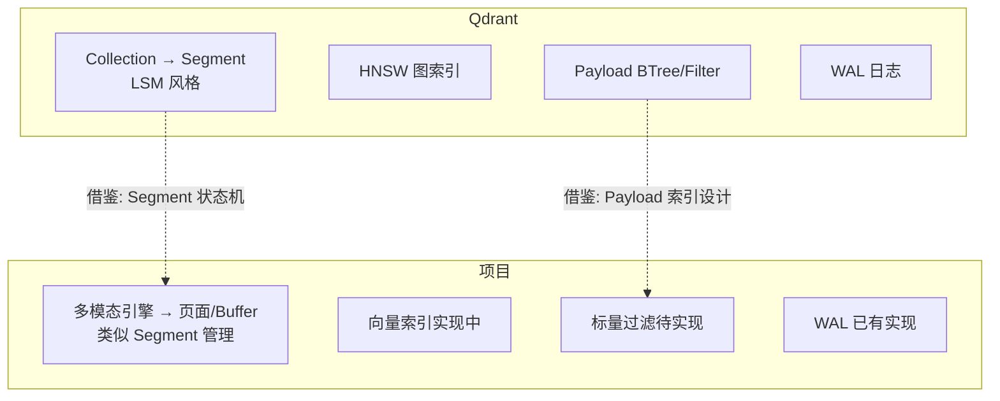

# Qdrant 学习资源与项目关联

## 学习目标

- 获取 Qdrant 的学习资源
- 分析 Qdrant 设计对项目的启发

## 学习资源

### 官方资源

- **文档**：[https://qdrant.tech/documentation/](https://qdrant.tech/documentation/)
- **GitHub**：[https://github.com/qdrant/qdrant](https://github.com/qdrant/qdrant)
- **技术博客**：[https://qdrant.tech/blog/](https://qdrant.tech/blog/)

### 源码研读

## Qdrant 与项目关联

### 架构对比

### 可借鉴点

| Qdrant 设计 | 项目借鉴方式 | 优先级 |
|------------|-------------|-------|
| Segment 状态机 | Buffer Pool 页面管理改进 | ⭐⭐ |
| Payload 过滤 | 多模态引擎标量过滤实现 | ⭐⭐⭐ |
| 分组搜索 | 推荐系统模块算法 | ⭐ |
| HNSW 图索引 | 向量引擎索引实现 | ⭐⭐⭐ |

### 直接关联

Qdrant 的 Payload 过滤机制（match/range/geo）对项目中存储引擎的"标量过滤"设计有直接参考价值。目前项目中的多模态引擎支持向量、时序、图等模型，但还缺少类似 Qdrant 的灵活标量过滤能力。

## 要点总结

- Qdrant 源码结构清晰，核心在 lib/segment/ 目录
- Segment 状态机对项目 Buffer Pool 管理有启发
- Payload 过滤机制可直接借鉴到项目的标量过滤
- HNSW 图索引实现可作为向量引擎的参考