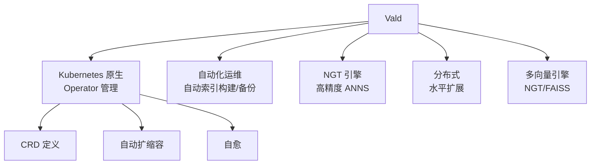

# Vald 项目概览

## 学习目标

- 了解 Vald 的云原生向量检索系统定位
- 掌握 Vald 的自动化运维设计

## 项目定位

> Vald 是一个云原生的分布式向量检索系统，专为大规模 AI 应用设计，强调 Kubernetes 原生集成和自动化运维。

**基本信息**：
- 开发方：株式会社ヴィズ・エーアイ（VDAI）
- 开源协议：Apache 2.0
- GitHub Stars：约 2k

## 核心设计

## 要点总结

- Kubernetes 原生，自动化运维能力突出
- 使用 NGT（Neighborhood Graph Tree）作为核心引擎
- 支持自动索引备份和恢复
- 适合在 K8s 上运行的大规模检索系统