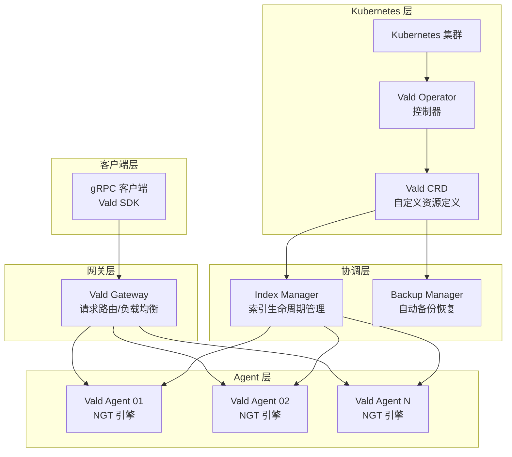
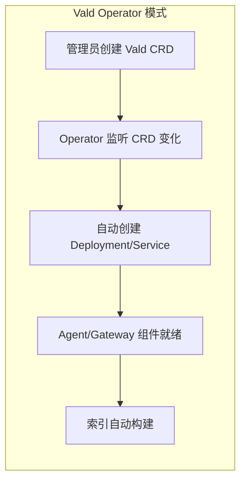
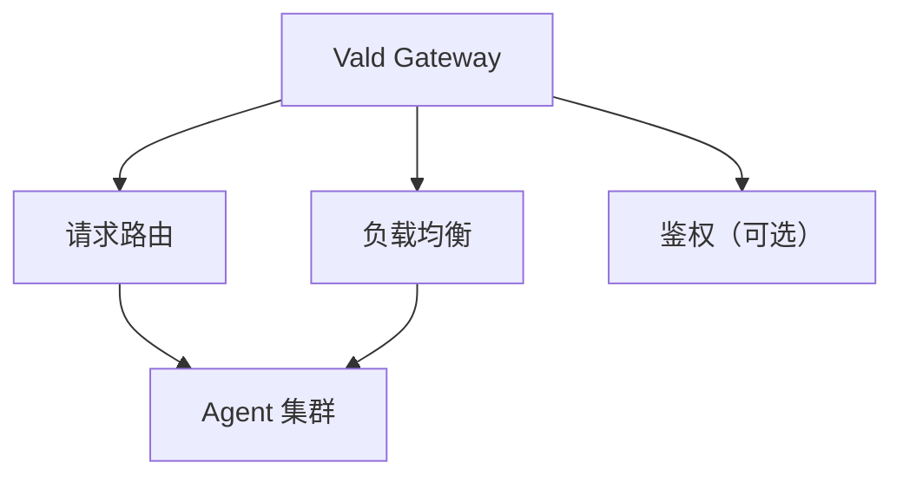
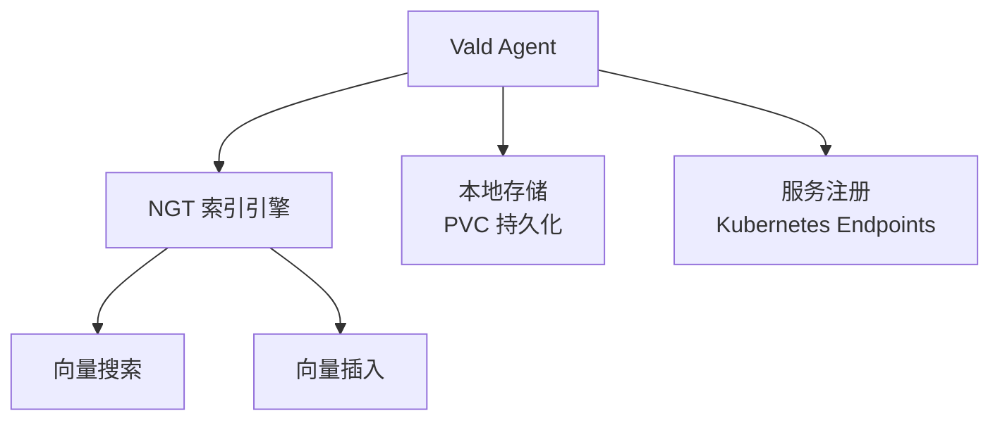
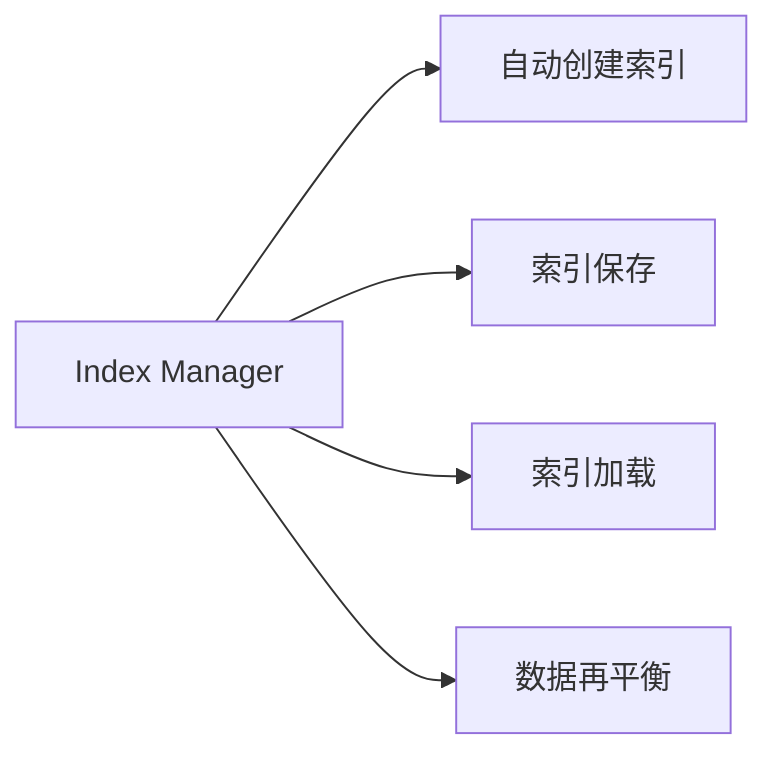
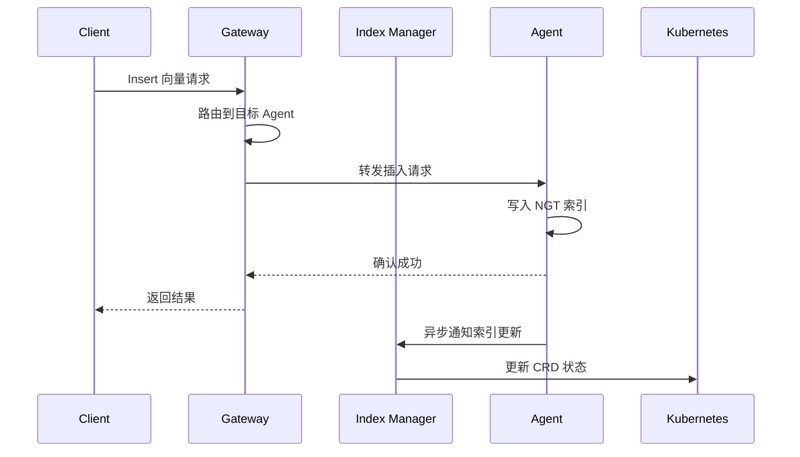
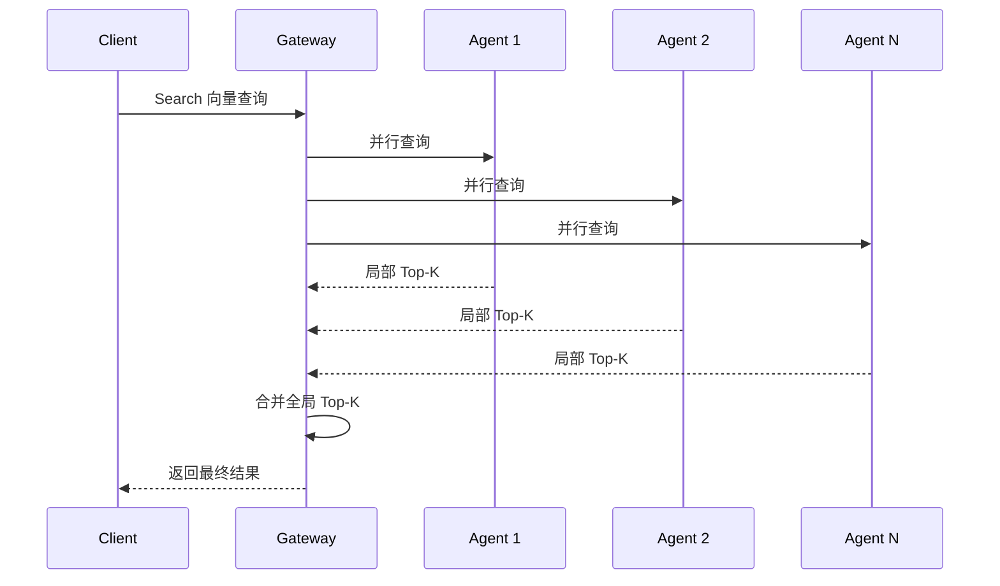
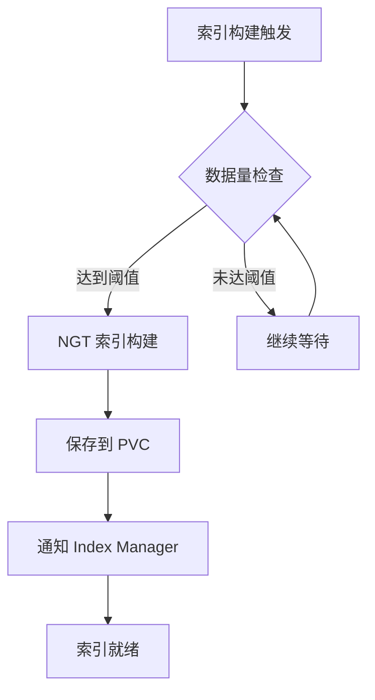

# Vald 整体架构

## 学习目标

- 理解 Vald 的 Kubernetes 原生架构设计
- 掌握各组件职责和数据流转
- 了解 NGT 引擎的集成方式

## 核心概念

- **Kubernetes 原生**：以 CRD（Custom Resource Definition）和 Operator 为核心的自动化运维
- **分布式架构**：Gateway、Agent、Index Manager 三层分离
- **NGT 引擎**：Neighborhood Graph Tree，高精度近似最近邻搜索算法
- **自动运维**：索引构建、备份、恢复全部自动化

## 架构总览

## Kubernetes 原生架构

| 组件 | Kubernetes 资源 | 说明 |
|------|----------------|------|
| Gateway | Deployment + Service | 无状态，可水平扩展 |
| Agent | StatefulSet | 有状态，持久化索引数据 |
| Index Manager | Deployment | 索引生命周期管理 |
| Backup Manager | CronJob | 定时备份任务 |

## 组件详解

### Gateway

- **请求路由**：将查询分发到正确的 Agent
- **负载均衡**：Round-robin 或一致性哈希
- **协议转换**：gRPC 接口处理

### Agent

- **NGT 引擎**：核心向量搜索能力
- **本地存储**：索引数据持久化到 PVC
- **服务注册**：自动注册到 Kubernetes Endpoints

### Index Manager

- **索引生命周期**：创建 → 更新 → 删除
- **数据再平衡**：Agent 扩缩容时自动迁移数据

## 写入流程

## 查询流程

## 自动索引构建

## 要点总结

- Vald 是 Kubernetes 原生的向量检索系统，以 Operator 模式实现自动化运维
- Gateway 无状态可扩展，Agent 有状态存储索引数据
- NGT 引擎提供高精度近似最近邻搜索
- 索引生命周期由 Index Manager 自动管理

## 思考题

1. Vald 的 Gateway 无状态设计有什么优势？如何保证 Agent 故障时的数据安全？
2. NGT 索引构建时，Vald 如何保证服务的可用性（写入继续进行）？
3. 如果要实现跨集群的 Vald 部署，需要考虑哪些架构调整？