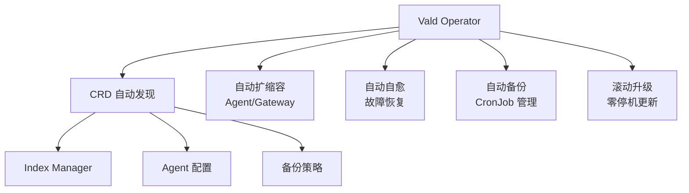
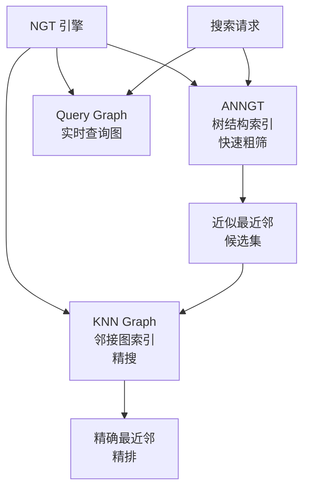
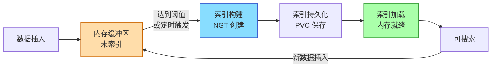
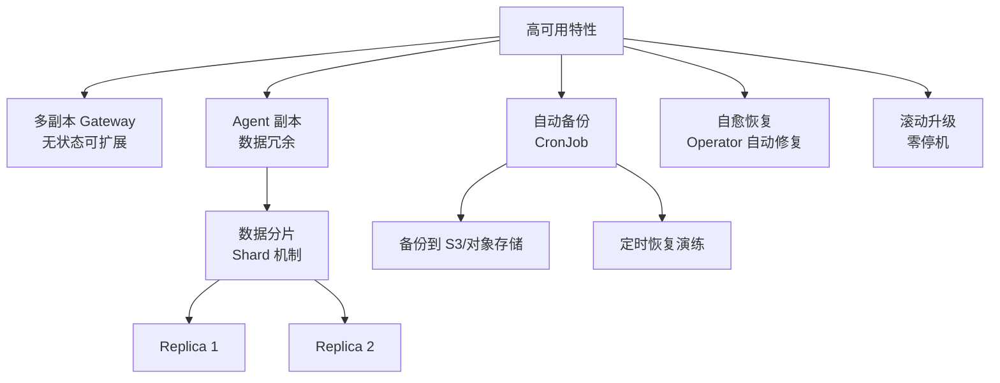
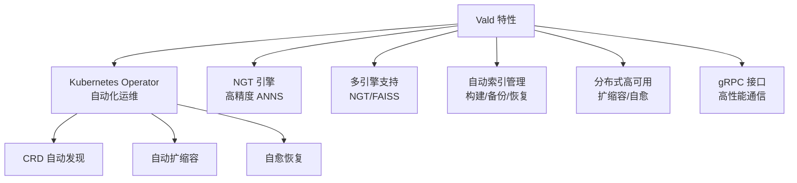

# Vald 关键特性

## 学习目标

- 掌握 Vald 的核心差异化特性
- 理解 Kubernetes Operator 在向量检索中的价值

## Kubernetes Operator 自动化管理

Vald 的核心竞争力在于 Kubernetes 原生自动化运维能力：



```yaml
# Vald CRD 示例
apiVersion: vald.vda.ai/v1
kind: ValdRelease
metadata:
  name: my-vald-cluster
spec:
  gateway:
    replicas: 3
    resources:
      limits:
        memory: "1Gi"
  agent:
    replicas: 5
    resources:
      limits:
        memory: "8Gi"
    ngt:
      dimension: 128
      object_type: Float
      distance_type: L2
  index_manager:
    auto_indexing: true
    index_interval: "10m"
    backup:
      enabled: true
      schedule: "0 */6 * * *"
```

## NGT（Neighborhood Graph Tree）索引

NGT 是 Vald 默认的核心向量索引引擎，结合了图搜索和树搜索的优势：



| NGT 特性 | 说明 | 优势 |
|---------|------|------|
| ANNGT | 树结构快速索引 | 快速排除无关数据 |
| KNN Graph | 邻接图精搜 | 高召回率 |
| 动态插入 | 支持增量更新 | 无需全量重建 |
| 多距离类型 | L2/IP/Cosine/Hamming | 灵活适配 |

## 多向量引擎支持

Vald 支持多种向量引擎，可通过插件机制切换：

```yaml
# Vald Agent 配置示例
apiVersion: vald.vda.ai/v1
kind: ValdAgent
spec:
  # NGT 引擎配置
  ngt:
    enabled: true
    dimension: 512
    object_type: Float
    distance_type: Cosine
    index_type: graph-and-tree

  # FAISS 引擎配置（可选）
  faiss:
    enabled: false
```

| 引擎 | 场景 | 精度 | 速度 |
|------|------|------|------|
| NGT | 默认引擎，高精度 | 高 | 快 |
| FAISS | 传统向量检索集成 | 中-高 | 快 |
| 自研引擎 | 自定义算法 | 可定制 | 可定制 |

## 自动索引生命周期管理



**索引策略配置**：

```yaml
index_manager:
  auto_indexing: true
  index_interval: "10m"              # 定时间隔
  index_threshold: 10000             # 新数据阈值
  initial_delay: "5m"                # 启动延迟
  create_index_timeout: "30m"        # 超时
```

## 高可用设计



## 特性总览



## 要点总结

- Kubernetes Operator 模式是 Vald 的核心差异，实现自动化运维
- NGT 引擎结合树搜索和图搜索，兼顾速度和精度
- 自动索引生命周期管理，无需人工干预
- 多副本和自动备份保障高可用

## 思考题

1. Vald 的 Operator 模式相比 Helm 部署，在运维上多了哪些能力？
2. NGT 的树+图混合索引相比纯 HNSW 图索引，优劣势是什么？
3. 自动索引构建的触发策略（定时 vs 阈值）如何影响搜索延迟和精度？