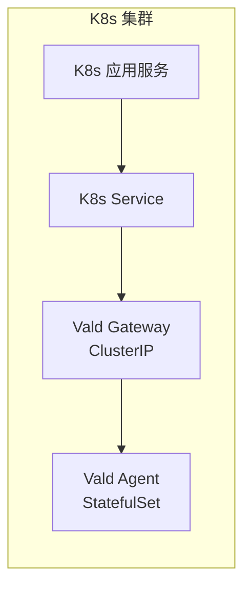
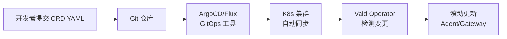
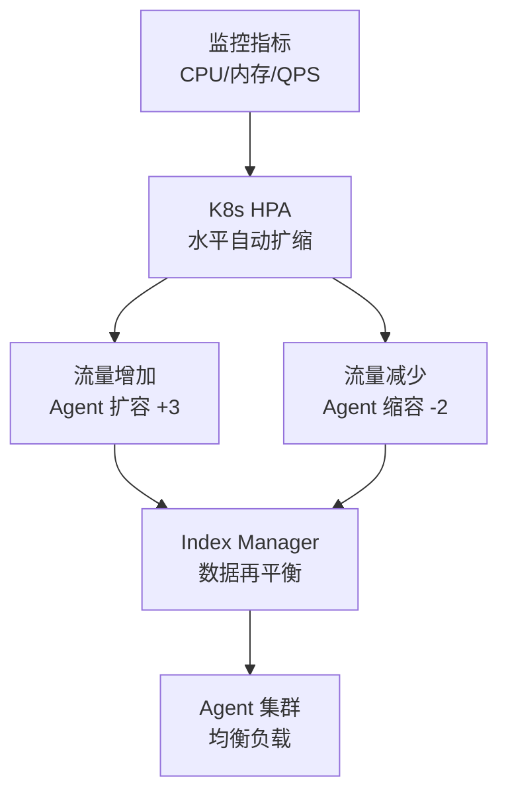
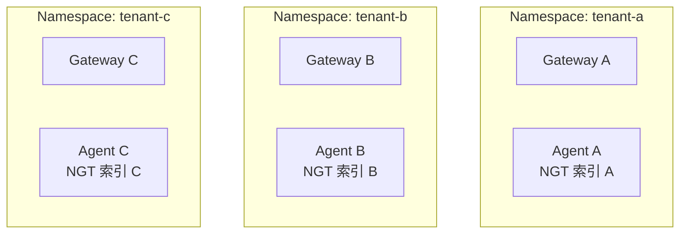

# Vald 使用场景

## 学习目标

- 掌握 Vald 的典型应用场景
- 理解 Kubernetes 原生向量数据库的适用条件

## K8s 原生大规模检索

Vald 最适合已在 Kubernetes 上运行的应用，可实现端到端云原生部署：



```yaml
# K8s 应用访问 Vald
apiVersion: v1
kind: Service
metadata:
  name: vald-gateway
spec:
  selector:
    app: vald-gateway
  ports:
    - port: 8081
      targetPort: 8081
---
apiVersion: apps/v1
kind: Deployment
metadata:
  name: my-app
spec:
  template:
    spec:
      containers:
        - name: app
          env:
            - name: VALD_HOST
              value: "vald-gateway"
            - name: VALD_PORT
              value: "8081"
```

- 与 K8s 生态深度集成，无需额外服务发现
- 利用 K8s 原生的扩缩容能力
- 自动配置 ConfigMap/Secret 管理

## CI/CD 流水线集成

Vald 的 CRD 驱动设计使其天然适合 GitOps 工作流：



```yaml
# 通过 CI/CD 管理 Vald 配置变更
# 1. 更新 CRD 中 Agent 副本数
# 2. 提交到 Git 仓库
# 3. ArgoCD 自动同步
# 4. Vald Operator 执行滚动更新
```

**优势**：
- 所有配置版本化管理
- 变更可审计、可回滚
- 环境一致性保障

## 自动扩缩容的检索服务

根据业务流量自动调整 Agent 规模：



```yaml
# HPA 配置
apiVersion: autoscaling/v2
kind: HorizontalPodAutoscaler
metadata:
  name: vald-agent-hpa
spec:
  scaleTargetRef:
    apiVersion: apps/v1
    kind: StatefulSet
    name: vald-agent
  minReplicas: 3
  maxReplicas: 20
  metrics:
    - type: Resource
      resource:
        name: cpu
        target:
          type: Utilization
          averageUtilization: 70
    - type: Resource
      resource:
        name: memory
        target:
          type: Utilization
          averageUtilization: 80
```

## 多租户隔离

通过 K8s Namespace 实现租户隔离：



| 租户 | Namespace | 副本数 | 资源限制 |
|------|-----------|--------|---------|
| 租户 A（高优） | tenant-a | 10 | 16GB 内存 |
| 租户 B（标准） | tenant-b | 5 | 8GB 内存 |
| 租户 C（试用） | tenant-c | 2 | 2GB 内存 |

**隔离方式**：
- 物理隔离：每个租户独立 Vald 实例
- 逻辑隔离：同一实例，不同索引
- 混合模式：高优租户物理隔离，普通租户逻辑隔离

## 场景选择矩阵

| 场景 | Vald 特性 | 推荐理由 |
|------|-----------|---------|
| K8s 原生应用 | Operator + CRD | 与 K8s 深度集成 |
| GitOps 流水线 | CRD 版本化管理 | 声明式配置 |
| 自动扩缩容 | HPA + Index Manager | 按需分配资源 |
| 多租户 | Namespace 隔离 | 资源隔离 |
| 自动化运维 | 自动备份/恢复 | 降低运维成本 |
| 高精度检索 | NGT 引擎 | 高召回率 |

## 要点总结

- Vald 最适合 Kubernetes 生态中的向量检索场景
- GitOps 工作流可实现 Vald 配置的版本化管理
- HPA 自动扩缩容，按业务流量动态调整资源
- 多租户隔离可通过 K8s Namespace 实现

## 思考题

1. 多租户场景下，物理隔离和逻辑隔离各有什么成本和安全性考虑？
2. 自动扩缩容时，新增 Agent 如何快速加载索引并开始服务？
3. GitOps 工作流中，CRD 配置变更如何保证不影响正在进行的查询？