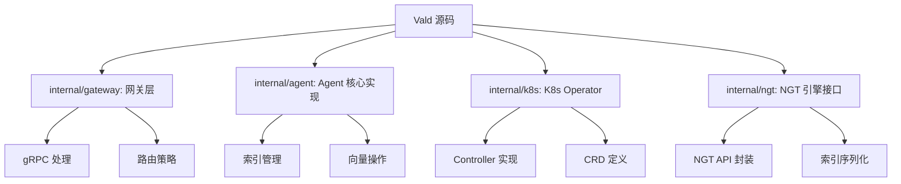
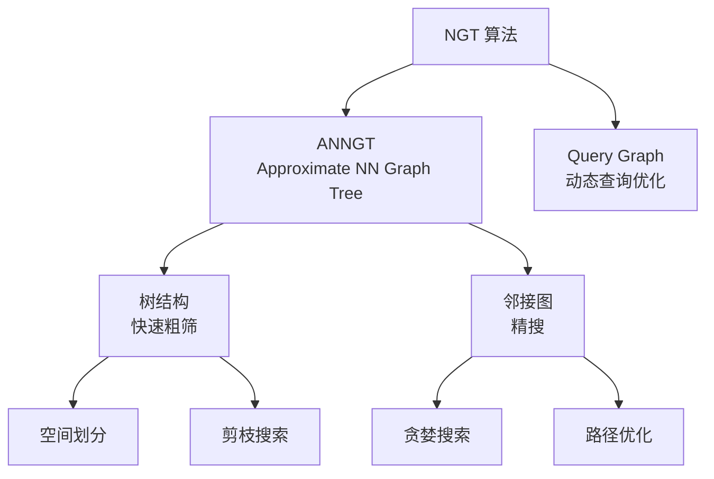
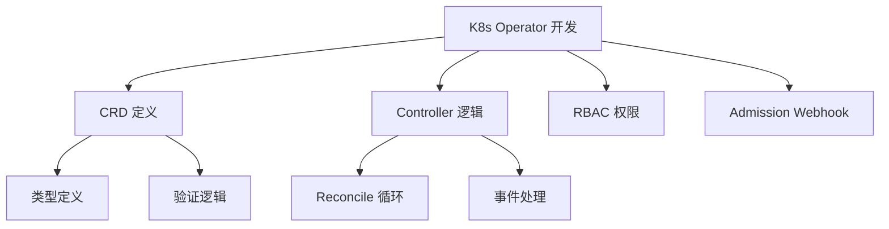
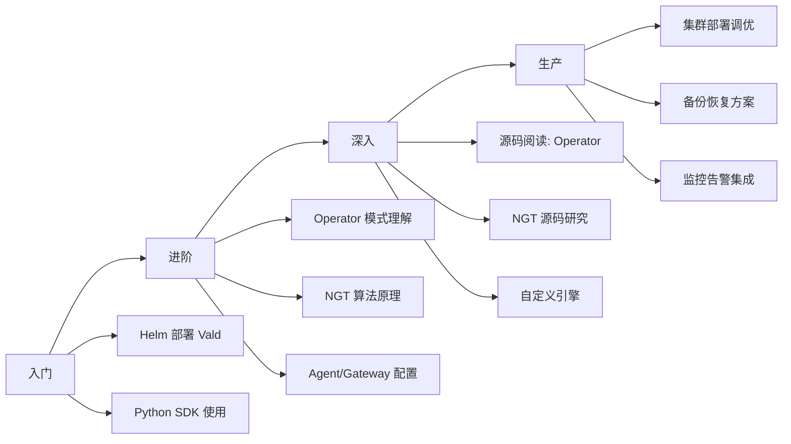

# Vald 学习资源

## 学习目标

- 获取 Vald 的优质学习资源
- 了解 NGT 算法的原理和应用

## 官方资源

- **官方文档**：[https://vald.vda.ai/docs/](https://vald.vda.ai/docs/)
- **GitHub**：[https://github.com/vdaas/vald](https://github.com/vdaas/vald)
- **Helm Charts**：[https://github.com/vdaas/vald-helm](https://github.com/vdaas/vald-helm)

## 源码研读路径

## NGT 算法资料

NGT 是 Vald 的核心索引算法：

- **NGT GitHub**：[https://github.com/yahoojapan/NGT](https://github.com/yahoojapan/NGT)
- **论文**："ANNGT: Approximate Nearest Neighbor Search using Graph and Tree"

**关键论文**：
1. Yahoo Japan Research, "NGT: Neighborhood Graph Tree for Approximate Nearest Neighbor Search"
2. "On the Effectiveness of Graph-based Algorithms for Approximate Nearest Neighbor Search"

## K8s Operator 开发资源

Vald 的 Operator 是学习 K8s Controller 开发的好案例：

- **Kubebuilder**：[https://book.kubebuilder.io/](https://book.kubebuilder.io/)
- **Operator SDK**：[https://sdk.operatorframework.io/](https://sdk.operatorframework.io/)

## 学习路径

| 阶段 | 内容 | 时间 |
|------|------|------|
| 入门 | Helm 部署 + SDK 使用 | 1-2 天 |
| 进阶 | Operator 模式 + NGT 原理 | 1 周 |
| 深入 | 源码阅读 + 自定义开发 | 2 周 |
| 生产 | 集群调优 + 监控 | 持续 |

## 项目启发

Vald 的设计对项目有诸多启发：

### 1. 自动化运维模式

Vald 的 Operator 模式展示了如何在 K8s 上实现完全自动化的数据库运维。项目中如需支持 K8s 部署，可借鉴其 CRD 设计。

### 2. NGT 索引算法

NGT 的树+图混合索引策略，对项目中向量索引的设计有参考价值。可考虑引入 ANNGT 思想优化检索精度。

### 3. 索引生命周期管理

Vald 的自动索引构建、保存、加载机制，可借鉴到项目的索引管理模块。

## 要点总结

- Vald 官方文档是最佳学习入口
- 源码核心在 internal/agent 和 internal/k8s 目录
- NGT 算法结合树和图的优点，适合高精度检索
- K8s Operator 开发资源丰富，Vald 是优秀学习案例