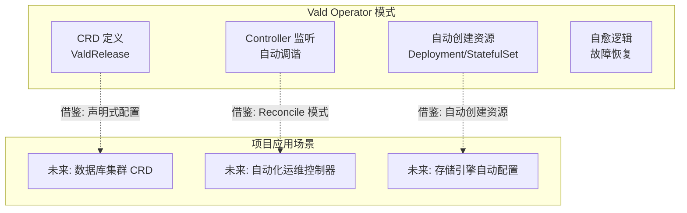
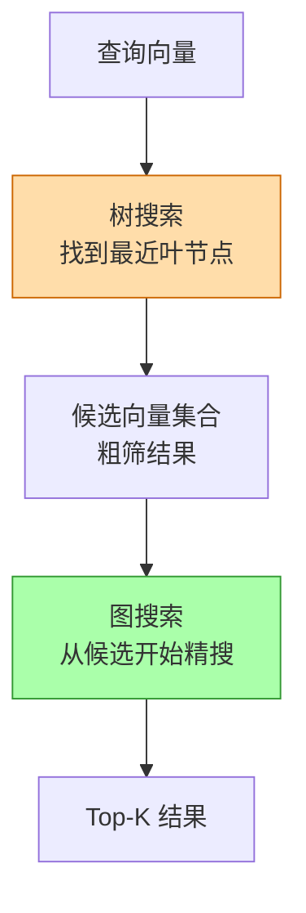
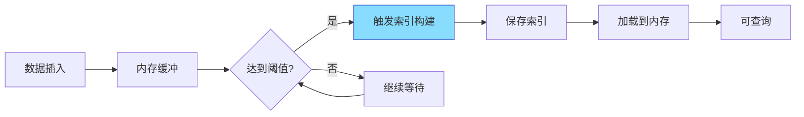
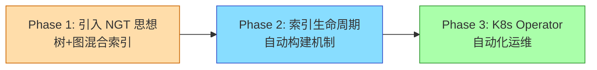

# Vald 与项目关联

## 学习目标

- 分析 Vald 设计对项目存储引擎的启发性
- 找出项目中可借鉴的关键技术点

## K8s Operator 模式启发

Vald 展示了 Kubernetes Operator 在数据库运维中的强大能力：



**可借鉴设计**：

| Vald 设计 | 项目对应 | 借鉴价值 |
|----------|---------|---------|
| ValdRelease CRD | 数据库集群配置 | 声明式管理 |
| Agent StatefulSet | 存储节点有状态管理 | 数据持久化 |
| 自动备份 CronJob | 定时备份任务 | 运维自动化 |
| Index Manager | 索引生命周期 | 自动索引构建 |

## NGT 索引设计参考

Vald 的 NGT 引擎对项目中向量引擎的索引设计有直接参考价值：

```c
// 借鉴 NGT 的树+图混合索引思路

// 1. 树结构: 快速粗筛
typedef struct ngt_tree_node {
    float *centroid;           // 聚类中心
    int n_children;            // 子节点数
    struct ngt_tree_node **children;  // 子节点
    int *vector_ids;           // 叶子节点包含的向量 ID
    int n_vectors;             // 向量数量
} ngt_tree_node_t;

// 2. 邻接图: 精搜
typedef struct ngt_graph {
    int n_nodes;               // 节点数
    int **neighbors;           // 邻接表
    int *n_neighbors;          // 每个节点的邻居数
    int max_neighbors;         // 最大邻居数
} ngt_graph_t;

// 3. 搜索流程: 树粗筛 → 图精搜
typedef struct ngt_index {
    ngt_tree_node_t *tree;     // 树结构
    ngt_graph_t *graph;        // 邻接图
    float *vectors;            // 向量数据
    int n_vectors;             // 向量总数
    int dimension;             // 向量维度
} ngt_index_t;
```



## 自动索引生命周期管理启发

Vald 的自动索引管理机制可借鉴到项目的索引模块：



**项目中的实现思路**：

```c
// 索引生命周期管理
typedef enum {
    INDEX_UNBUILT,      // 未构建
    INDEX_BUILDING,     // 构建中
    INDEX_READY,        // 可用
    INDEX_DIRTY         // 需要更新
} index_state_t;

typedef struct index_manager {
    index_state_t state;
    int unindexed_count;       // 未索引数据计数
    int index_threshold;       // 触发构建阈值
    pthread_t build_thread;    // 构建线程
    bool auto_build;           // 自动构建开关
} index_manager_t;

// 定时检查并触发构建
void *index_build_loop(void *arg) {
    index_manager_t *mgr = arg;
    while (true) {
        sleep(INDEX_CHECK_INTERVAL);
        if (mgr->unindexed_count >= mgr->index_threshold) {
            mgr->state = INDEX_BUILDING;
            build_index();
            mgr->state = INDEX_READY;
            mgr->unindexed_count = 0;
        }
    }
}
```

## 项目提升计划



## 要点总结

- Vald 的 K8s Operator 模式对项目未来 K8s 部署有直接借鉴意义
- NGT 的树+图混合索引策略可应用于项目向量引擎
- 自动索引生命周期管理可提升项目的运维效率
- 声明式配置（CRD）思想可应用于项目配置管理

## 思考题

1. 项目中如果要实现类似 NGT 的混合索引，需要修改哪些模块（Buffer Pool/索引层/执行器）？
2. 索引生命周期管理中，如何平衡构建频率和查询延迟（新数据不可查）？
3. 如果项目要支持 K8s Operator 模式，现有架构需要做哪些调整？