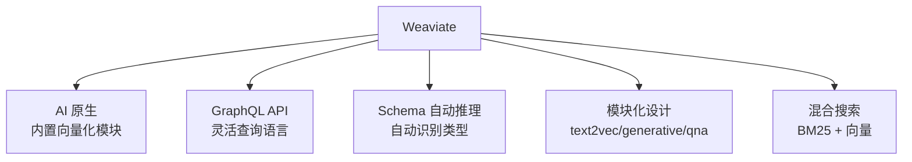
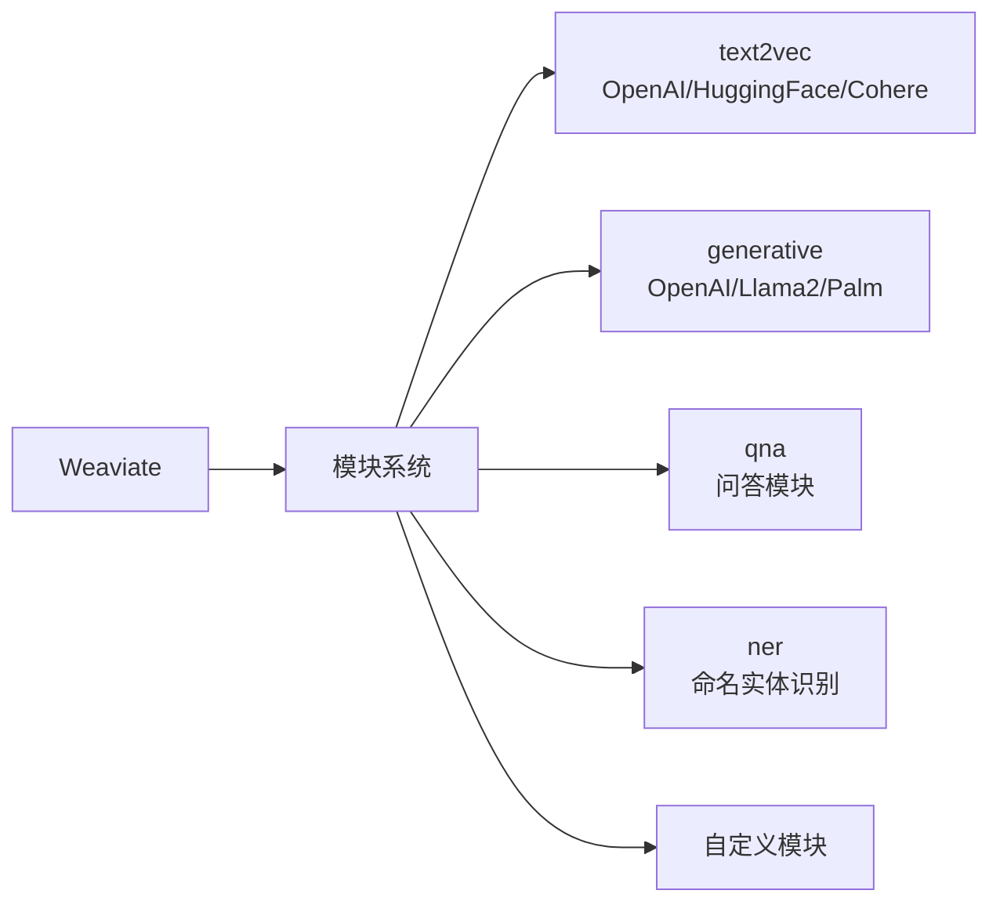

# Weaviate 项目概览

## 学习目标

- 了解 Weaviate 的 AI 原生向量数据库定位
- 掌握 Weaviate 的独特设计：Schema 自动推理 + GraphQL + 模块化

## 项目定位

> Weaviate 是一个 AI 原生向量数据库，内置自动向量化、GraphQL 访问和 Schema 推理能力。

**基本信息**：

- 开发方：Weaviate BV
- 首次发布：2019 年
- 开源协议：BSD 3-Clause
- GitHub Stars：约 13k（[weaviate/weaviate](https://github.com/weaviate/weaviate)）

## 核心设计理念

## 模块化架构

## 要点总结

- AI 原生设计，内置向量化模型
- GraphQL API，查询灵活表达
- Schema 自动推理，无需手动定义
- 模块化支持 text2vec/generative/qna
- 混合搜索 BM25 + 向量融合

## 思考题

1. 自动 Schema 推理的准确率如何？在什么场景下会出错？
2. GraphQL 相比 REST API 在查询向量时有什么优势？
3. 生成式模块（generative）在搜索后如何利用 LLM 生成回答？