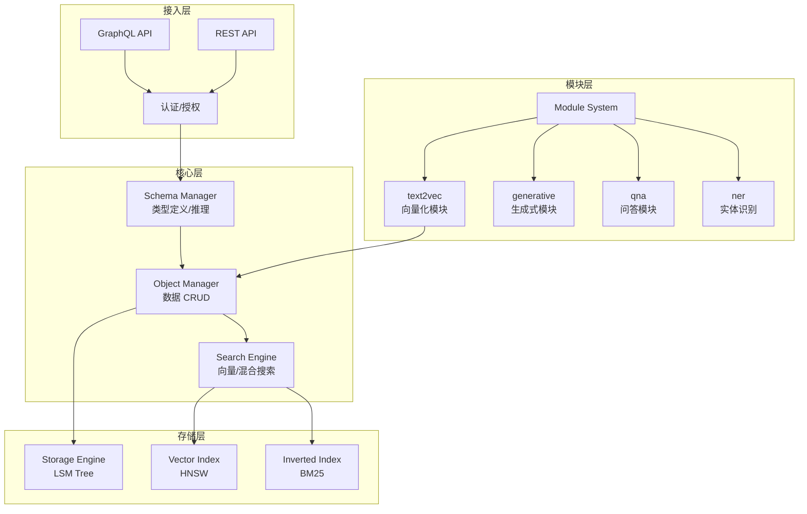
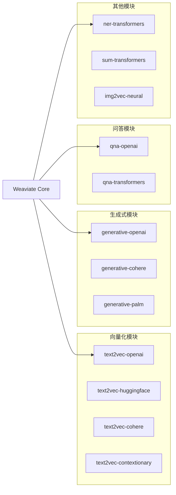
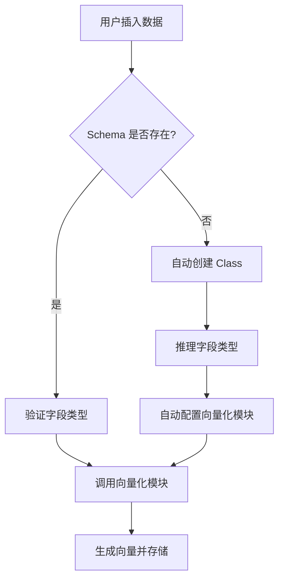
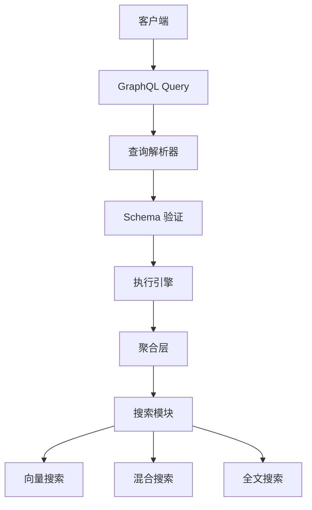
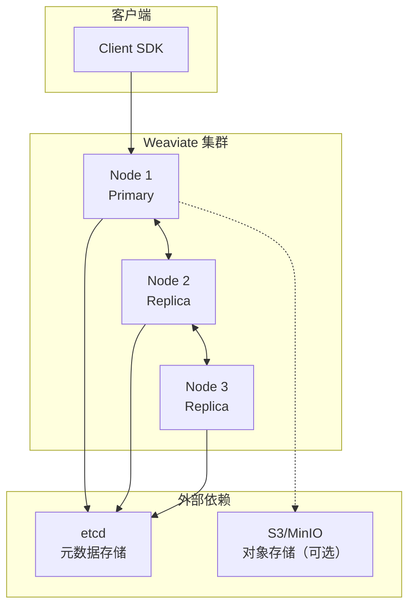
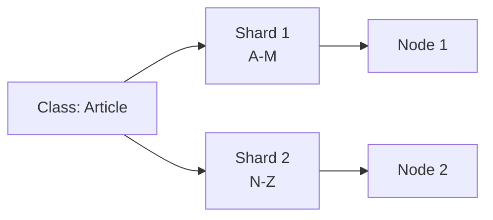
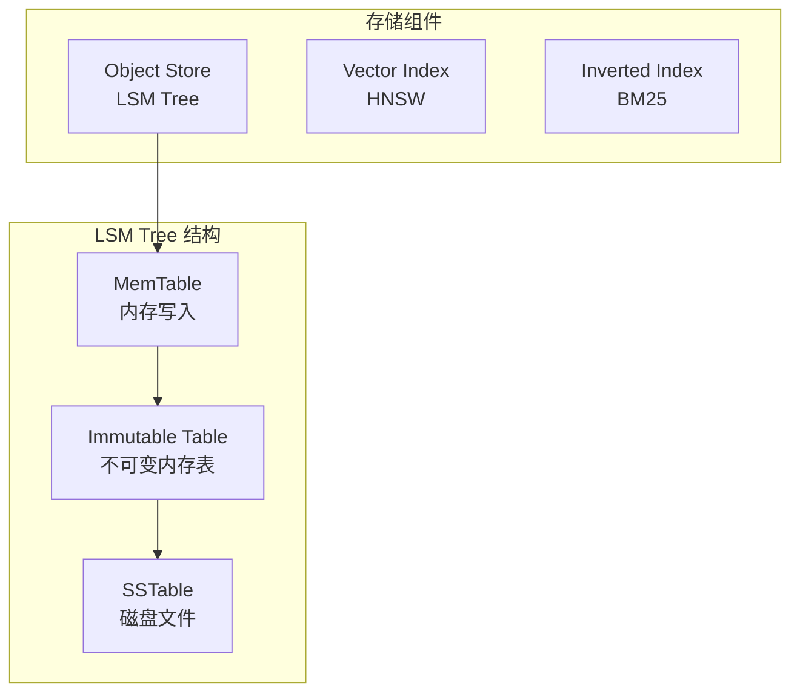
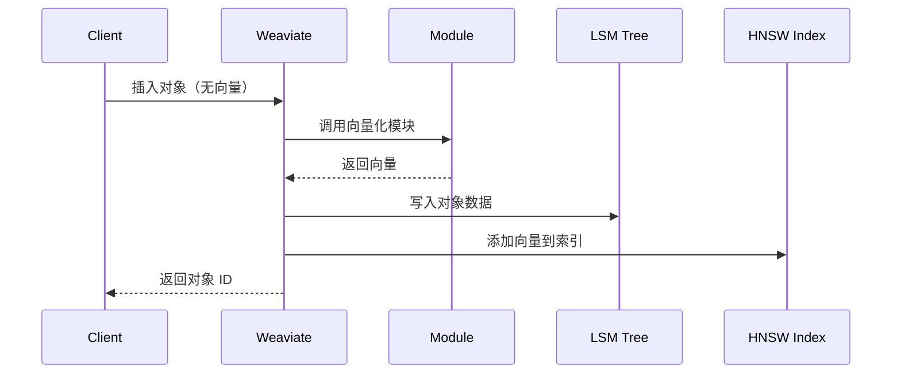
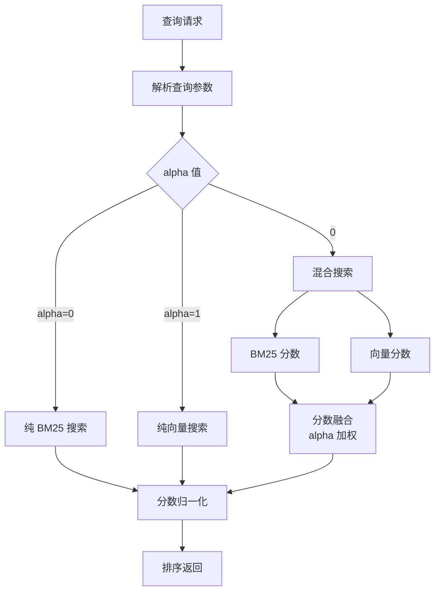

# Weaviate 整体架构

## 学习目标

- 理解 Weaviate 的模块化架构设计
- 掌握 GraphQL API 层与存储引擎的协作
- 了解 Schema 自动推理机制

## 核心概念

- **Class**：类似表的集合，定义数据类型和向量化配置
- **Object**：单个数据记录，自动生成向量
- **Module**：向量化/生成式等可插拔模块
- **Schema**：定义 Class 结构和模块配置
- **Inverted Index**：BM25 全文搜索索引
- **Vector Index**：HNSW 向量索引

## 架构总览



## 模块化系统架构



### 模块配置示例

```json
{
  "class": "Article",
  "moduleConfig": {
    "text2vec-openai": {
      "vectorizeClassName": true,
      "model": "ada",
      "type": "text"
    },
    "qna-openai": {
      "model": "text-davinci-003",
      "maxTokens": 100
    },
    "generative-openai": {
      "model": "gpt-3.5-turbo"
    }
  }
}
```

## Schema 自动推理机制



### 自动类型推理规则

| 输入值示例 | 推理类型 | 说明 |
|-----------|---------|------|
| `"hello world"` | `text` | 文本类型，自动向量化 |
| `123` | `int` | 整数类型 |
| `3.14` | `number` | 浮点类型 |
| `true` | `boolean` | 布尔类型 |
| `"2024-01-01"` | `date` | 日期类型（自动识别格式） |
| `{"key": "value"}` | `object` | 嵌套对象 |
| `["a", "b", "c"]` | `text[]` | 文本数组 |

## GraphQL API 层



### GraphQL 查询类型

```graphql
# 查询操作
type Query {
  Get { ... }      # 获取对象
  Aggregate { ... } # 聚合查询
  Explore { ... }   # 向量探索
}

# 变更操作
type Mutation {
  Add { ... }      # 添加对象
  Update { ... }   # 更新对象
  Delete { ... }   # 删除对象
}
```

## 分布式部署架构



### 分片策略



## 存储引擎



### 写入流程



### 混合搜索流程



## 要点总结

- Weaviate 采用模块化架构，向量化/生成式模块可插拔
- Schema 自动推理机制降低使用门槛
- GraphQL API 提供灵活的查询能力
- 存储层采用 LSM Tree + HNSW + Inverted Index 三重索引
- 混合搜索通过 alpha 参数控制 BM25 与向量的权重

## 思考题

1. Schema 自动推理在什么场景下可能出错？如何手动干预？
2. 模块化设计如何保证不同向量化模块的向量空间兼容性？
3. 混合搜索中 alpha 参数如何影响搜索结果的相关性和多样性？
4. LSM Tree 在 Weaviate 中如何保证向量索引与对象数据的一致性？
