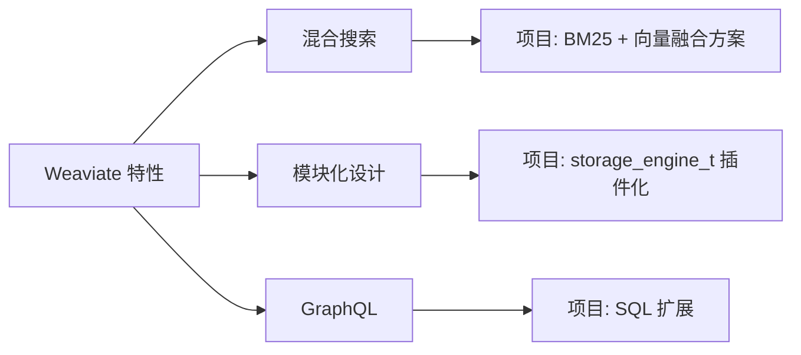

# Weaviate 关键特性与项目关联

## 学习目标

- 掌握 Weaviate 的核心特性
- 分析对项目的启发

## 混合搜索

```graphql
{
  Get {
    Article(
      hybrid: {
        query: "machine learning",
        alpha: 0.5
      }
    ) {
      title
      content
      _additional {
        score
        explainScore
      }
    }
  }
}
```

alpha=0: 纯 BM25 全文搜索
alpha=1: 纯向量搜索
alpha=0.5: BM25 + 向量权重各半

## 自动向量化

```graphql
# 不需要手动传入向量，Weaviate 自动调用向量化模块
{
  Get {
    Article(
      nearText: {
        concepts: ["人工智能"],
        distance: 0.7
      }
    ) {
      title
    }
  }
}
```

## 项目关联



## 要点总结

- 混合搜索 BM25 + 向量融合
- 模块化设计支持多种模型
- GraphQL 查询能力灵活
- 项目可借鉴混合搜索和模块化设计