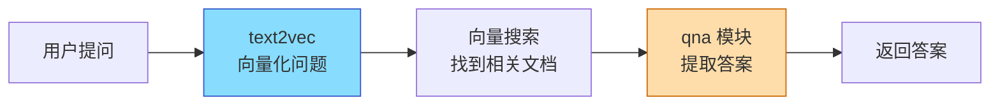
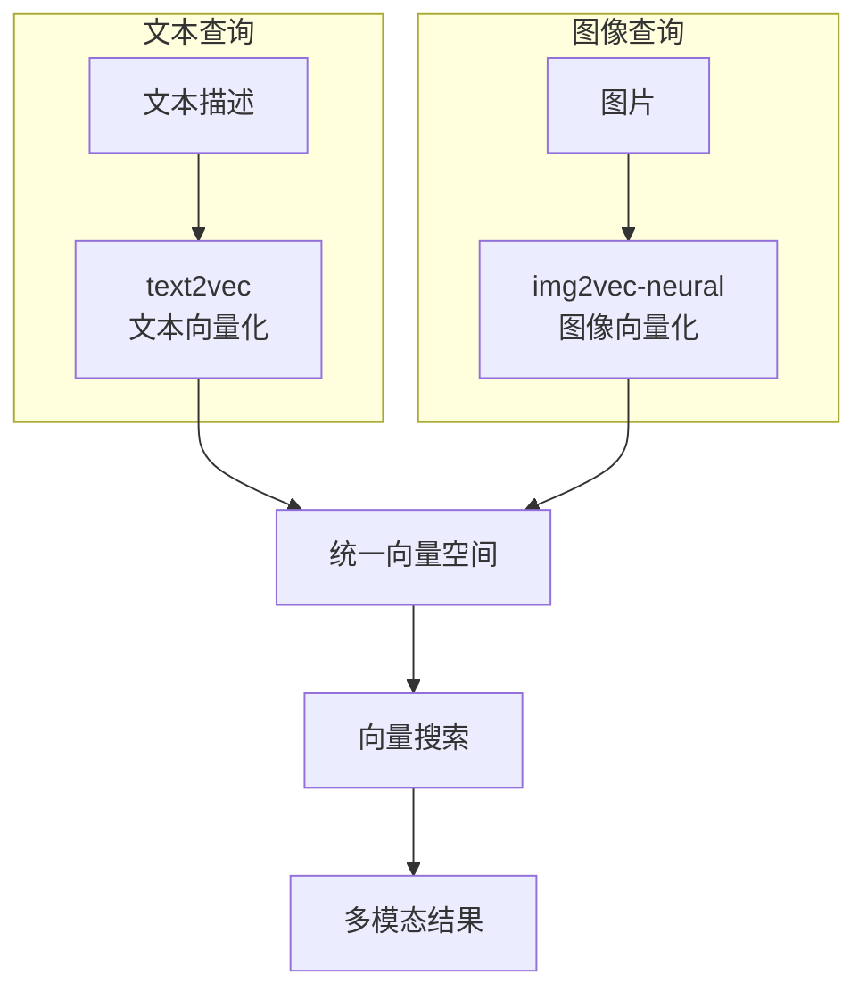
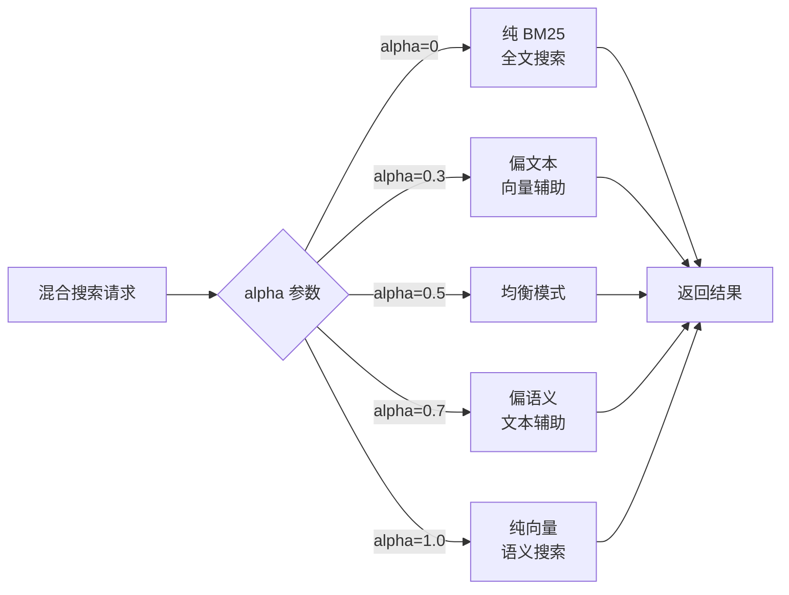

# Weaviate 使用场景

## 学习目标

- 掌握 Weaviate 的典型应用场景
- 理解模块化系统在不同场景中的应用
- 掌握混合搜索的实际用法

## 语义搜索（全自动向量化）

Weaviate 最核心的场景：用户无需手动向量化数据，只需配置 text2vec 模块，系统自动完成向量化。

```python
import weaviate
import json

# 连接 Weaviate
client = weaviate.Client("http://localhost:8080")

# 定义 Schema（text2vec 模块自动处理向量化）
class_obj = {
    "class": "Document",
    "moduleConfig": {
        "text2vec-openai": {
            "vectorizeClassName": False,
            "model": "ada",
            "type": "text"
        }
    },
    "properties": [
        {
            "name": "title",
            "dataType": ["text"],
            "moduleConfig": {
                "text2vec-openai": {
                    "skip": False,
                    "vectorizePropertyName": False
                }
            }
        },
        {
            "name": "content",
            "dataType": ["text"]
        },
        {
            "name": "author",
            "dataType": ["text"],
            "moduleConfig": {
                "text2vec-openai": {
                    "skip": True  # 跳过作者字段，不向量化
                }
            }
        },
        {
            "name": "publish_date",
            "dataType": ["date"]
        }
    ]
}

client.schema.create_class(class_obj)
```

```graphql
# 语义搜索：自动向量化 + 向量搜索
{
  Get {
    Document(
      nearText: {
        concepts: ["深度学习在 NLP 中的应用"]
      }
      limit: 10
    ) {
      title
      content
      _additional {
        certainty
      }
    }
  }
}
```

## 问答系统（QnA 模块）

利用 qna 模块，搜索后自动生成答案。



```graphql
{
  Get {
    Article(
      nearText: {
        concepts: ["什么是向量数据库"]
      }
    ) {
      title
      content
      _additional {
        answer {
          result    # 生成的答案
          property  # 答案来源字段
          startPosition
          endPosition
        }
      }
    }
  }
}
```

### 实际应用：企业知识库问答

```python
def ask_question(question):
    """向知识库提问，返回答案"""
    response = client.query.get(
        "Document", ["title", "content"]
    ).with_near_text({
        "concepts": [question]
    }).with_additional(["answer", "certainty"]).do()

    for item in response["data"]["Get"]["Document"]:
        answer = item.get("_additional", {}).get("answer", {})
        if answer and answer.get("result"):
            return {
                "answer": answer["result"],
                "source": item["title"],
                "certainty": item["_additional"]["certainty"]
            }

    return {"answer": "未找到相关答案"}
```

## 知识图谱构建

利用 Weaviate 的 Cross-Reference 功能构建知识图谱。

```python
# 定义知识图谱 Schema
def create_knowledge_graph_schema(client):
    """创建知识图谱 Schema，包含实体和关系"""
    # 人物
    client.schema.create_class({
        "class": "Person",
        "properties": [
            {"name": "name", "dataType": ["text"]},
            {"name": "bio", "dataType": ["text"]}
        ]
    })

    # 公司
    client.schema.create_class({
        "class": "Company",
        "properties": [
            {"name": "name", "dataType": ["text"]},
            {"name": "industry", "dataType": ["text"]}
        ]
    })

    # 文章（引用人物和公司）
    client.schema.create_class({
        "class": "Article",
        "properties": [
            {"name": "title", "dataType": ["text"]},
            {"name": "content", "dataType": ["text"]},
            {"name": "mentions_person",
             "dataType": ["Person"]},     # 交叉引用
            {"name": "mentions_company",
             "dataType": ["Company"]}     # 交叉引用
        ]
    })
```

```graphql
# 关联查询：找到文章中提到的人物
{
  Get {
    Article(
      nearText: {
        concepts: ["人工智能技术发展"]
      }
    ) {
      title
      mentions_person {
        ... on Person {
          name
          bio
        }
      }
      mentions_company {
        ... on Company {
          name
          industry
        }
      }
    }
  }
}
```

## 多模态搜索（文本+图像）

利用 img2vec 模块实现图像和文本的联合搜索。



### 图像搜索配置

```json
{
  "class": "Product",
  "moduleConfig": {
    "img2vec-neural": {
      "imageFields": ["image"]
    }
  },
  "properties": [
    {"name": "name", "dataType": ["text"]},
    {"name": "image", "dataType": ["blob"]},       // 图片字段
    {"name": "description", "dataType": ["text"]}
  ]
}
```

```graphql
# 以图搜图
{
  Get {
    Product(
      nearImage: {
        image: "base64_encoded_image_data..."
      }
      limit: 5
    ) {
      name
      description
      _additional {
        certainty
      }
    }
  }
}
```

## 混合搜索（BM25 + 向量融合）

```python
def hybrid_search(query, alpha=0.5):
    """
    混合搜索：BM25 + 向量融合

    alpha=0: 纯 BM25 全文搜索
    alpha=1: 纯向量搜索
    alpha=0.5: BM25 + 向量各半
    """
    response = client.query.get(
        "Article", ["title", "content"]
    ).with_hybrid(
        query=query,
        alpha=alpha,
        properties=["title^2", "content"]  # title 权重 2 倍
    ).with_limit(10).do()

    return response["data"]["Get"]["Article"]
```



### 带过滤的混合搜索

```graphql
{
  Get {
    Article(
      hybrid: {
        query: "气候变化影响",
        alpha: 0.5
      }
      where: {
        operator: And
        operands: [
          {
            path: ["publish_date"]
            operator: GreaterThan
            valueDate: "2024-01-01"
          },
          {
            path: ["category"]
            operator: Equal
            valueString: "science"
          }
        ]
      }
      limit: 10
    ) {
      title
      publish_date
      _additional {
        score
        explainScore
      }
    }
  }
}
```

## 场景选择矩阵

| 场景 | Weaviate 特性 | 推荐理由 |
|------|-------------|---------|
| 语义搜索 | text2vec 自动向量化 | 零代码向量化 |
| 企业问答 | qna + generative 模块 | 端到端问答 |
| 知识图谱 | Cross-Reference | 实体关联查询 |
| 多模态搜索 | img2vec-neural | 图像+文本联合 |
| 混合搜索 | hybrid + alpha | BM25+向量灵活控制 |
| 推荐系统 | nearText + where 过滤 | 语义+精确条件 |

## 要点总结

- 语义搜索是 Weaviate 最核心场景，text2vec 模块零代码完成向量化
- QnA 模块让问答系统无需额外搭建 NLP 管道
- Cross-Reference 支持知识图谱的实体关联查询
- img2vec-neural 实现图像+文本的多模态搜索
- 混合搜索通过 alpha 参数在 BM25 和向量之间平滑过渡

## 思考题

1. 在知识图谱场景中，Weaviate 的 Cross-Reference 和专门的图数据库（如 Neo4j）相比有什么优劣？
2. 多模态搜索中，文本向量和图像向量的语义对齐是如何实现的？
3. 混合搜索的 alpha 参数在实际应用中如何调优？是否应该对不同查询使用不同的 alpha？
4. 自动向量化场景中，skip 字段如何影响搜索精度和存储成本？