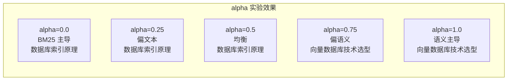

# 动手实验: Weaviate 部署与使用

## 学习目标

- 能够快速部署 Weaviate
- 掌握 Schema 定义和数据导入
- 体验 GraphQL 查询和自动向量化

## Docker 部署

```bash
# 单机部署（含 text2vec-openai 模块）
docker run -d \
  --name weaviate \
  -p 8080:8080 \
  -p 50051:50051 \
  -e AUTHENTICATION_ANONYMOUS_ACCESS_ENABLED=true \
  -e PERSISTENCE_DATA_PATH="/var/lib/weaviate" \
  -e DEFAULT_VECTORIZER_MODULE=none \
  -e CLUSTER_HOSTNAME="node1" \
  semitechnologies/weaviate:latest

# 验证
curl http://localhost:8080/v1/.well-known/ready
```

### 含向量化模块的部署

```bash
# 部署含 text2vec-huggingface 的版本
docker run -d \
  --name weaviate-hf \
  -p 8080:8080 \
  -p 50051:50051 \
  -e AUTHENTICATION_ANONYMOUS_ACCESS_ENABLED=true \
  -e PERSISTENCE_DATA_PATH="/var/lib/weaviate" \
  -e DEFAULT_VECTORIZER_MODULE=text2vec-huggingface \
  -e HUGGINGFACE_APIKEY="your-hf-key" \
  semitechnologies/weaviate:latest
```

## 创建 Schema 和数据导入

### 安装 Python 客户端

```bash
pip install weaviate-client
```

### 定义 Schema

```python
import weaviate
import json

client = weaviate.Client("http://localhost:8080")

# 清理已有 Schema（实验用）
client.schema.delete_all()

# 定义 Schema
schema = {
    "classes": [
        {
            "class": "Article",
            "description": "新闻文章",
            "vectorizer": "text2vec-huggingface",
            "moduleConfig": {
                "text2vec-huggingface": {
                    "model": "sentence-transformers/all-MiniLM-L6-v2",
                    "options": {
                        "waitForModel": True
                    }
                }
            },
            "properties": [
                {
                    "name": "title",
                    "dataType": ["text"],
                    "description": "文章标题"
                },
                {
                    "name": "content",
                    "dataType": ["text"],
                    "description": "文章内容"
                },
                {
                    "name": "category",
                    "dataType": ["text"],
                    "description": "文章分类"
                },
                {
                    "name": "word_count",
                    "dataType": ["int"],
                    "description": "文章字数"
                }
            ]
        }
    ]
}

client.schema.create(schema)
print("Schema 创建成功")
```

### 导入数据

```python
import hashlib
import time

# 示例数据
articles = [
    {
        "title": "深度学习在自然语言处理中的突破",
        "content": "近年来，深度学习技术彻底改变了自然语言处理领域。" +
                   "BERT、GPT 等预训练模型在文本分类、情感分析等任务上取得了显著成果。",
        "category": "AI",
        "word_count": 1200
    },
    {
        "title": "向量数据库技术选型指南",
        "content": "向量数据库是机器学习应用中的关键基础设施。" +
                   "本文对比了 Weaviate、Qdrant、Milvus 等主流向量数据库的架构和性能差异。",
        "category": "Tech",
        "word_count": 2500
    },
    {
        "title": "混合搜索算法实战",
        "content": "混合搜索结合了关键字搜索的精确性和向量搜索的语义理解能力。" +
                   "通过调整 BM25 和向量分数的权重，可以在不同场景下获得最优搜索结果。",
        "category": "AI",
        "word_count": 1800
    },
    {
        "title": "Go 语言并发编程模式",
        "content": "Go 语言的 goroutine 和 channel 提供了强大的并发原语。" +
                   "本文介绍 Fan-in、Fan-out、Pipeline 等常见的并发编程模式。",
        "category": "Programming",
        "word_count": 3200
    },
    {
        "title": "数据库索引原理剖析",
        "content": "B+ 树和 LSM 树是两种主流的数据库索引结构。" +
                   "B+ 树适合读多写少的场景，LSM 树则在写密集型场景中表现更优。",
        "category": "Database",
        "word_count": 2100
    }
]

# 批量导入
client.batch.configure(batch_size=10)  # 批量配置
with client.batch as batch:
    for i, article in enumerate(articles):
        properties = {
            "title": article["title"],
            "content": article["content"],
            "category": article["category"],
            "word_count": article["word_count"]
        }

        # 生成 UUID
        uuid = hashlib.md5(str(i).encode()).hexdigest()
        uuid = f"{uuid[:8]}-{uuid[8:12]}-{uuid[12:16]}-{uuid[16:20]}-{uuid[20:32]}"

        batch.add_data_object(
            properties,
            "Article",
            uuid=uuid
        )

print(f"成功导入 {len(articles)} 篇文章")
```

## GraphQL 查询

### 向量搜索（nearText）

```python
# 方式一：Python 客户端
response = client.query.get(
    "Article", ["title", "content", "category"]
).with_near_text({
    "concepts": ["自然语言处理"]
}).with_limit(3).with_additional(["certainty"]).do()

for article in response["data"]["Get"]["Article"]:
    print(f"标题: {article['title']}")
    print(f"分类: {article['category']}")
    print(f"相关性: {article['_additional']['certainty']:.4f}")
    print("---")
```

```graphql
# 方式二：GraphQL 直接查询
{
  Get {
    Article(
      nearText: {
        concepts: ["自然语言处理"],
        distance: 0.7
      }
      limit: 3
    ) {
      title
      content
      category
      _additional {
        distance
        certainty
      }
    }
  }
}
```

### 带过滤的搜索

```graphql
{
  Get {
    Article(
      nearText: {
        concepts: ["数据库技术"]
      }
      where: {
        operator: And
        operands: [
          {
            path: ["category"]
            operator: Equal
            valueString: "Database"
          },
          {
            path: ["word_count"]
            operator: GreaterThan
            valueInt: 1000
          }
        ]
      }
      limit: 5
    ) {
      title
      category
      word_count
      _additional {
        certainty
      }
    }
  }
}
```

### 混合搜索

```python
# 混合搜索：BM25 + 向量
response = client.query.get(
    "Article", ["title", "content", "category"]
).with_hybrid(
    query="索引算法",
    alpha=0.5,  # 0=纯BM25, 1=纯向量
    properties=["title^2", "content"]  # title 权重 2 倍
).with_limit(5).with_additional(["score"]).do()

for article in response["data"]["Get"]["Article"]:
    print(f"标题: {article['title']}")
    print(f"分数: {article['_additional']['score']:.4f}")
    print("---")
```

### BM25 搜索

```graphql
# 纯 BM25 全文搜索
{
  Get {
    Article(
      bm25: {
        query: "向量数据库 混合搜索",
        properties: ["title^2", "content"]
      }
      limit: 5
    ) {
      title
      content
      _additional {
        score
      }
    }
  }
}
```

## 自动向量化演示

### 不指定向量化模块

```python
# 关闭向量化模块，手动指定向量
client.schema.create_class({
    "class": "ManualVector",
    "vectorizer": "none",  # 不自动向量化
    "properties": [
        {"name": "text", "dataType": ["text"]}
    ]
})

# 手动插入向量
import numpy as np

client.data_object.create(
    properties={"text": "手动向量化示例"},
    class_name="ManualVector",
    vector=np.random.rand(768).tolist()  # 手动传入向量
)
```

### 自动向量化对比

```python
# 自动向量化（推荐）
auto_response = client.query.get(
    "Article"
).with_near_text({
    "concepts": ["机器学习"]
}).with_limit(3).do()

# 手动向量化对比
# 先将文本向量化，再传入向量搜索
manual_vector = np.random.rand(768)  # 实际应为模型输出
manual_response = client.query.get(
    "ManualVector"
).with_near_vector({
    "vector": manual_vector.tolist()
}).with_limit(3).do()

print(f"自动向量化结果: {len(auto_response['data']['Get']['Article'])} 条")
print(f"手动向量化结果: {len(manual_response['data']['Get']['ManualVector'])} 条")
```

## 模块配置实验

### 实验：不同向量化模型对比

```python
import time

def test_vectorizer(model_name, texts):
    """测试不同向量化模型的性能"""
    # 创建临时 Schema
    class_name = f"Test_{model_name.replace('-', '_')}"
    client.schema.create_class({
        "class": class_name,
        "vectorizer": "text2vec-huggingface",
        "moduleConfig": {
            "text2vec-huggingface": {
                "model": model_name
            }
        },
        "properties": [
            {"name": "text", "dataType": ["text"]}
        ]
    })

    # 导入数据
    start = time.time()
    for text in texts:
        client.data_object.create(
            properties={"text": text},
            class_name=class_name
        )
    import_time = time.time() - start

    # 搜索测试
    start = time.time()
    response = client.query.get(
        class_name, ["text"]
    ).with_near_text({
        "concepts": ["测试"]
    }).with_limit(3).do()
    search_time = time.time() - start

    # 清理
    client.schema.delete_class(class_name)

    return import_time, search_time

# 测试不同模型
texts = ["深度学习技术", "向量数据库", "自然语言处理"]
models = ["all-MiniLM-L6-v2", "all-mpnet-base-v2", "multi-qa-MiniLM-L6-cos-v1"]

for model in models:
    import_time, search_time = test_vectorizer(model, texts)
    print(f"模型: {model}")
    print(f"  导入时间: {import_time:.2f}s")
    print(f"  搜索时间: {search_time:.2f}s")
    print()
```

### 实验：alpha 参数对搜索结果的影响

```python
def test_alpha(query, alpha_values):
    """测试不同 alpha 值对排序的影响"""
    results = []
    for alpha in alpha_values:
        response = client.query.get(
            "Article", ["title", "content"]
        ).with_hybrid(
            query=query,
            alpha=alpha
        ).with_limit(5).with_additional(["score"]).do()

        articles = response["data"]["Get"]["Article"]
        top_title = articles[0]["title"] if articles else "无结果"
        top_score = articles[0]["_additional"]["score"] if articles else 0
        results.append((alpha, top_title, top_score))
    return results

# 测试：搜索"数据库技术"
alphas = [0.0, 0.25, 0.5, 0.75, 1.0]
results = test_alpha("数据库技术", alphas)

for alpha, title, score in results:
    print(f"alpha={alpha:.1f}: 首条={title}, 分数={score:.4f}")
```



## 清理资源

```python
# 清理 Schema
client.schema.delete_all()

# 停止 Docker 容器
# docker stop weaviate
# docker rm weaviate
```

## 要点总结

- Docker 一键部署，支持多种向量化模块配置
- Schema 定义灵活，支持自动向量化和手动向量化
- GraphQL 查询语法清晰，支持 nearText/bm25/hybrid 三种搜索模式
- 混合搜索的 alpha 参数可动态调整搜索策略
- 不同向量化模型的性能差异可通过实验比较

## 思考题

1. 实验中发现 alpha=0.5 时排序结果和纯 BM25 相似，为什么？这是否说明数据量太小？
2. 如果使用 text2vec-huggingface 时模型下载失败，如何处理？
3. 批量导入时，batch_size 参数对导入性能有何影响？
4. 手动向量化和自动向量化场景下，search 接口的调用方式有何区别？